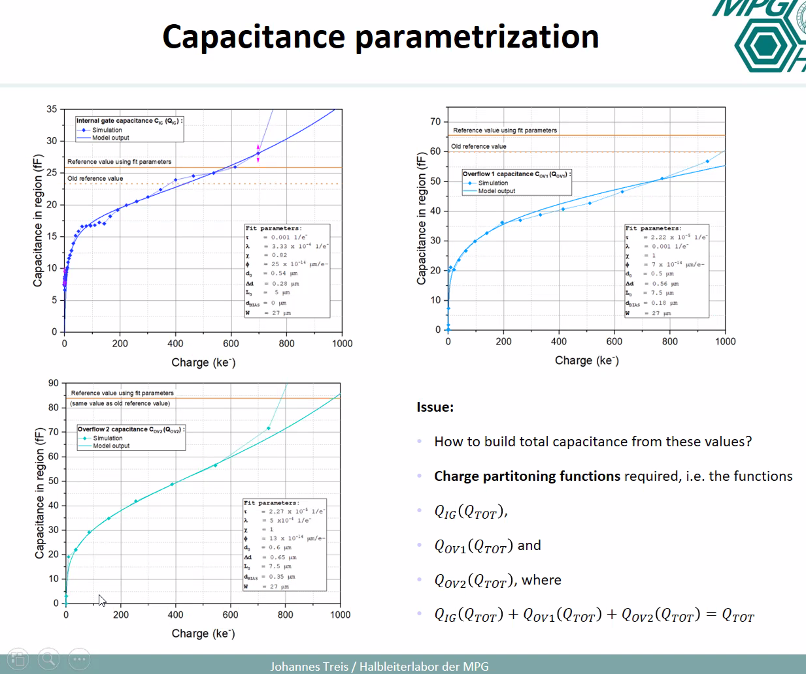

common clear gate

gate set
gate clear

Switcher ASIC sets
clear on	18V		A seconds gate wich enabled a transistor path to attact the charges out of the internal gate.
clear off	2-3V
gate on 	-5 to -3V
gate off	5V

HV -80V		sets p+ baside wealky to around ~80V, when the depletion reaches it
bulk +10
drift -5V
source 6V (reference) of depfet xtor 

Some questions:
Understanding the difference between TIA vs a more standard readout
Noise sources, drain line resistances/capacitances
applications of real time imaging. Spacial resolution, vs single shot time resolution, vs frame rate
Characteristics of the electron source, magnification, 
data availability (signal current vs total charge, w/ gq extraction)
Can slides be posted on indico?

Johannes:
2d simulation of capacitance and g_q
transfer to 3D Oscar simulations
Capacitances change (increase) as total charge increases
Modeling this capacitance is super important, as it tells how charge partitions between different regions of the depfet, which helps understand how gq charges
plots of capacitance of region vs total charge
model of total capacitance vs injected charge

But gq is not only a function of capacitance,
we normally think of depfet in small signal model, but in large signal the internal gate charge modulations the channel pinch off
So why are we getting mostly linear amplification (constant gq in a local region) at all? Perhaps there's some effect cancellations?

Alexander Baehr (2d device simulations) and Reiner Richter?
origin

noise spectral density setup exists

15 year ago, mateo took spectral noise density

# The source and optics
DEPFET is a general HLL creation, but where will EDET likely be physically setup? Will more than one be made?
What are the characteristics of the electron source and optics? Energy resolution, spatial resolution, stroboscopic rate, single-shot precision?

Is it planned to use the electron beam in a orthoganal transmission through the sample?

# Applications
High framerates with integrating mode readout would seem to imply high-dosage. Would biological samples still tolerate this? What sort of DQE do we need? (read that 20-100 el/Å2 is max for cryo-EM bio samples vs 200 primaries of 300ke per pixel in your presentations?
How does a pixel pitch of 60um correspond to the spatial resolution of different applications? I understand that you want to balance between charge sharing (negative for energy resolution) and 
How does the single-shot precision vs framerate of the detector compare?
base-pairing dynamics and ubiquitous nature of DNA interactions
DNA origami/drug delivery/

# EDET
How will a clock be syncronized to source?
Do we plan to use any ADF/HAADF sensors around? 
What sort of energy resolution do we expect/need from EDET?
If my math is right, a 300keV e- primary loses about 16kEv worth of energy in 50um of Si, this produces around 5000e- of signal. It seems noise is often on the order of 
spectrally there is amazing performance from the beam, so sensor will dominate

# Discussion with Sascha Epp
we'd also use it for other electron beams
femto second diffraction, way less ____ involved

200fs electron beams, with few electrons to avoid repulsion spatially, 
only need kHz repetition rate
repeatable/reversible excitations

at euXFEL they want pump probe, but xrays don't excite the core. So you could excite with flash, and probe it with our electrons
terra incognita

other people: smaller pixels, 

IN TEM, detector refresh rate deteremienrs resolution, in 12
small molecular things are repeatable, and so we can construct a movie from multiple events
the story of EDET is though is non-repeatable dynamics: examples 
the source can be pulsed to aid the sensor in gett
four fold read-out, neighbors?
contrast is low due to carbon in celluar, and radiation tolerance is low
so we won't start with this ^ as it's challenging
instead liquid-phase, thin layer of liquid, for example nano-particle gold growth in solution
    they can grow differently, in different shapes, which affects their dynamics. We can see this.
    another good example is battery research: one challege is cathode and anode observation. Can help us see failure, lithum-phosphate,

energy loss in sample is totally covered in landau noise, we care only about change in position of single particle.
therefore, what we really need to be able to do is just accuracly know the number of particles without error
I dourki has MPSD perspective
if the electron is splitting into three pixels, (solved in thesis) with homogenous resolution

there's also a master's thesis of Martin, coving

The lense is electron/mangmetics solinoid, arrangement of coils 
source -> condensor lense -> objective lense -> orthoganl beam
beam shifter allows chopping the beam

the source/optics totally outperformas the sensors
we have less total pixels
small field of view doesn't affect the physics, just helpful to not miss stuff

I dourki talks about backscattering and

we expect 10nm resolution. Ele a factor of 1-million means 1 nm disk on samples in 1mm disk on sensor
in principle you can zoom in for ever, but at some point the electron optics will fail to magnify

for example: 1nm disk on sample with 100 electrons, 1million is 1mm on the sensor (166pixel), would old only 1-2 electrons at the sensor isn't enough for contrast. You need like 10 or more electrons at least.

and we can't just produce more electrons as the sample per area crhomatics abberations,
and we are dumping many electrons so we are wasting our intensity

as you increase magnifigcation, you need more source intensity to arrive at the same contrast per pixel in the sensor. Unfortunatley, as the intensity is increased, the source's spatial resolution and the resolution in the optics begins to degrade. 

There also maybe be a limit on how high the source can go, especially considering post chopper that we a wasting a bunch of electrons.

# questions for Hans
Why can't they make the pixels smaller? I know pitch vs depth should be roughly square. But the still the sensor is 30um thin potentially, but the pitch is 60um?

A unifying factor of detectors of high-energy particles is that they have a high spectral SNR, and very often have little information of interested encoded in that domain. And so we are typically more concerned with just counting accurately. (Good DQE and good linearity)

# Other detectors

how quickly are other designs getting their data out? And how does this compare to commerical high-speed image sensors?

DE-20       5120x3840       6.4um   25      491Mpx/s
Falcon-II   4096x4096       14.0um  18
K2 Summit   3838x3710       5.0um   400
EDET        1024x1024       60um    10000   91Gpx/s

Celetris    