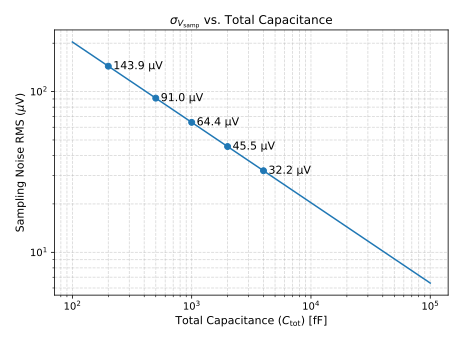
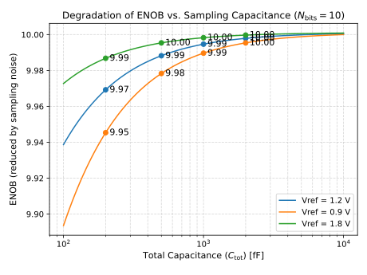
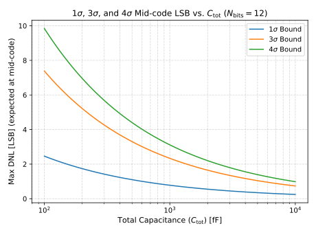
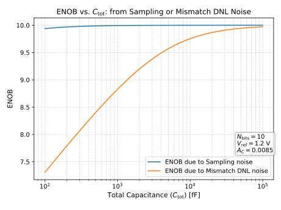
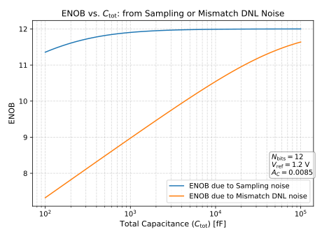

# Quantization and Sampling Noise Analysis in SAR ADCs

## Quantization Noise in ADCs

| Capacitance | $V_\text{rms}$ | $Q_{n}$ (coulombs) | Noise charge (electrons) |
|-------------|----------------|--------------------|--------------------------|
| 1 fF        | 2 mV           | 2 aC               | $13\,e^{-}$              |
| 10 fF       | 640 μV         | 6 aC               | $40\,e^{-}$              |
| 100 fF      | 200 μV         | 20 aC              | $125\,e^{-}$             |
| 1000 fF     | 64 μV          | 64 aC              | $400\,e^{-}$             |

$V_\text{rms} = \sqrt{\frac{k_{\text{B}}T}{C}}$

Noise charge $Q_{n} = \sqrt{k_{\text{B}}TC}$ (coulombs)

Thermal noise of capacitors at 300 K (27°C)

The quantization noise standard deviation is given by:

$$\sigma_{V_{\mathrm{qnoise}}} = \frac{2 V_\mathrm{ref}}{2^N \sqrt{12}}$$

## Sampling Noise in SAR ADCs

## ENOB vs Total Capacitance: Sampling Noise

| 10-bit ENOB vs C_tot | 12-bit ENOB vs C_tot |
|----------------------|----------------------|
|  |  |

## Unit Fringe Capacitor

Metal-on-metal (MOM) capacitor characteristics for 65nm CMOS process:

- 1 layer: $0.31~\mathrm{fF}/\mu\mathrm{m}^2$
- 2 layers: $0.62~\mathrm{fF}/\mu\mathrm{m}^2$
- 3 layers: $0.93~\mathrm{fF}/\mu\mathrm{m}^2$

Pelgrom matching coefficient: $\sigma(\Delta C/C) = 0.85\% \times \sqrt{C~[\mathrm{fF}]}$

| 3D view of CDAC unit cell | CDAC unit cell layout |
|---------------------------|----------------------|
|  |  |

## Expected Mismatch and DNL Noise

| Expected mismatch (12-bit) | DNL noise from mismatch (12-bit) |
|---------------------------|----------------------------------|
|  |  |

## ENOB Comparison: Sampling Noise vs Mismatch DNL Noise

| 10-bit comparison | 12-bit comparison |
|-------------------|-------------------|
|  |  |

**Note:** Assuming a worst case $3\sigma$ variation, corresponding to roughly 1 in 300 ADCs.

## CDAC Array Overview

The complete CDAC array specifications:

- Total Area = $1940~\mu\mathrm{m}^2$
- $C_\mathrm{tot} = 1.4~\mathrm{pF}$

| 3D view of CDAC array | CDAC array layout |
|----------------------|-------------------|
|  |  |