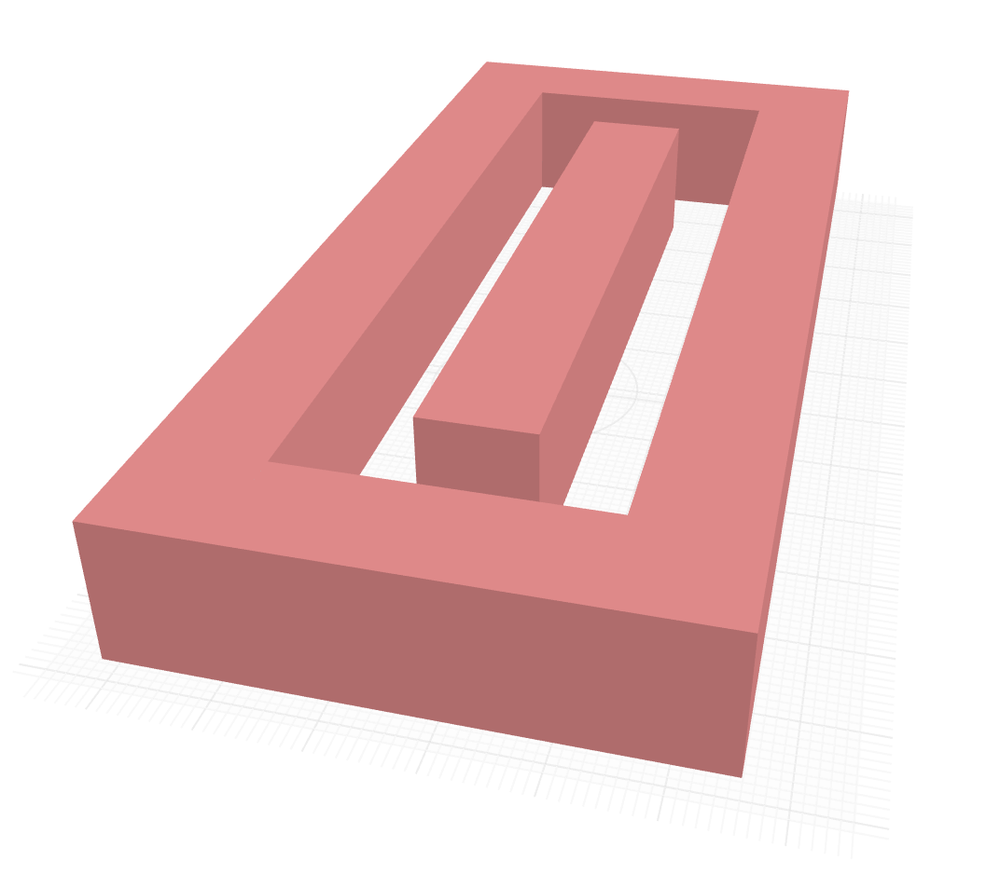
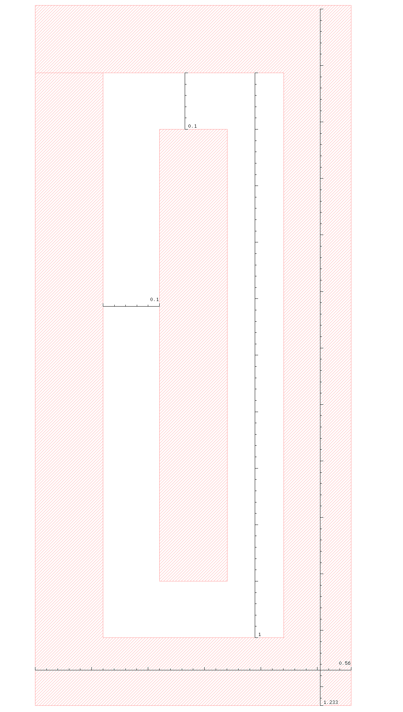
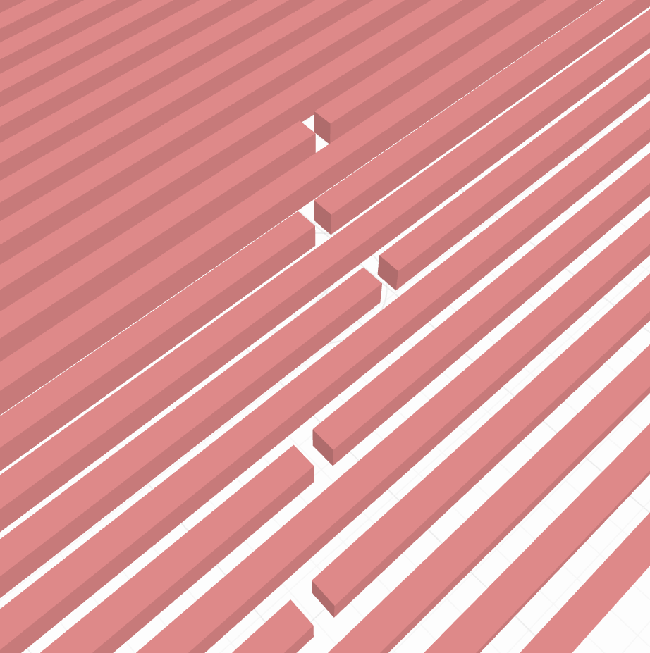
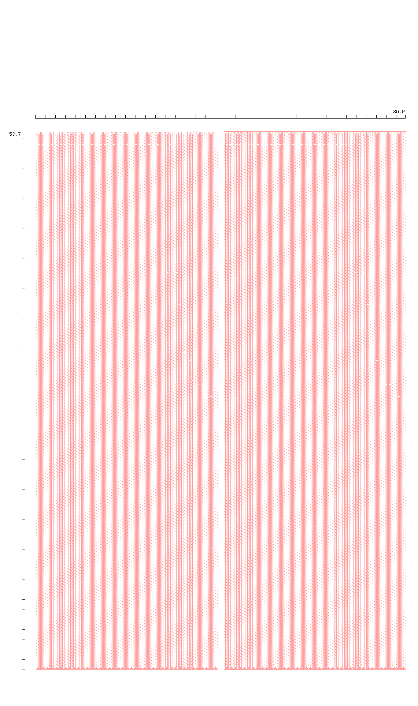

# Quantization and Sampling Noise Analysis in SAR ADCs

## Quantization Noise in ADCs

The quantization noise standard deviation is given by:

$$\sigma_{V_{\mathrm{qnoise}}} = \frac{2 V_\mathrm{ref}}{2^N \sqrt{12}}$$

## Sampling Noise in SAR ADCs

## ENOB vs Total Capacitance: Sampling Noise

| 10-bit ENOB vs C_tot | 12-bit ENOB vs C_tot |
|----------------------|----------------------|
|  |  |

## Unit Fringe Capacitor

Metal-on-metal (MOM) capacitor characteristics for 65nm CMOS process:

- 1 layer: $0.31~\mathrm{fF}/\mu\mathrm{m}^2$
- 2 layers: $0.62~\mathrm{fF}/\mu\mathrm{m}^2$
- 3 layers: $0.93~\mathrm{fF}/\mu\mathrm{m}^2$

Pelgrom matching coefficient: $\sigma(\Delta C/C) = 0.85\% \times \sqrt{C~[\mathrm{fF}]}$

| 3D view of CDAC unit cell | CDAC unit cell layout |
|---------------------------|----------------------|
|  |  |

## Expected Mismatch and DNL Noise

| Expected mismatch (12-bit) | DNL noise from mismatch (12-bit) |
|---------------------------|----------------------------------|
|  |  |

## ENOB Comparison: Sampling Noise vs Mismatch DNL Noise

| 10-bit comparison | 12-bit comparison |
|-------------------|-------------------|
|  |  |

**Note:** Assuming a worst case $3\sigma$ variation, corresponding to roughly 1 in 300 ADCs.

## CDAC Array Overview

The complete CDAC array specifications:

- Total Area = $1940~\mu\mathrm{m}^2$
- $C_\mathrm{tot} = 1.4~\mathrm{pF}$

| 3D view of CDAC array | CDAC array layout |
|----------------------|-------------------|
|  |  |