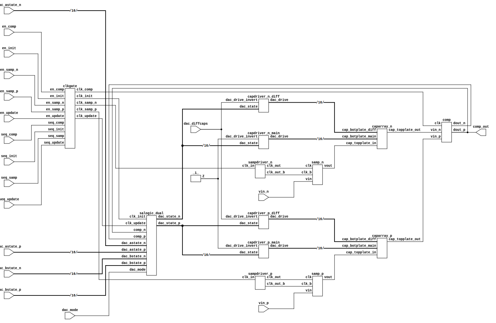
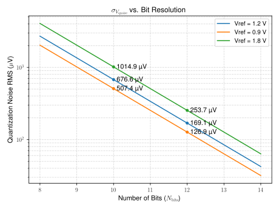
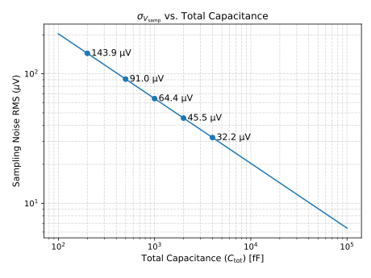
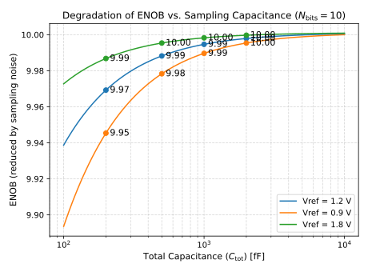
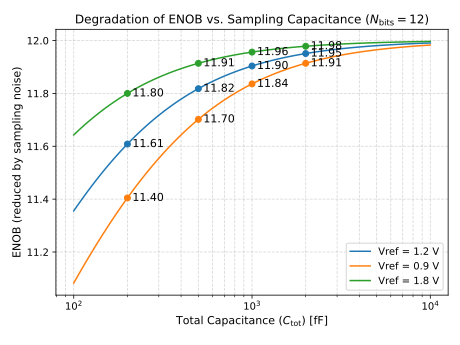
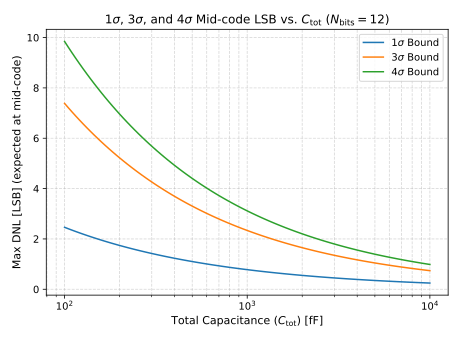
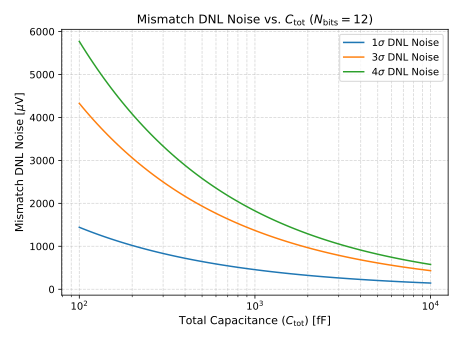
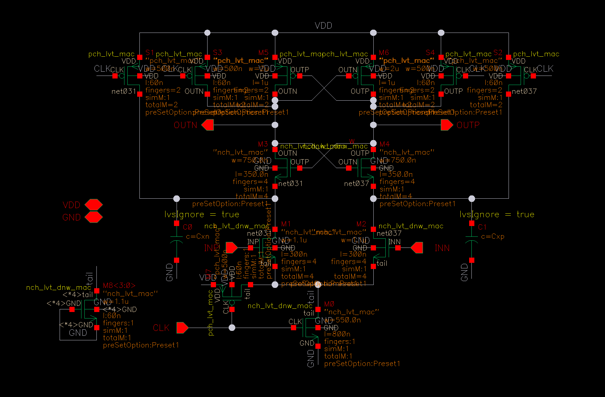
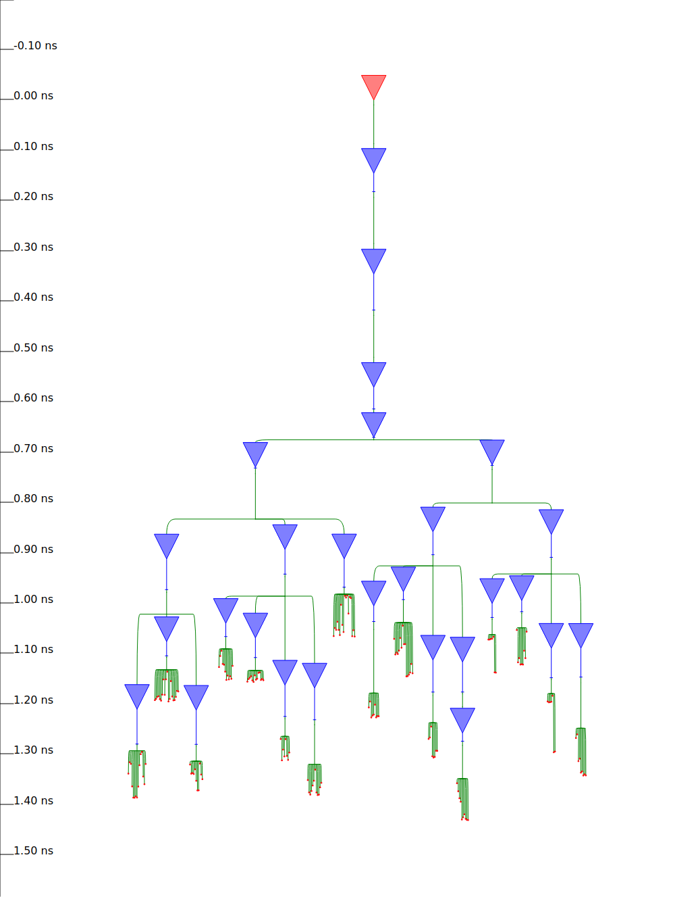
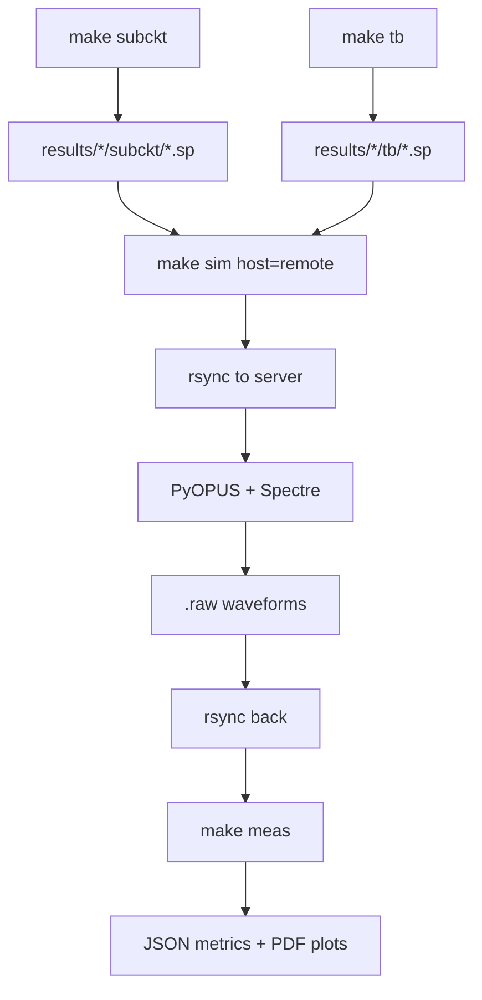

---

## FRIDA ADC Specifications

| Parameter | Target Value |
|-----------|-------------|
| Resolution | 10-12 bit |
| Conversion rate | 10 MHz |
| ADC dimensions | 50x50 $\mu$m |
| Power per ADC | 200 $\mu$W |
| Sampling rate density | >5 ksps/$\mu$m$^2$ |
| Power density | <1 W/cm$^2$ |
| Walden FOM | ~10 fJ/conv-step |

---

## Prior Work Comparison

| Design | DCD v1 | CoRDIA | M | H | **FRIDA** |
|--------|--------|--------|---|---|-----------|
| Resolution | 8-bit | 10-bit | 8-bit | 10-bit | **12-bit** |
| ENOB | 8.3 | 8.8 | 8.0 | 9.5 | **11.0** |
| Rate | 6.25 MHz | 2.5 MHz | 4.5 MHz | 10 MHz | **10 MHz** |
| Area | 2200 $\mu$m$^2$ | 26000 $\mu$m$^2$ | 48000 $\mu$m$^2$ | 1500 $\mu$m$^2$ | **2500 $\mu$m$^2$** |
| Power | 960 $\mu$W | 30 $\mu$W | 700 $\mu$W | 100 $\mu$W | **200 $\mu$W** |
| FOM$_{wal}$ | 487 fJ | 26 fJ | 608 fJ | 14 fJ | **10 fJ** |

# 

## ADC Block Diagram

{ width=80% }

Single comparator, synchronous sequencer with external clock phases for initialization, sampling, comparison, and logic update.

---

## SAR ADC Components

- **Sample/Hold:** Bootstrap switch for rail-to-rail input
- **CDAC:** Binary-weighted capacitor array with redundancy
- **Comparator:** StrongARM latch with regenerative amplification
- **SAR Logic:** Synchronous state machine with external sequencing
- **Clock Gate:** Per-phase enable control

All blocks designed for 65nm CMOS with 1.2V supply.

---

# Capacitor Unit Variation Modeling

## Thermal Noise Fundamentals

| Capacitance | $V_{rms}$ | Noise charge | Electrons |
|-------------|-----------|--------------|-----------|
| 1 fF | 2 mV | 2 aC | 13 $e^-$ |
| 10 fF | 640 $\mu$V | 6 aC | 40 $e^-$ |
| 100 fF | 200 $\mu$V | 20 aC | 125 $e^-$ |
| 1000 fF | 64 $\mu$V | 64 aC | 400 $e^-$ |

$$V_{rms} = \sqrt{\frac{k_B T}{C}} \qquad Q_n = \sqrt{k_B T C}$$

---

## Quantization vs Sampling Noise

{ width=45% }
{ width=45% }

Quantization noise $\sigma_{V_{qnoise}} = \frac{2 V_{ref}}{2^N \sqrt{12}}$

---

## ENOB vs Total Capacitance

| 10-bit ENOB vs $C_{tot}$ | 12-bit ENOB vs $C_{tot}$ |
|--------------------------|--------------------------|
| { width=45% } | { width=45% } |

Trade-off: Smaller caps improve speed/power but degrade noise performance.

---

## Capacitor Mismatch: Pelgrom Model

Metal-on-metal (MOM) capacitor in 65nm CMOS:

- 1 layer: 0.31 fF/$\mu$m$^2$
- 2 layers: 0.62 fF/$\mu$m$^2$
- 3 layers: 0.93 fF/$\mu$m$^2$

**Pelgrom matching coefficient:**
$$\sigma(\Delta C/C) = 0.85\% \times \sqrt{C\,[\text{fF}]}$$

---

## Expected Mismatch Analysis

| Expected mismatch (12-bit) | DNL noise from mismatch |
|---------------------------|-------------------------|
| { width=45% } | { width=45% } |

Worst-case 3$\sigma$ variation corresponds to ~1 in 300 ADCs.

---

# CDAC Design

## CDAC Design Strategies

1. **Calibration:** Limited effectiveness in binary-weighted design
2. **Redundancy (sub-radix-2):** Overlapping search voltages enable error correction
3. **Coarse-Fine Partitioning:** Improve unit matching without increasing total area
4. **Switching Schemes:** BSS/Monotonic reduce power, CRS improves linearity

---

## CDAC Weight Calculation

Five implemented strategies in `blocks/cdac.py`:

| Strategy | Description | Radix |
|----------|-------------|-------|
| `rdx2` | Standard binary | 2.0 |
| `subrdx2` | Sub-radix-2 rounded | <2.0 |
| `subrdx2lim` | Sub-radix-2 with floor | <2.0 |
| `subrdx2rdst` | MSB redistribution | ~2.0 |
| `rdx2rpt` | Binary with repeated caps | 2.0 |

$$\beta = 2^{N/M} \qquad W_i = \max(1, \lfloor \beta^{M-1-i} \rfloor)$$

---

## Coarse-Fine Partitioning

For weights $W \leq 64$ (threshold $T$):

**Difference Capacitor Split:**
$$W = q \cdot T + r \quad \text{where } q = \lfloor W/T \rfloor$$

- Coarse: $C_{main} = T \cdot C_u$, $m = q$
- Coarse diff: $C_{diff} = 1 \cdot C_u$, $m = q$
- Fine: $C_{main} = (T+1+r)$, $C_{diff} = (T+1-r)$

**Effective:** $C_{eff} = C_{main} - C_{diff}$

---

## CDAC Unit Cell Layout

| 3D view | Top-down layout |
|---------|-----------------|
| { width=45% } | { width=45% } |

---

## Complete CDAC Array

| 3D view | Array layout |
|---------|--------------|
| { width=45% } | { width=45% } |

- Total Area: 1940 $\mu$m$^2$
- $C_{tot}$: 1.4 pF

---

# Comparator Design

## Topology Parameters

| Parameter | Options |
|-----------|---------|
| `preamp_diffpair` | nmosinput, pmosinput |
| `preamp_bias` # Copied and reformatting from the Appendix of PH Wei's 2021 Thesis 


| stdbias, dynbias |
| `comp_stages` | singlestage, doublestage |
| `latch_pwrgate_ctl` | clocked, signalled |
| `latch_pwrgate_node` | external, internal |
| `latch_rst_extern_ctl` | clocked, signalled, noreset |
| `latch_rst_intern_ctl` | clocked, signalled |

Generates cartesian product of valid combinations.

---

## StrongARM Reference Design

{ width=50% }

Single-stage design: integrated preamp and regenerative latch.

---

## Comparator Testbench

Per "Practical Hint 12.2" - source impedances critical:

- 5 common-mode voltages: 0.3V to 0.7V
- 11 differential voltages: -50mV to +50mV
- 10 clock cycles per point
- **550 total comparison cycles**

Source impedance: 1k$\Omega$ + 100fF models DAC output.

---

# Custom Analog Flow

## Flow Overview

```
blocks/         # Cell definitions (subckt + tb + analyses + measures)
flow/           # Flow scripts
  netlist.py    # Subcircuit and testbench generation
  simulate.py   # PyOPUS-based Spectre simulation
  measure.py    # Measurement extraction and plotting
  expression.py # Custom measurement functions
results/        # Generated netlists and simulation data
```

---

## Netlist Generation

```bash
make subckt [cell]    # Generate subcircuits
make tb [cell]        # Generate testbenches
```

**Expansion Process:**
1. `expand_topo_params()` - cartesian product of topology parameters
2. `generate_topology()` - compute ports/devices for each combo
3. `expand_dev_params()` - tech, instance, device parameter sweeps
4. Output: SPICE + JSON metadata per variant

---

## Simulation Flow

```bash
make sim cell=comp mode=all host=remote
```

- PyOPUS PerformanceEvaluator orchestrates Spectre
- Local/remote execution with rsync synchronization
- Up to 40 parallel simulations on compute server
- Output: .scs (input), .log, .raw (waveforms), .pkl (results)

---

## Measurement System

Expressions evaluated against waveform data:

```python
measures = {
    "offset_mV": {
        "analysis": "tran",
        "expression": "m.comp_offset_mV(v, scale, 'in+', 'in-', 'out+', 'out-')",
    },
    "power_uW": {
        "analysis": "tran",
        "expression": "m.avg_power_uW(v, i, scale, 'Vvdd')",
    },
}
```

Monte Carlo: automatic statistics (mean, std, min, max) across runs.

---

# Digital Flow with OpenROAD

## OpenROAD Flow Scripts (ORFS)

**Input files:**
- Verilog RTL: `adc.v`, `salogic.v`, `clkgate.v`, `capdriver.v`
- Constraints: `constraint.sdc`
- Libraries: `tcbn65lplvt.lib`, `tcbn65lplvt_9lmT2.lef`

**Flow stages:**
1. Synthesis (Yosys)
2. Floorplan
3. Placement
4. Clock Tree Synthesis
5. Routing
6. Finishing (GDS generation)

---

## ORFS Modifications for Mixed-Signal

Custom patches required (`docs/orfs_mods.patch`):

| Modification | Purpose |
|--------------|---------|
| `def2stream.py` | Via cell preservation for TSMC65 |
| `synth.tcl` | Custom cell support (disable -assert) |
| `global_place.tcl` | DONT_TOUCH + MANUAL_PLACE hooks |
| `floorplan.tcl` | Placement/routing blockage support |

---

## ADC Floorplan

```
FEOL-M3: Logic + Macros     M3-M4: Power Domains     M5-M6: Cap Arrays
+-----------------------+   +------------------+     +------+------+
| Cap Drivers (diff)    |   | vdd_dac, vss_dac |     |      |      |
+-----------------------+   +------------------+     |      |      |
| SW N | Comp | SW P |     |  vdd_a, vss_a |     | P    | N    |
+------+------+------+     +----------------+     | Cap  | Cap  |
|                         |   |                  |     | Array| Array|
| SA Logic, Clk Gate,     |   |  vdd_d, vss_d    |     |      |      |
| & Samp Driver           |   |                  |     |      |      |
+-----------------------+   +------------------+     +------+------+
```

---

## Clock Tree Synthesis

**Clock domains:**
- `seq_init_clk`: 100ns period (initialization)
- `seq_samp_clk`: 50ns period (sampling)
- `seq_comp_clk`: 20ns period (comparison)
- `seq_update_clk`: 40ns period (SAR update)

**CTS Results:**
- 31 BUFFD2LVT cells across 7 clock networks
- All domains asynchronous (no CDC)
- Clock power: 41.6% of total

---

## Clock Tree Visualization

{ width=70% }

---

## Library Mismatch Resolution

**Problem:** GDS used LVT library, LEF/Liberty used standard library.

**Solution:** Updated `platforms/tsmc65/config.mk`:
- `LIB_FILES = tcbn65lplvtwc.lib`
- `LEF_FILES = tcbn65lplvt_9lmT2.lef`
- `GDS_FILES = tcbn65lplvt.gds`

All cell references updated to LVT variants (BUFFD2LVT, TIELLVT, etc.)

---

## Routing Challenges

**COVER vs BLOCK Instance Types:**
- Capacitor arrays classified as "COVER" (metal-only structures)
- OpenROAD's `find_macros` only detects "BLOCK" instances
- Global router generates warnings for COVER instances
- Detailed router struggles with "bottom-up" pin access (M1-M3 to M4)

**Status:** Guide coverage issues under investigation.

---

# System Chip Design

## FRIDA Chip Overview

- **Die Size:** 1mm x 1mm
- **Core Area:** 600 $\mu$m x 600 $\mu$m
- **ADC Array:** 4x4 grid (16 ADCs)
- **Technology:** TSMC 65nm LP
- **Tapeout:** October 2025
- **Testing:** Spring 2026

---

## Top-Level Layout

{ width=50% }

---

## Pad Ring Configuration

| Pad Type | Count | Purpose |
|----------|-------|---------|
| LVDS_RX | 4 | Sequencing clocks |
| LVDS_TX | 1 | Comparator output |
| CMOS_IO | 5 | SPI interface + reset |
| PASSIVE | 1 | Analog input (differential) |
| POWER | 4 | VDD (analog, digital, IO, DAC) |
| GROUND | 4 | VSS (analog, digital, IO, DAC) |

**Total: 22 pads**

---

## Pad Ring Layout

{ width=60% }

---

## SPI Configuration Register

**Total: 65 bits**

| Field | Width | Purpose |
|-------|-------|---------|
| `chan_en[15:0]` | 16 | Channel enable |
| `chan_sel[15:0]` | 16 | Channel select (one-hot) |
| `dac_init[M-1:0]` | M | DAC initial values |
| `manual` | 1 | Manual/Auto DAC mode |

Register layout: `[64] manual | [63:48] dac_init | [47:32] chan_sel | [31:16] chan_en`

---

## ADC Operation Modes

| Mode | Channels | Purpose |
|------|----------|---------|
| 1 | Single | Normal ADC characterization |
| 2 | Single selected, all enabled | VREF noise characterization |
| 3 | Single, manual DAC | Calibration mode |

**DAC Modes:** Conventional, Monotonic, BSS (Binary Scaled Segmented)

---

## Channel Design Space

| Parameter | Options |
|-----------|---------|
| N:M Ratio | 12:17, 10:13 |
| Coarse-Fine | Cap. Difference, RDAC Scaling, Bridge Cap |
| $C_{tot}$ | 1pF, 2pF |

**12 configurations** (2 x 3 x 2) across 16 ADC channels for direct comparison.

---

# Test PCB and Verification

## FRIDA65A Single Chip Card

**PCB Design:** KiCad 9.0, Rev 1.0 (November 2025)

**Authors:** K. Caisley, H. Kruger, C. Bespin (SiLab, Universitat Bonn)

Key features:

- 4-layer PCB with controlled impedance
- Multiple isolated power domains
- Differential signal conditioning
- FPGA-compatible interface connectors

---

## PCB Power Architecture

| Domain | Purpose | Voltage |
|--------|---------|---------|
| VDD_A | Analog circuits | 1.2V |
| VDD_D | Digital logic | 1.2V |
| VDD_IO | I/O buffers | 1.8V/2.5V |
| VDD_DAC | DAC reference | 1.2V |
| VDD_DIF | Differential amplifier | 3.3V |

Separate LDOs per domain with ferrite bead isolation.

---

## Signal Conditioning

**Differential Amplifier:** TI THS4520RGTT

- Fully differential input/output
- Low noise: 1.3 nV/rtHz
- High bandwidth: 620 MHz
- Drives VIN_P/VIN_N to chip

**Clock Distribution:**

- CLK_INIT_P/N - Initialization clock
- CLK_SAMP_P/N - Sampling clock
- CLK_COMP_P/N - Comparator clock
- CLK_LOGIC_P/N - SAR logic clock

---

## Test Board Connectors

| Connector | Type | Purpose |
|-----------|------|---------|
| J1 | RJ45 | Sequencing clocks (4 LVDS pairs) |
| J2 | DisplayPort | Data output + auxiliary |
| J3 | Molex 44620-0002 | FPGA interface (100-pin) |
| J4-J7 | SMA | Analog input, test points |
| J8 | 6-pin header | SPI interface |

---

## FPGA Verification Plan

1. **Sequencing:** Generate 4-phase clock pattern via RJ45
2. **Configuration:** SPI register load/readback (65-bit shift register)
3. **Data capture:** LVDS comparator output via DisplayPort
4. **Calibration:** External DAC state control in manual mode

**Target FPGA:** Xilinx Artix-7 or Kintex-7 with LVDS support

---

## Test Software Architecture

```
FPGA Firmware:
  - Clock pattern generator (programmable timing)
  - SPI controller (1-10 MHz)
  - LVDS deserializer
  - Data buffering (BRAM/DDR)
  - USB/Ethernet interface

Host Software:
  - ADC configuration GUI
  - Data acquisition and logging
  - Real-time FFT analysis
  - Calibration routines
```

---

## Characterization Plan

| Test | Purpose |
|------|---------|
| Static linearity | INL, DNL vs code |
| Dynamic performance | ENOB, SFDR, SNDR vs $f_{in}$ |
| Power consumption | Per-ADC and total |
| Speed | Maximum conversion rate |
| Mismatch | Channel-to-channel variation |
| Temperature | -40C to +125C corners |

---

# Summary and Status

## Accomplishments (Past 8 Months)

1. **Custom analog flow:** Python-based netlist generation with PyOPUS simulation
2. **CDAC design:** Multiple weight strategies, coarse-fine partitioning
3. **Comparator exploration:** Topology parameter space with automated generation
4. **Digital flow:** OpenROAD integration with custom ORFS patches
5. **Chip submission:** 1mm x 1mm test chip taped out October 2025
6. **Test infrastructure:** PCB design, FPGA verification planning

---

## Key Innovations

- **Parameterized topology generation:** Single block definition generates hundreds of variants
- **Hierarchical simulation:** PyOPUS enables Monte Carlo with foundry models
- **Mixed-signal OpenROAD:** Custom hooks for analog macro integration
- **Design space exploration:** 12 ADC configurations for direct comparison

---

## Next Steps

1. **Chip arrival:** Spring 2026
2. **Test board assembly and bring-up**
3. **FPGA firmware development**
4. **Characterization campaign:**
   - Static/dynamic performance
   - Calibration algorithm development
   - Temperature/voltage corners
5. **Design iteration based on silicon results**

---

## Repository Structure

```
frida/
├── blocks/     # Cell definitions
├── flow/       # Python flow scripts
├── results/    # Generated data
├── docs/       # Documentation + images
└── etc/        # CDL, LEF files
```

**Tools:** Python 3.11+, PyOPUS 0.11.2, Spectre, OpenROAD, Yosys, KLayout

---

# Questions?

## Resources

- **Repository:** `/home/kcaisley/frida`
- **README:** Complete flow documentation
- **ORFS mods:** `docs/orfs_mods.md`
- **Analog flow:** `docs/cdac.md`, `docs/comp.md`

---

# Appendix

## Simulation Flow Diagram



---

## Monte Carlo Measurement Extraction

For MC simulations, same measure expressions work unchanged:

```json
{
  "offset_mV": {
    "mean": 0.45,
    "std": 1.2,
    "min": -1.5,
    "max": 2.3,
    "values": [2.3, -1.1, 0.8, ...],
    "numruns": 10
  }
}
```

PDK mismatch models included via `"modules": ["tb", "mc"]`

---

## CDAC Testbench

```python
# DAC code sequence: 0 -> 1/4 -> 1/2 -> 3/4 -> full_scale
max_code = (1 << n_dac) - 1
test_codes = [0, max_code // 4, max_code // 2,
              3 * max_code // 4, max_code]
```

Measures: INL, DNL (LSB), settling time (ns), glitch amplitude (mV)

---

## Comparator Measures

| Measure | Expression |
|---------|------------|
| `offset_mV` | Input voltage where P(out+>out-)=50% |
| `noise_sigma_mV` | S-curve width |
| `delay_ns` | Clock edge to output crossing |
| `settling_ns` | Time to 1% of final |
| `power_uW` | Average from Vdd current |
| `slew_Vns` | Output slew rate |

---

## Architecture Diagram

{ width=80% }
