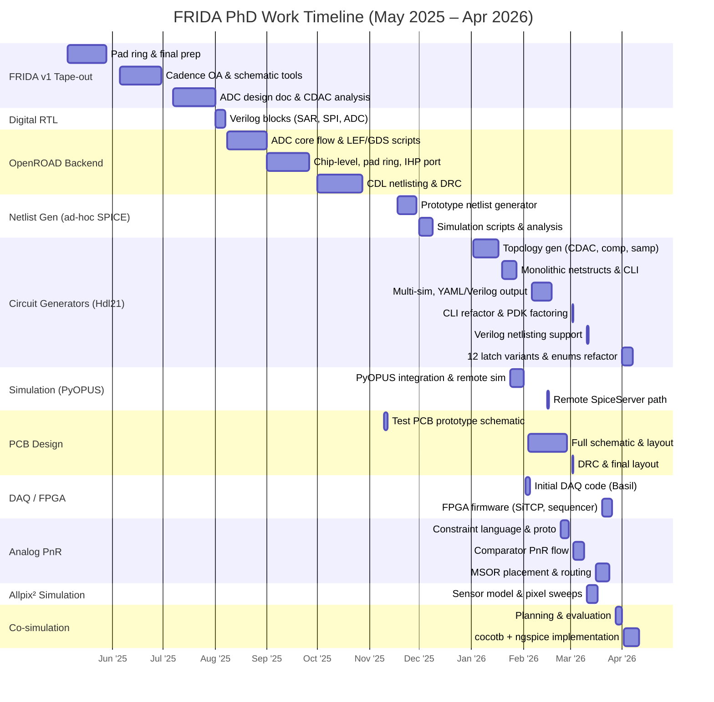

```mermaid
gantt
    title FRIDA PhD Work Timeline (May 2025 – Apr 2026)
    dateFormat YYYY-MM-DD
    axisFormat %b '%y

    section FRIDA v1 Tape-out
    Pad ring & final prep              :2025-05-05, 2025-05-28
    Cadence OA & schematic tools       :2025-06-05, 2025-06-30
    ADC design doc & CDAC analysis     :2025-07-07, 2025-08-01

    section Digital RTL
    Verilog blocks (SAR, SPI, ADC)     :2025-08-01, 2025-08-07

    section OpenROAD Backend
    ADC core flow & LEF/GDS scripts    :2025-08-08, 2025-09-01
    Chip-level, pad ring, IHP port     :2025-09-01, 2025-09-26
    CDL netlisting & DRC               :2025-10-01, 2025-10-28

    section Netlist Gen (ad-hoc SPICE)
    Prototype netlist generator         :2025-11-18, 2025-11-29
    Simulation scripts & analysis       :2025-12-01, 2025-12-09

    section Circuit Generators (Hdl21)
    Topology gen (CDAC, comp, samp)    :2026-01-02, 2026-01-17
    Monolithic netstructs & CLI        :2026-01-19, 2026-01-28
    Multi-sim, YAML/Verilog output     :2026-02-06, 2026-02-18
    CLI refactor & PDK factoring       :2026-03-02, 2026-03-03
    Verilog netlisting support         :2026-03-11, 2026-03-12
    12 latch variants & enums refactor :2026-04-01, 2026-04-07

    section Simulation (PyOPUS)
    PyOPUS integration & remote sim    :2026-01-24, 2026-02-01
    Remote SpiceServer path            :2026-02-15, 2026-02-16

    section PCB Design
    Test PCB prototype schematic       :2025-11-10, 2025-11-12
    Full schematic & layout            :2026-02-04, 2026-02-27
    DRC & final layout                 :2026-03-02, 2026-03-03

    section DAQ / FPGA
    Initial DAQ code (Basil)           :2026-02-02, 2026-02-05
    FPGA firmware (SiTCP, sequencer)   :2026-03-20, 2026-03-26

    section Analog PnR
    Constraint language & proto        :2026-02-23, 2026-02-28
    Comparator PnR flow                :2026-03-03, 2026-03-09
    MSOR placement & routing           :2026-03-16, 2026-03-24

    section Allpix² Simulation
    Sensor model & pixel sweeps        :2026-03-11, 2026-03-17

    section Co-simulation
    Planning & evaluation              :2026-03-28, 2026-04-01
    cocotb + ngspice implementation    :2026-04-02, 2026-04-11
```
