# Analog layout optimization flow

This document describes the FRIDA analog layout flow: an NSGA-II optimization
loop that drives OpenROAD as a black-box place-and-route engine, with symmetric
placement and routing handled via netlist partitioning and guide mirroring.

This strategy is inspired by the Analog Layout Optimization Engine (ALOE) from
P.H. Wei's 2021 thesis, adapted to use OpenROAD instead of Cadence Innovus and
with symmetric routing handled via guide mirroring rather than native tool support.

---

## Algorithm outline

```
Inputs
├── tech lef            (from pdk)
├── primitive lefs      (from primitive generator sweep)
└── netlist             (from hdl21 compilation of e.g. Comp)

layout.py  (runs in FRIDA under uv, called by `flow layout`)
│
├── 1. Netlist analysis
│   ├── extract symmetric pairs from naming / topology (_p ↔ _n)
│   ├── identify partition: half-A devices, half-B = mirror of A
│   ├── map compiled devices → unit primitives (stem-cell map)
│   └── emit structural verilog (half-circuit if symmetric)
│
├── 2. Constraint extraction
│   ├── ndr rules for high-current / sensitive nets
│   ├── pin side assignments
│   └── floorplan estimate (half-area bounding box)
│
├── 3. Initial net weight guess (uniform or heuristic seed)
│
├── 4. Optimization loop  (NSGA-II)
│   │
│   ├── 4.1  Generate population of candidate net-weight vectors
│   │
│   ├── 4.2  For each candidate  (parallelizable)
│   │   │
│   │   ├── Serialize input data (json)
│   │   │     net weights, ndrs, placements, partition info,
│   │   │     file paths to lefs and verilog
│   │   │
│   │   ├── ── subprocess call ──────────────────────────────
│   │   │   │
│   │   │   │  openroad -exit -python runner.py <serialized>
│   │   │   │
│   │   │   │  runner.py  (runs inside OpenROAD)
│   │   │   │  │
│   │   │   │  ├── a. Deserialize input data
│   │   │   │  ├── b. Load tech lef + primitive lefs + verilog
│   │   │   │  ├── c. Initialize floorplan (half-area estimate)
│   │   │   │  ├── d. Place pins (half-circuit side)
│   │   │   │  ├── e. Apply net weights
│   │   │   │  ├── f. Apply ndr rules via odb
│   │   │   │  ├── g. Global placement → detail placement
│   │   │   │  ├── h. Global routing → detail routing (half)
│   │   │   │  ├── i. Mirror placements across symmetry axis
│   │   │   │  ├── j. Mirror routing guides for paired nets
│   │   │   │  ├── k. Route remaining stitching nets
│   │   │   │  ├── l. Write output def
│   │   │   │  └── m. Extract metrics → serialize back
│   │   │   │        per-net wire length, bounding box,
│   │   │   │        drc count, congestion
│   │   │   │
│   │   │   └── ── end subprocess ───────────────────────────
│   │   │
│   │   └── Deserialize metrics from runner
│   │
│   ├── 4.3  Evaluate objectives
│   │   ├── minimize total area
│   │   ├── minimize total net length
│   │   └── minimize differential net length mismatch
│   │
│   ├── 4.4  NSGA-II: non-dominated sort → selection → crossover → mutation
│   │
│   └── 4.5  If converged or max generations reached → exit loop
│
└── 5. Output best-candidate def
```

---

## Mermaid diagram

```mermaid
flowchart LR
    subgraph inputs [" "]
        direction TB
        techlef[/"tech lef<br/>(pdk)"/]
        primlef[/"primitive lefs<br/>(generator sweep)"/]
        netlist[/"netlist<br/>(hdl21 Comp)"/]
    end

    subgraph layout ["layout.py — runs in FRIDA (uv run flow layout)"]
        direction LR

        analysis["1. Netlist analysis<br/>• symmetry pair extraction<br/>• partition into half-A / half-B<br/>• stem-cell mapping<br/>• emit half-circuit verilog"]

        constraints["2. Constraint extraction<br/>• ndr rules<br/>• pin assignments<br/>• floorplan estimate"]

        seed["3. Initial net-weight seed"]

        subgraph loop ["4. NSGA-II optimization loop"]
            direction LR
            gen["4.1 Generate candidate<br/>net-weight vectors<br/>(population)"]
            par["4.2 For each candidate<br/>(parallelizable)"]
            eval["4.3 Evaluate objectives<br/>• minimize area<br/>• minimize total net length<br/>• minimize diff-pair mismatch"]
            select["4.4 NSGA-II<br/>sort → select →<br/>crossover → mutate"]
            converge{"4.5 Converged<br/>or max gen?"}

            gen --> par
            par --> eval
            eval --> select
            select --> converge
            converge -- "no" --> gen
        end

        best["5. Output best-candidate def"]

        analysis --> constraints --> seed --> loop
        converge -- "yes" --> best
    end

    inp_data[("input json<br/>net weights, ndrs,<br/>placements, partition,<br/>lef/verilog paths")]

    subgraph runner ["runner.py — runs inside OpenROAD subprocess"]
        direction LR
        deser["a. Deserialize input"]
        load["b. Load lefs + verilog"]
        floor["c. Init floorplan (half-area)"]
        pins["d. Place pins"]
        weights["e. Apply net weights"]
        ndr["f. Apply ndr rules (odb)"]
        place["g. Global → detail placement"]
        route_half["h. Global → detail routing (half)"]
        mirror_place["i. Mirror placements across axis"]
        mirror_guide["j. Mirror routing guides"]
        stitch["k. Route stitching nets"]
        write_def["l. Write def"]
        metrics["m. Extract & serialize metrics"]

        deser --> load --> floor --> pins --> weights --> ndr
        ndr --> place --> route_half
        route_half --> mirror_place --> mirror_guide --> stitch
        stitch --> write_def --> metrics
    end

    out_data[("output json<br/>per-net wire lengths,<br/>bounding box,<br/>drc count, congestion")]

    inputs --> analysis
    par -- "serialize" --> inp_data
    inp_data -- "openroad -exit -python runner.py" --> deser
    metrics -- "return" --> out_data
    out_data -- "deserialize" --> eval
```



---

## Key design decisions

| Decision | Choice | Rationale |
|----------|--------|-----------|
| Code generation vs data passing | Data passing (json) | No templating; runner.py is a fixed script that reads data |
| Tcl vs Python for runner | Python (`-python` flag) | odb access needed for guide mirroring; `evalTclString` for commands without Python wrappers |
| Optimization algorithm | NSGA-II | Multi-objective (area, length, mismatch); well-studied for analog place-and-route (Wei/ALOE) |
| Symmetric routing | Mirror guides after routing half | OpenROAD has no native symmetric routing support |
| Net weights as search variable | Yes | Primary knob ALOE uses to steer placement/routing toward different trade-offs |
| Where partitioning happens | layout.py (FRIDA side) | Netlist analysis is pure Python; OpenROAD only sees the half-circuit |

## See also

- [docs/or_odb.md](file:///home/kcaisley/frida/docs/or_odb.md) — OpenROAD Python
  execution model, `openroad`/`odb` api reference, symmetric routing workaround
- [docs/or_analog.md](file:///home/kcaisley/frida/docs/or_analog.md) — placement
  status, routing guides, Python vs Tcl comparison, ALOE appendix
- [docs/plan.md](file:///home/kcaisley/frida/docs/plan.md) — constraint types,
  Tcl emitter design, end-to-end integration plan
