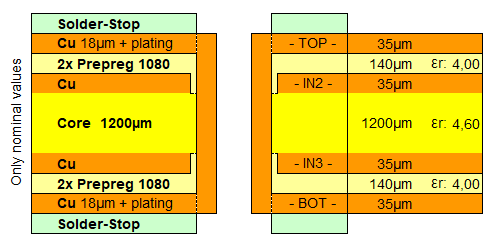

## Connectors & Footprints

- [x] RJ45 connector (J3) updated to Molex 446200002 with 3D model and datasheet
- [x] Molex Mini-Fit Jr connector (J5) updated to part 469990014 (2x2, 4 circuits) with 3D model
- [x] SMA connectors J1/J2 updated to Molex 733910070 vertical SMA with local footprint/model
- [x] Pin headers updated from 2x04 to 2x02 where applicable
- [x] DisplayPort connector footprint fixed (zero-sized pad corrected)
- [x] THS4541 (U3) footprint switched to local Texas RUN0010A WQFN-10 copy
- [x] TXV0106-Q1 level shifter (U2) added to schematic with local footprint + 3D model mapping
- [x] All footprints and 3D models self-contained in daq/dut/frida.pretty
- [x] Stale library references removed from fp-lib-table (silab, dmaps, import)

### Library file inventory

Local symbols in `frida:`, local footprints in `frida:`, KiCad built-in libraries prefixed accordingly.
Naming convention: `Company_Type_PartNum`.

| ID | Component | Symbol | Footprint | 3D Model |
|---|---|---|---|---|
| J1 | Input SMA P (Molex 733910070) | `frida:Molex_SMA_733910070` | `frida:Molex_SMA_733910070` | `Molex_SMA_733910070.stp` |
| J2 | Input SMA N (Molex 733910070) | `frida:Molex_SMA_733910070` | `frida:Molex_SMA_733910070` | `Molex_SMA_733910070.stp` |
| J3 | RJ45 (Molex 446200002) | `Connector:RJ45` | `frida:Molex_RJ45_446200002` | `Molex_RJ45_446200002.stp` |
| J4 | DisplayPort (Molex 472720024) | `frida:Molex_DisplayPort_472720024` | `frida:Molex_DisplayPort_472720024` | `Molex_DisplayPort_472720024.stp` |
| J5 | Molex Mini-Fit Jr 2x02 (469990014) | `frida:Molex_MiniFitJr_469990014` | `frida:Molex_MiniFitJr_469990014` | `Molex_MiniFitJr_469990014.stp` |
| J6 | Generic header 2x06 | `Connector_Generic:Conn_02x06_Top_Bottom` | *(unassigned in schematic)* | *(none)* |
| U1 | FRIDA ASIC | `frida:FRIDA_ASIC_Pad` | `frida:FRIDA_ASIC_Pad` | *(none)* |
| U2 | TXV0106-Q1 level shifter | `frida:TI_LevelShifter_TXV0106Q1` | `frida:TI_LevelShifter_TXV0106Q1` | `TI_LevelShifter_TXV0106Q1.stp` |
| U3 | THS4541 diff amp | `frida:TI_DiffAmp_THS4541` | `frida:TI_DiffAmp_THS4541` | `TI_DiffAmp_THS4541.stp` |

## Test Point Placement

Reference section for future TP additions in the schematic:

- Place TP symbols on a single horizontal row at `y = 114.3 mm`.
- Use `x` pitch of `12.7 mm` between adjacent TP symbols.
- For example, some TP row anchor points are `x = 25.4, 38.1, 50.8, 63.5, 76.2, 88.9, 101.6, 114.3, 127.0, 139.7 mm` (TP1..TP10).
- Place each net label at the exact same coordinate as its TP symbol anchor (delta `x = 0`, delta `y = 0`).
- Set TP label text angle to `270 deg` with `justify right bottom` so text runs downward.
- Draw no connecting wire between TP and label (line length `0 mm` because both are coincident).
- Hide the `Value` field on TP symbols.

## Power & Voltage Management

- [ ] Level shifter: specify voltage requirements (source and target voltages)
- [ ] Forward VDD_FPGA voltage on one of the extra pins
- [ ] Buffer negative rail: make configurable with negative supply or ground (add jumper)
- [ ] TVS diode for reverse polarity protection (not for transients)

## Analog Input Path

- [x] Input devices/switching for buffer
- [ ] Clamp diodes to protect FRIDA chip from external/buffer sources (VIN_P and VIN_N, use solder/pin jumper, check ENOB impact, clamp to VDD_DAC and GND)
- [ ] Share input connector pins but have headers to measure current
- [x] Add test point on VIN_N

## Feedback Network

- [ ] Cap feedback: specify values and frequency response requirements

## Reset Circuit

- [ ] Add pulldown for reset using NMOS with 20k resistor connected to chip reset pin

## PCB Stackup & Impedance

4-layer stackup from Multi-CB (FR4, 1.6mm nominal):

- Estimated final thickness (+/- 10%): 1.6mm
- Prepreg thicknesses after pressing, at approx. 80% copper utilization on the inner layers.
- Loss Tangent / Dissipation factor (Df): ca. 0.02
- Dielectric constant Er for 1x Prepreg 1080: 3.95

### Differential trace geometry

| Type              | Impedance | Signal layer | Reference layer | Width  | Space  |
|-------------------|-----------|--------------|-----------------|--------|--------|
| Single ended      | 50 Ohm    | TOP          | IN2             | 245um  | -      |
| Differential pair | 90 Ohm    | TOP          | IN2             | 180um  | 120um  |
| Differential pair | 100 Ohm   | TOP          | IN2             | 120um  | 115um  |

- [ ] Request impedance control from Multi-CB at order time (+/- 10% or +/- 5% tolerance available on request)

## High-Speed Signals

- [ ] LVDS TX traces: design for 100 ohm differential impedance
- [ ] LVDS RX traces: design for 100 ohm differential impedance

## Research & Component Selection

- [ ] Check for new application notes on Analog Devices (AD) website
- [ ] Check for new application notes on Texas Instruments (TI) website

## Layout Integration Checklist

- [ ] solid silk screen field
- [ ] add logos
- [ ] more headers, double for ground
- [ ] text on header names
- [ ] name testpoints the actual signal net, instead of the testpoint number
- [ ] don't go under the displayport connector
- [ ] electrical connection for chip back plane (via down)
- [ ] feedback capacitors, extra
- [ ] series measurement resistors
- [ ] add vdd half to the vocm jacket
- [ ] name the jumpers themselves
- [ ] switch clamps to output of amplifier
- [ ] connect ground
- [ ] add pull /up/down to amp_en_ext_b
- [x] switch vocm voltage divider to be powered from vdd_dac instead of vdd_io
- [ ] add pin 8 supply for vdaq\
- [ ] reverse the PD_N pull down to a pullup with VDD_BDAQ
- [x] rename vdd_daq -> vdd_bdaq
- [ ] flip pin orders in

## PCB Feedback Notes

### Schematic Changes Needed

- [x] feedback capacitors, extra
- [x] series measurement resistors
- [x] switch vocm voltage divider to be powered from vdd_dac instead of vdd_io
- [ ] add vdd half to the vin_n jack
- [ ] switch clamps to output of amplifier
- [ ] add ground to AMP PD EXT
- [ ] add pull /up/down to amp_en_ext_b
- [ ] switch naming to bdaq, instead of daq

### PCB Edits

- [ ] solid silk screen field
- [ ] add logos
- [ ] text on header names
- [ ] name testpoints the actual signal net, instead of the testoint number
- [ ] don't go under the displayport connector
- [ ] name the jumpers themselves
- [ ] add ground plane to frida footprint

### PCB New Additions

- [ ] more headers, double for ground
- [ ] electrical connection for chip back plane (via down)

change pulldowns to 1k
pu resistors on backside
change vdd_dac to vdd_bdaq
tp for amp is good
float the pins instead of eathing
change pin of rj45 pin 7 to provide ground refernce
check part number of drivers

connect all gnd pads of frida to the footprint, to reduce ground 
make the differential resistors be equisidstanct front he fhip.
don't forget to add lot number place