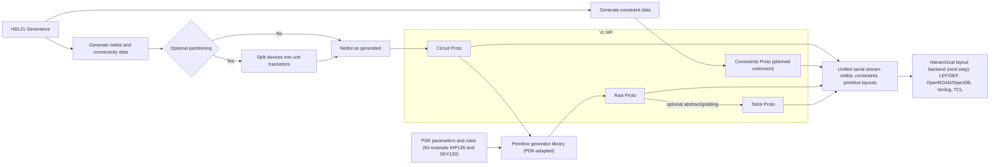

# Proto Flow (Draft)



## Primitive Generation Options (VLSIR Bridge View)

Status snapshot date: `2026-02-19`.

## Phase-1 Implementation Plan: Gate-Array NMOS Primitive (IHP130 First)

Goal: create a first programmable unit-device primitive that can be reused by analog PnR,
while prioritizing direct VLSIR serialization.

Scope for this phase:
- Build one generator for an NMOS cell with:
  - vertical gates,
  - configurable finger-count (default `8`),
  - an opposite-polarity dummy row in the complementary device region.
- Keep geometry in memory through KLayout Python API.
- Serialize directly to `vlsir.raw.Library` (`.pb` and `.pbtxt`) as the primary output.
- Allow GDS write only as optional debug output.

Planned code split:
- `flow/layout/layout.py`
  - Shared geometry helpers and layer handling.
  - Process presets (starting with `ihp130`).
  - KLayout `Layout` -> `vlsir.raw.Library` conversion.
  - Output helpers for protobuf bytes/text and optional debug GDS.
- `flow/layout/nmos.py`
  - `NmosUnitParams` configuration.
  - NMOS + opposite-doped dummy geometry generator.
  - Lightweight runnable entrypoint that emits a few example variants.

Geometry assumptions (phase-1):
- Cell height is parameterized by a 9-track model aligned to digital-cell style.
- The metric of interest is center-to-center distance from bottom M1 track to top M1 track.
- Device dimensions are intentionally constrained to regularized unit-style layout.
- This is a layout-automation primitive, not a full signoff-equivalent replacement for official
  PDK transistor cells.

Next planned extensions:
- PMOS twin generator.
- Technology presets for `tsmc65` and `tsmc28`.
- Export of abstract view (`raw.Abstract`) and LEF-oriented metadata from the same source.

Core `vlsir.layout.raw` targets for bridging:
- `Rect`: `Rectangle`
- `Poly`: `Polygon`
- `Path`: `Path`
- `Inst`: `Instance`
- `Text`: `TextElement`
- `Abs`: `Abstract` (`outline`, `ports`, `blockages`)

| Option | Language | Link | Status | Native Output / In-Process Format | `vlsir.raw` Coverage | VLSIR Bridge Effort | Open PDK Examples |
|---|---|---|---|---|---|---|---|
| BFG (C++) | C++ | https://github.com/growly/bfg | Active (pushed `2026-02-18`) | Direct `vlsir.raw.Library` + `vlsir.circuit.Package` (`.pb` / `.txt`) | Strong `Rect/Poly/Inst/Text/Abs`; paths typically polygonized | Low | Sky130 + GF180 generators |
| Layout21 (Rust) | Rust | https://github.com/dan-fritchman/Layout21 | Active-ish (pushed `2025-02-25`) | Native raw/tetris model + `gds2proto` / `proto2gds` converters | Full `Rect/Poly/Path/Inst/Text/Abs`, plus tetris | Very Low | Sky130 examples in converter tests/resources |
| Substrate2 | Rust | https://github.com/ucb-substrate/substrate2 | Active (pushed `2026-02-18`) | Native `layir`/`scir` IR + `gdsconv`; protobuf (`tonic/prost`) used for cache RPC | Good `Rect/Poly/Inst/Text`; no native `Path`; `Abs`/blockage conventions need adapter | Medium | Sky130 PDK crate and examples |
| GDSTK | C++ + Python | https://github.com/heitzmann/gdstk | Active (pushed `2026-01-27`) | C++/Python geometry for GDS/OASIS | Good `Rect/Poly/Path/Inst/Text`; `Abs` must be synthesized | Medium | PDK-agnostic (no built-in Sky130/IHP primitives) |
| StemCells concept (papers) | N/A (papers) | https://doi.org/10.1109/TVLSI.2021.3105028, http://purl.stanford.edu/mv779vk8233 | Research concept (no OSS code) | Algorithmic/template concept | Theoretical only | Very High | None (published concept) |
| ALIGN primitive generation | Python + C++ | https://github.com/ALIGN-analoglayout/ALIGN-public | Active (pushed `2026-01-13`) | SPICE + `.const.json` -> internal JSON + GDS | Practical via JSON/GDS (`Rect/Poly/Inst`); `Abs` partial | Medium-High | Mock FinFET + ALIGN PDK adapters; no first-class IHP/Sky130 primitive libs |
| MAGICAL + ConstGen | C++ + Python | https://github.com/magical-eda/MAGICAL | Lower activity (pushed `2024-04-24`) | Internal flow + output GDS + `.sym`/`.symnet` constraints | Mostly via post-conversion from GDS | High | Example analog circuits; no clear maintained IHP/Sky130 primitive path |
| GDSFactory core | Python | https://github.com/gdsfactory/gdsfactory | Very active (pushed `2026-02-19`) | Python component graph -> GDS/OASIS/etc + metadata | Strong `Rect/Poly/Path/Inst/Text`; `Abs` from ports + outlines with adapter | Medium-Low | Generic framework, many PDKs |
| GDSFactory IHP PDK (`cells` + `cells2`) | Python | https://github.com/gdsfactory/ihp | Active (pushed `2026-02-17`) | Pure Python parametric cells + wrapped legacy PyCells | Good direct mapping to `Rect/Poly/Path/Inst/Text`; `Abs` derivable | Medium-Low | IHP SG13G2 NMOS/PMOS/res/cap/others |
| GDSFactory Sky130 PDK | Python | https://github.com/gdsfactory/skywater130 | Active (pushed `2026-02-17`) | Python PCells on top of gdsfactory | Good direct mapping to raw primitives | Medium-Low | Sky130 NMOS/PMOS/caps/res/etc in `sky130/pcells` |
| Official IHP Open PDK (KLayout PyCells) | Python (KLayout) | https://github.com/IHP-GmbH/IHP-Open-PDK | Active preview (pushed `2026-02-17`) | KLayout tech + Python PyCells (`sg13g2_pycell_lib`) + GDS/LEF libs | Good via KLayout DB (`Rect/Poly/Path/Inst/Text`), `Abs` from pin/obs layers | Medium | IHP SG13G2 official primitives incl MOS/res/cap |
| Official SkyWater PDK | Mixed (Magic TCL + Python + collateral) | https://github.com/google/skywater-pdk | Maintained but older cadence (pushed `2024-10-28`), experimental-preview docs | Primitive libs + Magic TCL parameterized generators + fixed collateral | Mostly post-generated GDS conversion; limited native Python PCell path | High | SKY130 official primitive libs; wrappers commonly via other tools |
| KLayout PyPI API (`klayout.db`) | Python (C++ backend) | https://www.klayout.org/klayout-pypi | Active (KLayout pushed `2026-02-14`) | Python geometry DB API (subset of full KLayout) | Strong `Rect/Poly/Path/Inst/Text`; `Abs` requires convention/adapter | Medium-Low | Tooling used by IHP Open PDK and many custom scripts |
| ciccreator | C++ | https://github.com/wulffern/ciccreator | Active-ish (pushed `2025-06-22`) | Custom `*.cic` format (README: GDS/SPICE removed; use `cicpy` converters) | Indirect via conversion pipeline | High | Some Sky130-related ecosystem mention (`aicex`) |
| BAG (Blue Cheetah) | Python | https://github.com/bluecheetah/bag | Active-ish (pushed `2024-07-24`) | OA-centric analog generator flow | Potentially high, but requires custom OA->VLSIR bridge | High | Mostly non-open/ NDA PDK usage patterns |
| Laygo2 | Python | https://github.com/niftylab/laygo2 | Maintenance mode (README note since Sep 2024; pushed `2025-06-22`) | Grid/template-based Python layout generation | Good geometry-level mapping; abstract metadata custom | Medium | Open examples exist; no strong official IHP/Sky130 primitive stack |

### Notes
- `substrate2` does use protobuf, but for cache RPC (`libs/cache/proto/*.proto` + `tonic/prost` codegen), not as a VLSIR-like circuit/layout interchange schema.
- For your immediate goal (unit NMOS/PMOS + resistor + MOM/MIM cap footprints), the lowest-friction paths are:
  1. `IHP` and `skywater130` gdsfactory PDKs (Python-first),
  2. official IHP KLayout PyCells,
  3. direct KLayout PyPI API for custom generators.
- BFG/Layout21 are the strongest references for **native VLSIR-first** layout serialization, but are not drop-in PDK primitive providers for your exact device set.

## Primitive Drawing Command Comparison (Generator-Level)

Expanded scan scope for this table:
- `BFG`: `libs/bfg/src/**/*.cc`, `libs/bfg/src/**/*.h`
- `IHP PyCells`: `libs/IHP/ihp/cells2/ihp_pycell/**/*.py`
- `IHP GDSFactory PCells`: `libs/IHP/ihp/cells/**/*.py`, `libs/IHP/ihp/cells2/**/*.py`
- `KLayout API check`: runtime introspection via `uv run python` on `klayout.db` (PyPI package)

Top API counts from the expanded scan:
- `BFG`: `AddRectangle (221)`, `SetActiveLayerByName (137)`, `MakeVia (88)`, `AddPolygon (81)`, `SavePoint (57)`
- `IHP PyCells`: `dbCreateRect (473)`, `dbCreatePolygon (192)`, `dbCreateRectArray (134)`, `dbCreateLabel (79)`, `MkPin (63)`
- `IHP GDSFactory`: `components.rectangle (176)`, `add_ref (160)`, `add_port (97)`, `add_label (39)`, `boolean (15)`

### BFG Primitive Library Layering (`libs/bfg/src/layout.h`)

| Library layer | Representative API |
|---|---|
| Core geometry insertion | `AddRectangle`, `AddSquare`, `AddPolygon`, `AddPolyLine`, `AddInstance` |
| Rule-aware metal/via helpers | `MakeVia`, `MakeViaEncap`, `DistributeVias`, `StampVias`, `MakeWire`, `MakeAlternatingWire` |
| Pin/port helpers | `MakePin`, `MakePort`, `AddRectangleAsPort`, `AddSquareAsPort`, `AddPort` |
| Context/anchor helpers | `SetActiveLayerByName`, `SavePoint`, `SavePoints` |

### Transistor Generator Leaf Audit

Audit scope:
- FRIDA KLayout PyPI: `flow/layout/nmos.py`, `flow/layout/layout.py`
- Layout21: API and schema capability review from `layout21raw` and `layout21tetris`
- BFG: `libs/bfg/src/atoms/sky130_simple_transistor.cc`
- IHP PyCells: `libs/IHP/ihp/cells2/ihp_pycell/nmos_code.py`, `libs/IHP/ihp/cells2/ihp_pycell/pmos_code.py`
- IHP GDSFactory: `libs/IHP/ihp/cells/fet_transistors.py`, wrapper path `libs/IHP/ihp/cells2/mos_transistors.py`

Legend:
- `✅` API/function family is available in the library
- `⚠️` partial support or composition required
- `❌️` not available as a first-class API item
- `🍂` function family used in primitive-cell generators

Note: this matrix is API-capability based. `🍂` marks APIs that are used in
primitive-cell generators.

| Primitive API family | FRIDA KLayout PyPI | VLSIR raw | Layout21 | BFG | IHP PyCells | IHP GDSFactory |
|---|---|---|---|---|---|---|
| Layer targeting or active layer context | ✅ 🍂 layer selection with `layout.layer` and `cell.shapes` | ✅ 🍂 layer tags with `raw.LayerShapes.layer.number` and `raw.LayerShapes.layer.purpose` | ✅ APIs `layout21raw::Layers::add`, `layout21raw::Layers::get_or_insert`, `layout21raw::Element.layer`, `layout21raw::Element.purpose` | ✅ 🍂 layer selection with `SetActiveLayerByName` | ✅ 🍂 layer objects with `Layer` | ✅ 🍂 per-shape layer assignment with `add_polygon` |
| Rectangle primitive | ✅ 🍂 rectangle insertion with `insert_box_um` and `kdb.Box` | ✅ 🍂 rectangles with `raw.LayerShapes.rectangles` | ✅ APIs `layout21raw::Rect`, `layout21raw::Shape::Rect` | ✅ 🍂 rectangle insertion with `AddRectangle` | ✅ 🍂 rectangle insertion with `dbCreateRect` | ⚠️ 🍂 rectangle geometry emitted as polygon with `_add_rect` and `add_polygon` |
| Polygon primitive | ❌️ polygon drawing via `kdb.Polygon` not used in primitive-cell generators | ✅ 🍂 polygons with `raw.LayerShapes.polygons` | ✅ APIs `layout21raw::Polygon`, `layout21raw::Shape::Polygon` | ❌️ `AddPolygon` not used in primitive-cell generators | ❌️ `dbCreatePolygon` not used in primitive-cell generators | ✅ 🍂 polygon insertion with `add_polygon` |
| Path primitive | ❌️ path drawing via `kdb.Path` not used in primitive-cell generators | ✅ paths with `raw.LayerShapes.paths` | ✅ APIs `layout21raw::Path`, `layout21raw::Shape::Path` | ✅ 🍂 poly gate path with `AddPolyLine` | ❌️ `dbCreatePath` not used in primitive-cell generators | ❌️ `gf.Path`, `path.extrude` not used in primitive-cell generators |
| Text label primitive | ✅ 🍂 label insertion with `insert_text_um` and `kdb.Text` | ✅ 🍂 annotations with `raw.Layout.annotations` | ✅ APIs `layout21raw::TextElement`, `layout21raw::Layout.annotations` | ❌️ text API not used in primitive-cell generators | ✅ 🍂 labels with `dbCreateLabel` | ❌️ `add_label` not used in primitive-cell generators |
| Boolean geometry | ❌️ boolean geometry APIs not used in primitive-cell generators | ❌️ no boolean geometry primitive in `vlsir.raw` | ❌️ no boolean API in `layout21raw` | ❌️ boolean geometry APIs not used in primitive-cell generators | ❌️ boolean geometry APIs not used in primitive-cell generators | ❌️ `boolean` not used in primitive-cell generators |
| Size or offset grow-shrink operation | ❌️ region sizing APIs not used in primitive-cell generators | ❌️ no grow-shrink primitive in `vlsir.raw` | ⚠️ APIs `layout21raw::Point::shift`, `layout21raw::Transform`, `layout21raw::BoundBox::expand`; no direct shape grow-shrink API | ❌️ sizing APIs not used in primitive-cell generators | ❌️ `dbLayerSize` not used in primitive-cell generators | ❌️ sizing APIs not used in primitive-cell generators |
| Hierarchical instance insertion | ❌️ hierarchy APIs not used in primitive-cell generators | ✅ instances with `raw.Layout.instances` | ✅ APIs `layout21raw::Instance`, `layout21raw::Layout.insts`, `layout21tetris::Layout.instances` | ❌️ instance insertion APIs not used in primitive-cell generators | ❌️ instance insertion APIs not used in primitive-cell generators | ❌️ `add_ref` not used in primitive-cell generators |
| Rectangle-array convenience primitive | ❌️ rectangle-array convenience APIs not used in primitive-cell generators | ⚠️ repeated rectangles with `raw.LayerShapes.rectangles` | ❌️ no dedicated rectangle-array API in `layout21raw` | ❌️ rectangle-array convenience APIs not used in primitive-cell generators | ❌️ `dbCreateRectArray` not used in primitive-cell generators | ❌️ rectangle-array convenience APIs not used in primitive-cell generators |
| Via or contact array helper | ⚠️ 🍂 manual repeated contacts with `draw_contact_with_optional_strap` | ⚠️ 🍂 repeated cuts with `raw.LayerShapes.rectangles` | ❌️ no dedicated via-array API in `layout21raw` | ❌️ via-array helper APIs not used in primitive-cell generators | ✅ 🍂 contact arrays with `contactArray` | ✅ 🍂 contact arrays with `_place_contacts` |
| Instance-array placement primitive | ❌️ instance-array APIs not used in primitive-cell generators | ⚠️ repeated instances with `raw.Layout.instances` | ⚠️ API `layout21tetris::array` exists for array modeling; no dedicated raw array field | ❌️ instance-array APIs not used in primitive-cell generators | ❌️ instance-array APIs not used in primitive-cell generators | ❌️ instance-array APIs not used in primitive-cell generators |
| Square convenience primitive | ⚠️ 🍂 square cuts and pads composed with `draw_contact_cut` and `draw_metal_pad` | ⚠️ squares represented as `raw.LayerShapes.rectangles` | ❌️ no dedicated square API in `layout21raw`; use `layout21raw::Rect` | ❌️ square convenience APIs not used in primitive-cell generators | ❌️ square convenience APIs not used in primitive-cell generators | ❌️ square convenience APIs not used in primitive-cell generators |
| Polyline inflation to polygon helper | ❌️ polyline-inflation APIs not used in primitive-cell generators | ⚠️ path or polygon encoding with `raw.LayerShapes.paths` and `raw.LayerShapes.polygons` | ✅ API `layout21raw::ShapeTrait::to_poly` | ✅ 🍂 polyline to polygon behavior via `AddPolyLine` | ❌️ polyline-inflation APIs not used in primitive-cell generators | ❌️ polyline-inflation APIs not used in primitive-cell generators |
| Single via primitive helper | ⚠️ 🍂 via semantics composed with `draw_contact_cut` and `draw_metal_pad` | ⚠️ via cuts and enclosures encoded as `raw.LayerShapes.rectangles` | ⚠️ APIs `layout21tetris::Layout::cut`, `layout21tetris::stack::cut`; partial via support | ❌️ `MakeVia`, `MakeViaEncap` not used in primitive-cell generators | ❌️ `StdVia` not used in primitive-cell generators | ❌️ single-via helper APIs not used in primitive-cell generators |
| Rule-aware wiring helper | ⚠️ 🍂 rails and straps from tech-derived dimensions with `derive_nmos_geometry` and `draw_horizontal_rail` | ❌️ no rule-aware wiring primitive in `vlsir.raw` | ✅ APIs `layout21tetris::Layout::assign`, `layout21tetris::tracks::set_net`, `layout21tetris::tracks::cut_or_block`, `layout21tetris::placer::Placer::place` | ❌️ rule-aware wiring APIs not used in primitive-cell generators | ❌️ rule-aware wiring APIs not used in primitive-cell generators | ❌️ rule-aware wiring APIs not used in primitive-cell generators |
| Pin or port declaration primitive | ⚠️ 🍂 pin markers and labels with `draw_rect` and `draw_label` | ✅ ports with `raw.Abstract.ports` and `raw.AbstractPort.shapes` | ✅ APIs `layout21raw::AbstractPort::new`, `layout21raw::Abstract.ports` | ❌️ pin/port APIs not used in primitive-cell generators | ✅ 🍂 pin declaration with `MkPin` | ✅ 🍂 port declaration with `add_port` |
| Net or global-net annotation primitive | ❌️ net-annotation APIs not used in primitive-cell generators | ✅ net names with `raw.Rectangle.net` and `raw.Polygon.net` | ✅ API `layout21raw::Element.net` | ❌️ `AddGlobalNet`, `LabelNet` not used in primitive-cell generators | ❌️ net-annotation APIs not used in primitive-cell generators | ❌️ net-annotation APIs not used in primitive-cell generators |
| Named anchor or landmark save-lookup | ❌️ named-anchor APIs not used in primitive-cell generators | ✅ named marks can be carried as `raw.Layout.annotations` | ❌️ no named-anchor API in `layout21raw`; fallback text API `layout21raw::TextElement` | ✅ 🍂 named landmarks saved with `SavePoint` | ❌️ named-anchor APIs not used in primitive-cell generators | ❌️ named-anchor APIs not used in primitive-cell generators |
| Transform helpers move rotate mirror | ❌️ transform helper APIs not used in primitive-cell generators | ⚠️ instance transforms with `raw.Instance.origin_location`, `raw.Instance.reflect_vert`, and `raw.Instance.rotation_clockwise_degrees` | ✅ APIs `layout21raw::Transform::translate`, `layout21raw::Transform::rotate`, `layout21raw::Transform::reflect_vert`, `layout21raw::Transform::cascade`, `layout21raw::Point::transform` | ❌️ transform helper APIs not used in primitive-cell generators | ❌️ `dbMoveFig` not used in primitive-cell generators | ❌️ transform helper APIs not used in primitive-cell generators |
| Copy or merge layout helpers | ❌️ copy/merge APIs not used in primitive-cell generators | ❌️ no copy-merge primitive in `vlsir.raw` | ❌️ no dedicated copy API in `layout21raw`; use Rust clone patterns | ❌️ copy/merge APIs not used in primitive-cell generators | ❌️ copy/merge APIs not used in primitive-cell generators | ❌️ copy/merge APIs not used in primitive-cell generators |
| Delete geometry helper | ❌️ delete APIs not used in primitive-cell generators | ❌️ no delete primitive in `vlsir.raw` | ❌️ no dedicated delete API in `layout21raw`; use vector mutation | ❌️ delete APIs not used in primitive-cell generators | ❌️ `dbDeleteObject` not used in primitive-cell generators | ❌️ delete APIs not used in primitive-cell generators |
| Donut or hole polygon primitive | ❌️ donut/hole APIs not used in primitive-cell generators | ❌️ no hole primitive in `vlsir.raw.Polygon` | ❌️ no hole API in `layout21raw::Polygon` | ❌️ donut/hole APIs not used in primitive-cell generators | ❌️ `dbCreateDonut` not used in primitive-cell generators | ❌️ donut/hole APIs not used in primitive-cell generators |

## Design Rule / PDK-Dimension Matrix (Tool Columns)

Legend: ✅ = directly supported in spec/parser, ⚠️ = partial/indirect, ❌️ = not first-class.

`tech.proto` today is mostly a layer catalog: `Technology` with `LayerInfo` entries (`name`, `index`, `sub_index`) and a `LayerPurpose` type (`LABEL`, `DRAWING`, `PIN`, `OBSTRUCTION`, `OUTLINE`). It does not yet include rule-deck dimensions such as pitch/width/spacing/enclosure.

| Rule / Dimension (Y-axis) | CICC / ciccreator | ALIGN | MAGICAL | TECHLEF + OpenROAD |
|---|---|---|---|---|
| Layer map (`name -> gds_layer/datatype/purpose`) | ✅ (`examples/tech.json` + `Rules::setRules`) | ✅ (`layers.json`: `GdsLayerNo`, `GdsDatatype`) | ✅ (`techfile.simple` + LEF layer names) | ✅ (`LAYER`, LEF layer purposes; OpenROAD consumes LEF/DEF) |
| Connectivity stack (prev/next layer) | ✅ (`layers.previous/next`) | ✅ (`Stack` in via layers) | ⚠️ (from LEF/via defs) | ✅ (`VIA`, `VIARULE`, layer topology) |
| Routing direction per metal | ⚠️ (not explicit in rules table) | ✅ (`Direction`) | ✅ (`DIRECTION` in LEF) | ✅ (`DIRECTION` in TECHLEF) |
| Routing pitch per layer | ⚠️ (global `ROUTE.horizontalgrid/verticalgrid`) | ✅ (`Pitch`) | ✅ (`PITCH`) | ✅ (`PITCH`) |
| Routing offset per layer | ⚠️ (route-track options, global grid) | ✅ (`Offset`) | ⚠️ (router grid offsets in flow) | ✅ (`OFFSET`, track patterns) |
| Min width / nominal width | ✅ (`width`, `ana_width`, `cap_width`) | ✅ (`Width`) | ✅ (`WIDTH`) | ✅ (`WIDTH`, `MAXWIDTH`) |
| Min spacing | ✅ (`space`) | ✅ (`Space` or `Width[]/Space[]`) | ✅ (`SPACING`) | ✅ (`SPACING`) |
| Width-dependent spacing table | ❌️ | ⚠️ (list-valued width/space, not full PRL table) | ✅ (`SPACINGTABLE`) | ✅ (`SPACINGTABLE PARALLELRUNLENGTH`) |
| End-of-line / min-step style rules | ❌️ | ⚠️ (`EndToEnd`, `MinL`) | ✅ (`SPACING ... ENDOFLINE`, `MINSTEP`) | ✅ (`ENDOFLINE`, `MINSTEP` where provided) |
| Min length / min area | ⚠️ (`mingatelength` for poly/gates) | ✅ (`MinL`, optional `MaxL`) | ⚠️ (`AREA` in LEF, no generic MinL for all layers) | ✅ (`AREA`, `MINIMUMCUT`, layer checks) |
| Via cut size + spacing | ✅ (`VIA*.width/height/space`) | ✅ (`WidthX/Y`, `SpaceX/Y`) | ✅ (`VIA` geometry + spacing) | ✅ (`VIA` definitions + via-layer `SPACING/WIDTH`) |
| Via enclosure (directional/asymmetric) | ✅ (`*enclosure`, `*encOpposite`) | ✅ (`VencA_*`, `VencP_*`) | ⚠️ (from LEF `VIA` geometry) | ✅ (`ENCLOSURE BELOW/ABOVE`, `PREFERENCLOSURE`) |
| Multi-cut / adjacent-cut constraints | ⚠️ (route options: `Ncuts`, `Nvcuts`) | ⚠️ (can express arrays; no explicit ADJACENTCUTS construct) | ✅ (via cut tables in params + LEF via options) | ✅ (`ADJACENTCUTS`, `MINIMUMCUT`) |
| Manufacturing grid / DBU | ✅ (`gamma`, `grid`) | ✅ (`ScaleFactor`) | ✅ (`DATABASE MICRONS`, tool DBU) | ✅ (`UNITS`, `MANUFACTURINGGRID`) |
| FEOL primitive process rules | ✅ (`mingatelength`, `fingerspace`, implant enclosure) | ⚠️ (mostly in primitive generators; not only in `layers.json`) | ⚠️ (in device generator/glovar and PDK libs) | ❌️/⚠️ (TECHLEF is mainly BEOL + abstracted constraints) |
| RC parasitics in technology description | ❌️ | ✅ (`UnitR`, `UnitC`, `UnitCC`) | ⚠️ (not strongly represented in shown mock files) | ⚠️/✅ (TECHLEF may include resistance/cap fields by PDK) |
| Antenna rule metadata | ⚠️ (route option named `antenna`, not full rule deck) | ❌️ | ❌️ | ✅ (`ANTENNA*` fields in TECHLEF) |
| Density / CMP-related rules | ❌️ | ❌️ | ❌️ (not in mock files) | ⚠️ (possible in broader decks; not always in minimal tech LEF) |

## Design Constraint Matrix (Tool Columns)

Legend: ✅ = first-class constraint/support, ⚠️ = indirect or limited, ❌️ = missing.

| Constraint / Intent (Y-axis) | CICC / ciccreator | ALIGN | MAGICAL | OpenROAD |
|---|---|---|---|---|
| Device symmetry pairs | ⚠️ (manual by placement/patterning) | ✅ (`SymmetricBlocks`) | ✅ (`.sym` pairs + auto ConstGen/S3DET) | ❌️ (no generic analog pair constraint) |
| Self-symmetry | ⚠️ | ✅ (single-element pair form) | ✅ (`.sym` single-token/self forms) | ❌️ |
| Net symmetry | ⚠️ (manual routed intent) | ✅ (`SymmetricNets`) | ✅ (`.symnet`) | ❌️/⚠️ (mirrored IO pins only at boundary) |
| Group / virtual hierarchy | ⚠️ (cell composition) | ✅ (`GroupBlocks`) | ⚠️ (hierarchy exists; no rich user schema) | ⚠️ (groups/partitions exist but not analog semantic groups) |
| Common-centroid / interdigitated capacitor intent | ⚠️ (`PatternCapacitor` style + script conventions) | ✅ (`GroupCaps`) | ⚠️ (possible by generator style, not rich declarative schema) | ❌️ |
| Relative order constraints | ⚠️ (manual placement scripts) | ✅ (`Order`) | ❌️ | ❌️ |
| Edge/center alignment constraints | ⚠️ | ✅ (`Align`) | ❌️ | ❌️ |
| Floorplan row/column composition | ⚠️ | ✅ (`Floorplan`, `AlignInOrder`) | ⚠️ (placer boundary and hierarchy, but not ALIGN-style schema) | ⚠️ (`initialize_floorplan` for coarse die/core setup) |
| Aspect ratio bounds | ❌️ | ✅ (`AspectRatio`) | ❌️ | ⚠️ (floorplan aspect ratio at block/core level) |
| Boundary and halo constraints | ⚠️ (manual boundary + spacing) | ✅ (`Boundary`) | ⚠️ (boundary legalization in flow) | ✅ (`initialize_floorplan`, blockages/regions) |
| Place-on-grid legality | ✅ (route grid + track options) | ✅ (`PlaceOnGrid`) | ✅ (`gridStep`, simple tech) | ✅ (site/row/track based legality) |
| Port/pin location constraints | ✅ (`addPortOnEdge`, route-path directives) | ✅ (`PortLocation`) | ⚠️ (IO handling in placer/router flow) | ✅ (`set_io_pin_constraint`, `place_pin(s)`) |
| Fixed instance placement | ✅ (`moveTo`/explicit placement scripts) | ⚠️ (can encode via constraints and generated placement) | ✅ (placer outputs explicit coords) | ✅ (`place_inst`) |
| Inter-block distance constraints | ⚠️ | ✅ (`BlockDistance`, `HorizontalDistance`, `VerticalDistance`) | ⚠️ (proximity/sigpath heuristics) | ⚠️ (regions/blockages, not direct analog pair-distance class) |
| Guard ring intent | ✅ (`addGuard`) | ✅ (`GuardRing`) | ⚠️ (psub/nwell handling; no rich high-level declarative guard schema) | ❌️/⚠️ (manual geometry only) |
| Cap grouping with explicit ratios | ⚠️ | ✅ (`GroupCaps` with `num_units`) | ⚠️ (device gen can create cap structures) | ❌️ |
| Net routing layer bounds | ⚠️ (`startLayer`, `stopLayer` route options) | ✅ (`Route{min_layer,max_layer}`) | ⚠️ (router tech constraints; limited per-net declarative support) | ⚠️ (global layer control; not rich per-net analog schema) |
| Multi-wire / multi-track routing intent | ⚠️ (`routeWidth`, `cuts`, `vcuts`, `trackN`) | ✅ (`MultiConnection`, `Route customize`) | ⚠️ (wire/via width/cuts by net class tables) | ⚠️ (`create_ndr`/`assign_ndr`, `critical_nets_percentage`) |
| Shielded-net intent | ❌️/⚠️ (manual) | ✅ (`NetConst.shield`, route customize) | ❌️/⚠️ | ⚠️ (OpenDB special-wire shield APIs; no simple high-level flow primitive) |
| Critical-net priority | ⚠️ (manual route staging) | ✅ (`NetPriority`, `NetConst.criticality`) | ⚠️ (limited net weighting) | ⚠️ (`global_route -critical_nets_percentage`, net subsets) |
| Do-not-route nets | ❌️ | ✅ (`DoNotRoute`) | ❌️ | ⚠️ (`set_nets_to_route` as allow-list workaround) |
| Power/ground/clock role declaration | ⚠️ (net naming and routing scripts) | ✅ (`PowerPorts`, `GroundPorts`, `ClockPorts`) | ✅ (net-type marking in DB) | ✅ (power/clock constraints mostly via SDC/PDN/flow setup) |
| Charge/current-flow weighted objectives | ❌️ | ✅ (`ChargeFlow`) | ⚠️ (signal-path files and weighting hooks) | ❌️ |
| Hierarchical constraint propagation | ⚠️ (script-level) | ✅ (`translator.py`, propagated constraints) | ⚠️ (hierarchical flow with generated `.sym/.symnet`) | ⚠️ (hierarchical design handling, not analog-constraint propagation schema) |

## Literature-Grounded Constraint Priorities (Wei + Fritchman Ch. 7)

- Hard classes to preserve: `technological constraints` (DRC) and `functional constraints` (post-layout performance).
- Geometric constraints to carry explicitly: symmetry (devices and nets), proximity, routing shielding, wire widening/multi-wire for critical current paths, common-centroid/interdigitation where needed, and flexible floorplanning.
- ALIGN-centric practical list from Fritchman Ch.7: virtual hierarchy (`Group`), symmetry, `Order`/`Align`/`Floorplan`, route-layer requests, and multi-track routing requests.

## Evidence: Examples + Ingest Code Paths

- `ciccreator` rule ingestion and use:
  - `libs/ciccreator/cic-core/src/core/rules.cpp`
  - `libs/ciccreator/cic-core/src/core/layoutcell.cpp`
  - `libs/ciccreator/cic-core/src/core/route.cpp`
  - `libs/ciccreator/examples/tech.json`
- `ALIGN` constraint and PDK ingestion:
  - `libs/ALIGN-public/align/schema/constraint.py`
  - `libs/ALIGN-public/align/schema/pdk.py`
  - `libs/ALIGN-public/align/pdk/finfet/layers.json`
  - `libs/ALIGN-public/align/pnr/write_constraint.py`
  - `libs/ALIGN-public/examples/**/*.const.json`
- `MAGICAL` constraint/tech ingestion:
  - `libs/MAGICAL/flow/python/Constraint.py`
  - `libs/MAGICAL/flow/python/Placer.py`
  - `libs/MAGICAL/flow/python/PnR.py`
  - `libs/MAGICAL/examples/mockPDK/mock.lef`
  - `libs/MAGICAL/examples/mockPDK/techfile.simple`
  - `libs/MAGICAL/examples/**/*.sym`, `libs/MAGICAL/examples/**/*.symnet`
- `TECHLEF/OpenROAD` references:
  - `libs/IHP-Open-PDK/ihp-sg13g2/libs.ref/sg13g2_stdcell/lef/sg13g2_tech.lef`
  - `libs/OpenROAD/src/ppl/README.md`
  - `libs/OpenROAD/src/ifp/README.md`
  - `libs/OpenROAD/src/grt/README.md`
  - `libs/OpenROAD/src/odb/README.md`
- Literature scans used for prioritization:
  - `lit/2021_PH_Wei_thesis_analog_PnR.pdf` (Chapter 2 + constraints taxonomy)
  - `lit/2021_PH_Wei_B_Murmann_VLSI_analog_PnR.pdf`
  - `lit/2023_D_Fritchman_analog_EDA.pdf` (Chapter 7, ALIGN/ AlignHdl21 constraints)

## VLSIR Schema Additions Needed (Tech Rules + Constraints)

Current gap: existing `vlsir.tech.Technology` captures layer identity, but not enough rule detail to drive generator- or PnR-level constraint translation across `ciccreator`, `ALIGN`, and `MAGICAL`.

### 1) Extend `vlsir.tech` with executable rule dimensions

```proto
// Sketch only (not yet implemented)
message RuleDeck {
  GridSpec grid = 1;
  repeated RoutingLayerRule routing_layers = 10;
  repeated ViaRule via_rules = 11;
  repeated PrimitiveRule primitive_rules = 12;
  repeated NetClassRule net_classes = 13;
  repeated AntennaRule antenna_rules = 14;
  repeated DensityRule density_rules = 15;
}

message GridSpec {
  int64 db_unit_nm = 1;              // LEF DATABASE MICRONS equivalent
  int64 manufacturing_grid_nm = 2;   // LEF MANUFACTURINGGRID
  int64 route_grid_h_nm = 3;         // CICC ROUTE.horizontalgrid
  int64 route_grid_v_nm = 4;         // CICC ROUTE.verticalgrid
}

message RoutingLayerRule {
  string name = 1;
  enum Direction { H = 0; V = 1; }
  Direction direction = 2;
  int64 pitch_nm = 3;
  int64 offset_nm = 4;
  repeated int64 width_nm = 5;       // supports scalar or table
  repeated int64 space_nm = 6;       // supports scalar or table
  int64 min_length_nm = 7;
  int64 max_length_nm = 8;
  int64 min_end_to_end_nm = 9;
  int64 min_area_nm2 = 10;
  int64 min_step_nm = 11;
  RcRule rc = 12;                    // UnitR/UnitC/UnitCC style fields
}

message ViaRule {
  string name = 1;
  string lower_layer = 2;
  string upper_layer = 3;
  int64 cut_w_nm = 4;
  int64 cut_h_nm = 5;
  int64 cut_space_x_nm = 6;
  int64 cut_space_y_nm = 7;
  int64 enc_l_x_nm = 8;
  int64 enc_l_y_nm = 9;
  int64 enc_h_x_nm = 10;
  int64 enc_h_y_nm = 11;
  int32 min_cuts = 12;               // MINIMUMCUT-style
  int32 adj_cuts = 13;               // ADJACENTCUTS-style
}

message PrimitiveRule {
  enum DeviceKind { MOS = 0; RES = 1; CAP = 2; }
  DeviceKind kind = 1;
  string subtype = 2;                // nmos/pmos/mom/mim/polyres/...
  int64 gate_min_l_nm = 10;
  int64 finger_pitch_nm = 11;
  int64 gate_extension_nm = 12;
  int64 implant_enclosure_nm = 13;
  int64 contact_enclosure_nm = 14;
}

message NetClassRule {
  string name = 1;                   // signal_analog/power/clock/cap_critical/...
  int64 width_nm = 2;
  int64 spacing_nm = 3;
  int32 via_rows = 4;
  int32 via_cols = 5;
}
```

Minimum reason this is required:
- Captures CICC-style rule scalars (`width/space/enclosure/encOpposite`, route grids).
- Captures ALIGN-style structured layer/via/RC fields (`Pitch/Width/MinL/EndToEnd`, `SpaceX/WidthX/Venc*`, `UnitR/C/CC`).
- Captures MAGICAL/TECHLEF route-rule fields and net-class width/cut policies.

### 2) Add a dedicated `vlsir.constraints` package

```proto
// Sketch only (not yet implemented)
package vlsir.constraints;

message ConstraintLibrary {
  string domain = 1;
  repeated ModuleConstraints modules = 2;
}

message ModuleConstraints {
  vlsir.utils.Reference module = 1;
  repeated Constraint constraints = 2;
}

message Constraint {
  string name = 1;
  enum Strength { HARD = 0; SOFT = 1; }
  Strength strength = 2;
  int32 priority = 3;
  oneof kind {
    SymmetricBlocks symmetric_blocks = 10;
    SymmetricNets symmetric_nets = 11;
    GroupBlocks group_blocks = 12;
    GroupCaps group_caps = 13;
    Order order = 14;
    Align align = 15;
    Floorplan floorplan = 16;
    Boundary boundary = 17;
    AspectRatio aspect_ratio = 18;
    PlaceOnGrid place_on_grid = 19;
    PortLocation port_location = 20;
    Distance distance = 21;
    GuardRing guard_ring = 22;
    RouteConstraint route = 23;
    NetPriority net_priority = 24;
    MultiConnection multi_connection = 25;
    DoNotRoute do_not_route = 26;
    ChargeFlow charge_flow = 27;
    RolePorts role_ports = 28; // power/ground/clock
    FixedPlacement fixed_placement = 29;
  }
}
```

Required field coverage for concept completeness (informed by CICC/ALIGN/MAGICAL):
- Symmetry + matching: device pairs, self-symmetry, net-pair pin mapping, symmetry axis.
- Grouping + hierarchy: virtual groups and template/group names.
- Relative placement: order, alignment edge/center, row/column floorplan.
- Shape/outline controls: boundary, halo, aspect ratio, distance constraints.
- Grid legality: direction, pitch, legal offsets/scalings.
- Pin intent: side/region/location, mirrored/grouped IO where needed.
- Routing intent: min/max layers, width/spacing multiplier, shielding net, criticality, multi-wire multiplier, do-not-route lists.
- Analog structures: guard ring parameters and cap-group ratios/dummy policy.
- Objective metadata: hard/soft and priority, plus optional charge-flow waveforms.

### 3) Translator Interface Requirements (Hdl21 -> VLSIR -> OpenROAD/KLayout)

To avoid ad-hoc sidecars as the primary data model, each run should emit:
- `circuit.proto`: connectivity and parameters.
- `layout/raw.proto`: generated primitive or assembled geometry.
- `tech.proto` (extended): process dimensions/rules consumed by generators and route mapping.
- `constraints.proto` (new): placement/routing/matching intents.

Then use dedicated emitters:
- `VLSIR -> OpenROAD Tcl/SDC/DEF/ODB` emitters for actionable digital-PnR commands.
- `VLSIR -> KLayout` emitter for debug/inspection/DRC-oriented views.
- No requirement to emit native `ciccreator`/`ALIGN`/`MAGICAL` input files.

### 4) Proto-First Organization Rules

Goal: keep VLSIR canonical and tool-neutral; make tool files (`.tcl`, `.sdc`, `techlef`, etc.) generated artifacts.

- No OpenROAD-specific command semantics inside core constraint messages.
- Keep normalized engineering units in proto (nm, nm^2, enumerated directions, explicit axes).
- Keep logical intent separate from implementation strategy:
  - Intent: `SymmetricNets`, `GroupCaps`, `PlaceOnGrid`, `RouteConstraint`.
  - Strategy mapping: OpenROAD Tcl/OpenDB, ALIGN json, MAGICAL `.sym/.symnet`.
- Preserve hierarchy/scoping in proto, so emitters can target block-level or top-level flows without schema changes.
- Support lossless round-trip where possible: parse existing tool files into proto, then re-emit.

### 5) Near-Term Phasing

1. Freeze `vlsir.tech` and new `vlsir.constraints` message structure and field names.
2. Add validation tests using representative constraints drawn from `ciccreator`, `ALIGN`, and `MAGICAL` examples.
3. Build one-direction emitters:
   - `constraints.proto -> OpenROAD Tcl/SDC` (first target),
   - `tech.proto -> TECHLEF` subset (later target).
4. Keep external-format importers optional and out-of-scope for first implementation.
