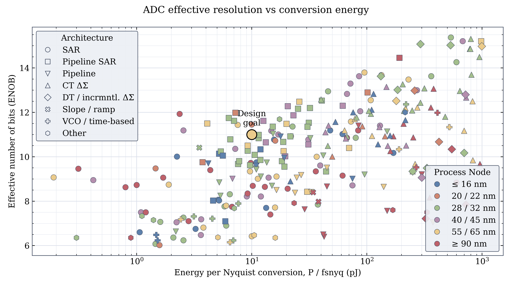
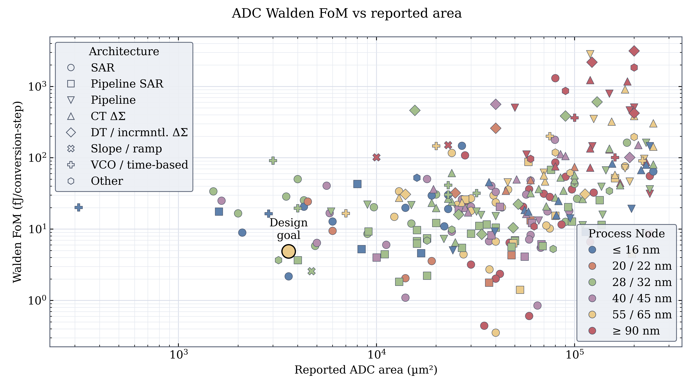
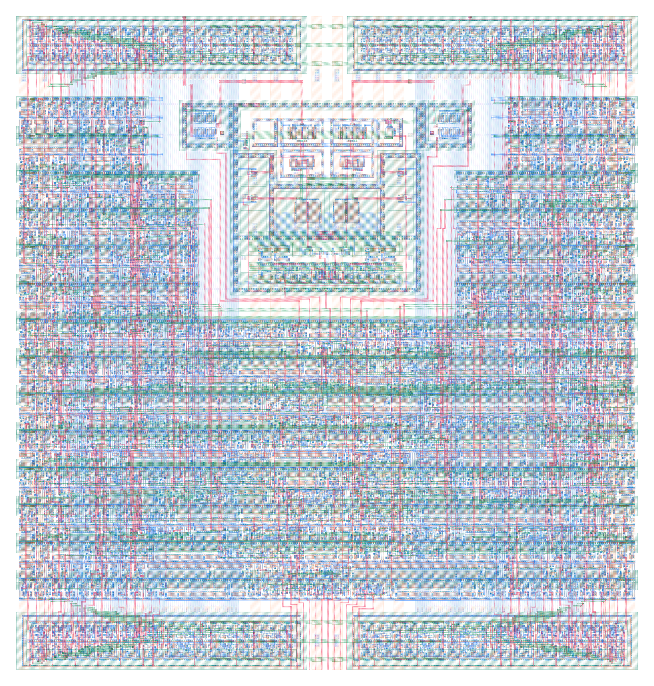
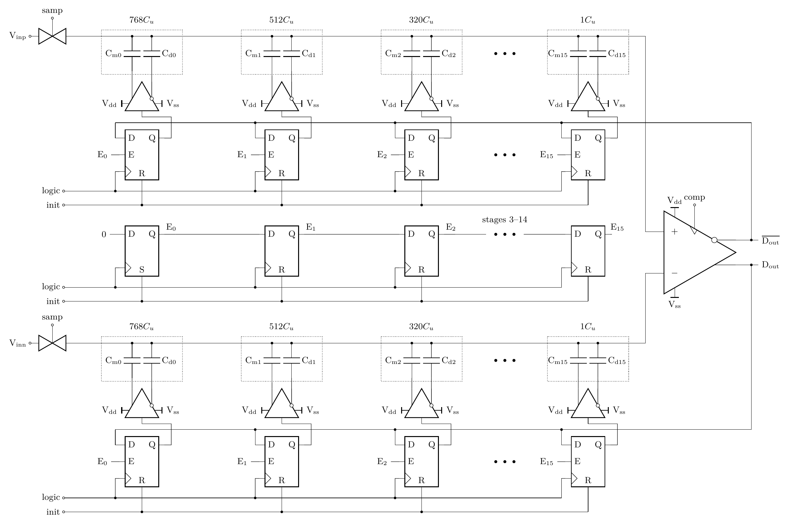
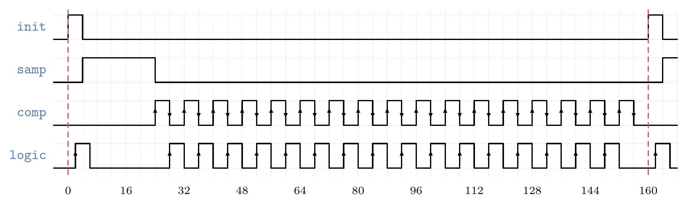
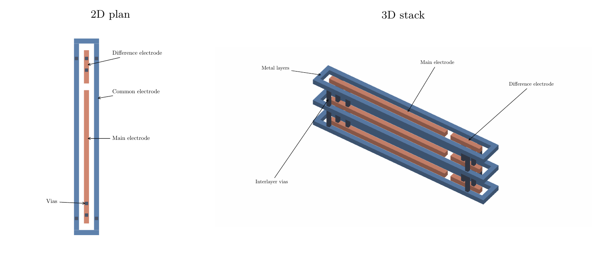

# FRIDA: a compact ADC for high frame rate scientific imaging

Scientific imaging increasingly requires detectors that combine rapid, continuous acquisition with sensitivity to weak signals and sufficient dynamic range to resolve intense features. In four-dimensional scanning transmission electron microscopy (4D-STEM), a diffraction pattern is acquired at every probe position, making detector throughput a direct constraint on acquisition time and accessible experiments. The [4D Camera](https://arxiv.org/abs/2305.11961), for example, operates a 576 × 576 pixel array at 87,000 frames per second. A related requirement arises in X-ray imaging at diffraction-limited synchrotrons and free-electron lasers operating in continuous-wave mode: [CoRDIA](https://doi.org/10.1088/1748-0221/19/03/C03006) targets continuous acquisition at approximately 150,000 frames per second, with single-photon sensitivity and a dynamic range of several thousand photons. High frame rate optical imaging presents comparable readout challenges, as illustrated by [Cai et al.'s 1.3-megapixel, 34,700-frame-per-second imager](https://imagesensors.org/2021-papers/). Ultrafast electron diffraction provides another application for sensitive electron detection, although its femtosecond temporal resolution comes from the pump–probe experiment and should be distinguished from the detector's frame rate, as described for [SLAC's MeV-UED instrument](https://lcls.slac.stanford.edu/instruments/mev-ued/run6sc).

These applications share a readout bottleneck: the analog-to-digital converters (ADCs) must digitize large pixel arrays without excessive power dissipation or silicon area. The required aggregate conversion rate is R = N_pixels × f_frame. As an illustrative scaling example, a 512 × 512 array at 100,000 frames per second produces 26.2 billion pixel samples per second, requiring at least approximately 2,622 ADC channels operating at 10 MS/s if each pixel is sampled once. At 1 mW per channel, the ADCs alone would dissipate approximately 2.6 W. Particle fluence, pixel area, and integration time determine the mean occupancy through n = Φ × A_pixel × T_int; the deposited charge and front-end gain then determine the required input range and resolution. The Walden figure of merit, FoM_W = P / (f_s × 2^ENOB), expresses the resulting efficiency requirement. At 10 MS/s and 11 effective bits, a 1 mW ceiling corresponds to approximately 49 fJ per conversion step, while a more ambitious 100 µW target corresponds to approximately 4.9 fJ per conversion step.

Figure 1a. Effective resolution versus conversion energy in the [Murmann ADC performance survey](https://github.com/bmurmann/ADC-survey). This existing plot provides the efficiency context; the FRIDA marker denotes the original 100 µW, 11-ENOB design target, rather than a measured operating point.

FRIDA addresses this requirement with a differential successive-approximation-register (SAR) ADC in 65 nm CMOS, designed for a nominal 12-bit output at up to 10 MS/s, a channel area below 5,000 µm², and power below 1 mW per channel. Its central contribution is the combination of a compact capacitor implementation, redundant conversion, and digital control suitable for dense replication. Area is essential to this argument: an efficient ADC that occupies too much silicon cannot be distributed throughout a tightly constrained detector readout. The area comparison therefore complements the conventional Walden metric and identifies the compact, efficient region that FRIDA seeks to occupy. Demonstrating the final position within that region requires effective resolution and power to be established at the same operating point.

Figure 1b. Walden figure of merit versus reported ADC area. The original FRIDA target uses an approximate 60 × 60 µm footprint; the prototype channel layout measures 60.5 × 63.5 µm. The two survey panels can be combined into one figure in the final report.

The design builds on earlier detector-readout work from the research group. The [8-bit SAR ADC reported by Kishishita et al.](https://doi.org/10.1016/j.nima.2013.05.192) demonstrated low-power conversion at 10 MS/s in a compact channel, but offered lower resolution. The [CoRDIA ADC](https://doi.org/10.1088/1748-0221/19/03/C03006) demonstrated more than 10 effective bits at 2.5 MS/s with approximately 24 µW consumption, but occupied 80 × 330 µm. The [DCD current-mode ADC](https://doi.org/10.1109/TNS.2010.2040487) established a successful multichannel readout approach for DEPFET detectors, with 8-bit conversion. These designs provide relevant precedents, while leaving scope for the combination of resolution, throughput, power, and channel footprint pursued here.

Figure 2a. FRIDA-1 ADC channel layout, measuring 60.5 × 63.5 µm, or approximately 3,842 µm². The capacitor structures occupy upper metal layers, allowing active circuitry to be placed beneath them. This overlap reduces the footprint that would otherwise be required by separate capacitor and circuit regions.

The capacitor digital-to-analog converter (CDAC) is the principal architectural feature enabling this compact layout. It uses fringe metal–oxide–metal capacitors with capacitance determined by finger length, drawing on [Harpe's unit-length capacitor approach](https://doi.org/10.1109/JSSC.2018.2878830), published in the March 2019 issue of JSSC. Small effective weights are formed from the difference between two capacitors switched in opposite directions: C_eff = C_main − C_diff. The prototype's smallest effective weight is 0.8 fF, obtained from nominal 26.4 fF and 25.6 fF elements. This avoids relying on an individually fabricated capacitor of the same small value, while retaining a compact array without a bridge-capacitor divider or additional scaled reference voltages. The benefit comes with sensitivity to matching between the paired elements, which must be assessed through extraction, modeling, and calibration.

Capacitance also establishes the sampling-noise budget. For an illustrative 800 fF capacitance per differential branch at 300 K, the ideal differential sampling noise is σ_sample = √(2kT/C) ≈ 102 µV RMS. For an assumed 1.2 V differential full-scale span, ideal 12-bit quantization noise is σ_quant = (1.2 V / 2^12) / √12 ≈ 85 µV RMS. Sampling noise is therefore already comparable to quantization noise at this capacitance, making capacitor sizing consequential for effective resolution. The prototype's nominal physical capacitance, including both members of the difference pairs, is approximately 1.88 pF per branch; the same ideal estimate gives approximately 66 µV RMS, before comparator noise and other nonidealities are included.

FRIDA uses a modified monotonic, single-side switching procedure, building on [Liu et al.'s monotonic switching scheme](https://doi.org/10.1109/JSSC.2010.2042254). Programmable initial capacitor states provide a means to adjust the comparator common-mode trajectory. Although other switching schemes can reduce theoretical switching energy further, the small array capacitance makes simple rail-driven CMOS switching attractive. The remaining architecture similarly prioritizes compactness: transmission-gate sampling switches, top-plate sampling, and a single-stage StrongARM comparator avoid a bootstrapped sampler, an internal input buffer, and a dedicated intermediate common-mode reference generator. The front end must nevertheless provide suitable input common mode and settling, and the reference supply must remain sufficiently stable.

Redundant capacitor weights spread conversion over 17 comparator decisions, from which a normalized 12-bit result is reconstructed. At 10 MS/s, a conversion lasts 100 ns, permitting approximately 5 ns per decision after sampling and initialization overhead. Overlapping decision ranges allow later comparisons to correct some earlier errors caused by noise or incomplete settling, with a correction margin that depends on the stage and error magnitude. Synchronous control supports implementation with conventional digital synthesis and place-and-route tools. A one-hot stage selector advances through 16 capacitor-control stages, followed by a terminal comparison that contributes to the decoded result without switching another capacitor.

Figure 2b. Differential ADC architecture, adapted from the existing hand-drawn schematic. Each dotted cell contains its main and difference capacitors, with the effective weight shown above it. Complementary rail drivers connect directly to the enabled decision registers. The first three capacitor stages and the final stage are shown; three dots denote the omitted stages 3–14. The central one-hot selector enables one P/N register pair at a time, and the terminal seventeenth comparison contributes to the result without switching another capacitor. Initialization loads the programmed starting state into all driver registers and seeds the selector with stage 0 active. Subsequent logic-clock edges shift this one-hot enable through the chain. Complementary comparator outputs feed the decision registers, and a dedicated clock input controls evaluation. Weighted decoding is external to the prototype ADC macro.

Figure 2c. Synchronous timing for the initialization sequence. Comparator and logic clocks have 50% duty cycle during conversion, with the logic rising edge following the comparator evaluation interval. The horizontal axis denotes sequencer symbols, rather than a fixed physical time.

Figure 2d–e. Side-by-side plan and perspective views of the same shortened illustrative GDS geometry. A blue surrounding common electrode couples to independent orange main and difference electrodes. Opposite switching produces the effective weight of element N, C_eff,N = C_N,main − C_N,diff. The perspective shows three metal layers connected by grey vias, while the plan shows their shared footprint and via locations. Each inner electrode has two vias near its outer end, away from the split between main and difference electrodes. This explanatory stack does not identify a particular fabricated metal-layer configuration. Metal thickness and layer spacing are illustrative; dielectric, shielding, and access routing are omitted for clarity.

Performance evaluation will combine extracted circuit simulation, behavioral modeling, and prototype measurements. Existing simulation plots cover ideal and parasitic-extracted supply power over 2–10 MS/s; the final comparison will report power at 2, 6, and 10 MS/s with the ADC variant and operating conditions identified. Preliminary prototype documentation reports approximately 488–494 µW at 10 MS/s and 1.2 V with one ADC active, including approximately 34 µW on the DAC supply. This supports the intended sub-milliwatt operating scale, but is a whole-chip reading that includes shared circuitry. It must be distinguished from simulated single-channel power and does not establish the original 100 µW target.

Resolution and linearity remain essential to demonstrating the intended imaging benefit. Repeated conversions at a fixed differential input will characterize input-referred noise versus sample rate; a noise-equivalent resolution derived from this test will be identified separately from ENOB obtained from a sinusoidal signal's signal-to-noise-and-distortion ratio. Behavioral predictions of differential and integral nonlinearity (DNL and INL) will use the selected capacitor weights and explicit mismatch assumptions, with calibration conditions stated. These results will establish whether the compact implementation preserves useful precision and linearity across its operating range, providing the quantitative basis for integrating FRIDA with the detector front end.

Figure 3 placeholder. A combined performance figure will show simulated power at 2, 6, and 10 MS/s, fixed-input noise or noise-equivalent resolution versus sample rate, and predicted DNL/INL. Numerical performance claims will be completed after the underlying results and model assumptions are verified.
