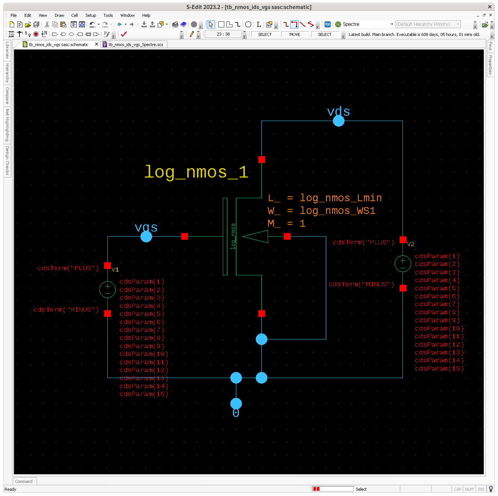
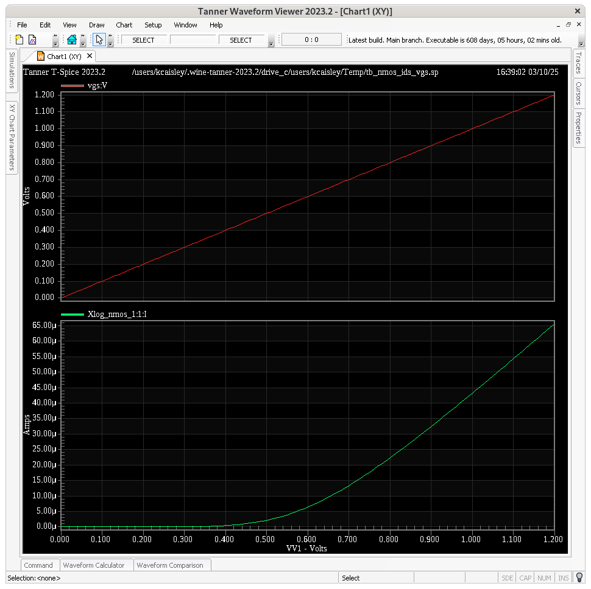
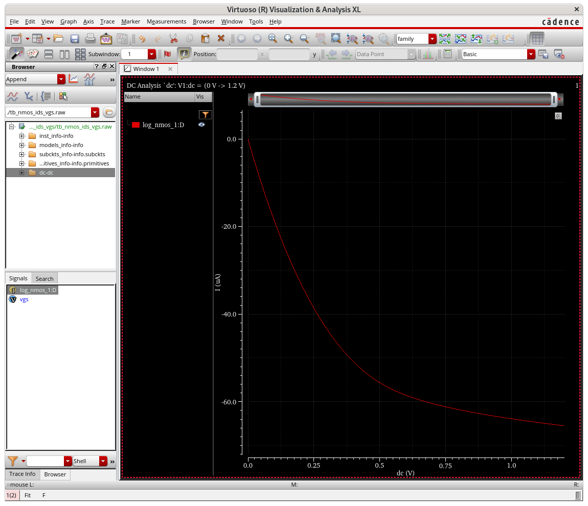
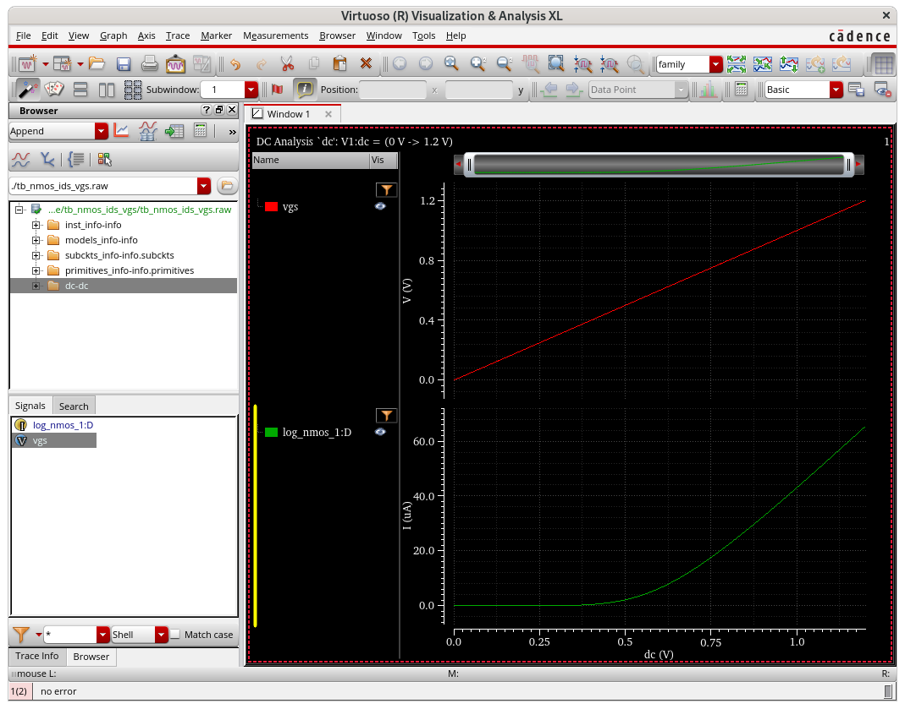

# SPICE netlists

- Spice standard netlist files should conventionally end in `.sp`, instead of the sometimes used `.spi`, `.ckt`, or `.net` extensions.
  - The combination of this extension and format allows portability between `spectre` and `ngspice`.
- The project supports multiple PDKs through symlinked `tech/` directories
- SPICE simulations output to `raw` binary format for broad tool compatibility
  - This is called `nutbin` by `spectre`


This doc provides notes how to correctly use SPICE netlists.

The the approve to generate differential clocks is:

```spice
VV5 syncn gnd! PULSE( log_VCC 0 -convtime/48  100p 100p convtime/24  convtime  )
VV6 syncp gnd! PULSE( 0 log_VCC -convtime/48  100p 100p convtime/24  convtime  )
VV7 clockn gnd! PULSE( log_VCC 0 0 100p 100p convtime/24  convtime/12 ) 
VV8 clockp gnd! PULSE( 0 log_VCC 0 100p 100p convtime/24  convtime/12 ) 
```

We can see there are two issues in the with the code above. Besides for the
initial transition, the new waveforms lag by 100ps. Next the waveforms
are seemly transitioning late.

Since `contime = 0.1u` we know that the period should be: 4.166 ns. This
indicates that the `pw` parameter in the `pulse(...)` function doesn't
include the rise or fall time in the width duration. Thus if we want a
waveform which has a pulse width measured from the half-maximum, we need
to shorten the pulse width by half the rise and half the fall time. Or
in the case that they are equal simply `pw = width - risefall`.

This solution exactly what we find upon inspecting the original old
waveform generator.

Not, you can't by default have independent params determined by others.
Also, you can't have spaces, and need quotes around expression. So
`pw=’(convtime/24)-100p’`


This statement may sometimes be needed, to ensure the simulator knows the size of devices:
*.SCALE micron


Digital IR drop, power domiains, timing closure

Level 1 16 params, bsim6 has 1200

Additions beyond the core spice:
Fast spice
Simulation corners and Monte Carlo
Extraction


15.4.2 batch versus interactive mode
.meas analysis may not be used in batch mode (-b command line option), if an output file (rawfile) is given at the same time (-r rawfile command line option).


# Netlist, schematic, and Simulation Setup corrections:

### 1. SPICE `.option` isn't supported. S-edit is smart enough to remove these in an AFS/Spectre export, but

```
WARNING (SFE-105): "/users/kcaisley/helena/tech/tsmc65/default_testbench_header_55ulp_linux.lib" 97: `threads' has been ignored because it is not
    an option. Correct the name and rerun the simulation. Type `spectre -h options' to get more information on valid option parameters.

WARNING (SFE-105): "/users/kcaisley/helena/tech/tsmc65/default_testbench_header_55ulp_linux.lib" 98: `monteinfo' has been ignored because it is not
    an option. Correct the name and rerun the simulation. Type `spectre -h options' to get more information on valid option parameters.
```

The relevant setting from this file is below, where we can see `.option`

```
 96 .lib tt
 97         .option threads = 1   * run on multiple cores of computer
 98         .option monteinfo = 2 * monteinfo=1 only print histogram
 99                           * monteinfo=2 print all simulation results
100     .param log_only=0
101     .param rh=0
102     .param lvs=0
103     .lib 'default_testbench_header_55ulp_linux.lib' NOM_MODEL
104     .lib 'default_testbench_header_55ulp_linux.lib' setting
105 .endl
```

But we can't fix this for now, without editing the underlying .lib file.

### 2. Redefining the params gives a lot of noisy warnings, in both T-spice and Spectre. In the latter at least, we can go into settings and add:

`.param redefinedparams=ignore`is needed to stop the error from redefined params, if running a .spc in spectre
`redefinedparams=ignore` is needed in spectre options, if running a .scs in spectre. It will netlist correctly.

### 3. `simulator lang=spectre` or `spice` is needed by Spectre. The S-Edit export already does this though in AFS/Spectre mode.

### 4. `**` is supported by tspice and spectre, but `^` isn't supported by spectre for exponents. I've updated the schematic in S-edit to fix this.

The C param of each capacitor is now set to: `cap/2/radix**2`

### 5. Reading verilog-A files needed a "" around the file name, which T-spice was unwilling to do in spice mode.

```
    ERROR (SFE-23): "SB_saradc8_radixN.scs" 637: The instance `vstepper_n' is referencing an undefined model or subcircuit, `vstepper'. Either include
        the file containing the definition of `vstepper', or define `vstepper' before running the simulation.
    ERROR (SFE-23): "SB_saradc8_radixN.scs" 638: The instance `vstepper_p' is referencing an undefined model or subcircuit, `vstepper'. Either include
        the file containing the definition of `vstepper', or define `vstepper' before running the simulation.
```

The relevant commands would be for e.g. `ahdl_include comparator_latch.va` and `ahdl_include vstepper.va`.

If exporting (instead of netlisting) one need to make sure to _un-check_ `Exclude ahdl_include`.

### 6. include statements in spectre need a `section=tt` instead of just `tt`, and the include needs double quotes. This can be achieved by changing the string in the `Setup Simulation > General > Spectre Library Files` and set it to `"/users/kcaisley/helena/tech/tsmc65/default_testbench_header_55ulp_linux.lib" tt` to produce the output netlist string `include "/users/kcaisley/helena/tech/tsmc65/default_testbench_header_55ulp_linux.lib" section=tt`

### 7. In the 'heirarchy priority list' you should put:

```
cell name w/ !		view type	view name (can be set abitrarylity, but is often the same as the view type)
!comparator_latch	veriloga	veriloga_test1
```

### 8. The single quotes below on the width param throw the error `Cannot run the simulation because an unexpected character ''' was found`

```
V5 (syncn gnd!) vsource type=pulse val0=log_VCC val1=0 period=convtime  delay=-convtime/48  rise=100p fall=100p width='(convtime/24)-100p'
V6 (syncp gnd!) vsource type=pulse val0=0 val1=log_VCC period=convtime  delay=-convtime/48  rise=100p fall=100p width='(convtime/24)-100p'
V7 (clockn gnd!) vsource type=pulse val0=log_VCC val1=0 period=convtime/12 delay=0 rise=100p fall=100p width='(convtime/24)-100p'
V8 (clockp gnd!) vsource type=pulse val0=0 val1=log_VCC period=convtime/12 delay=0 rise=100p fall=100p width='(convtime/24)-100p'
```

### 9. The capacitor model is called `capacitor` and must be lower cased, else you get this error:

```
ERROR (SFE-23): "SB_saradc8_radixN.scs" 580: The instance `Capacitor_3' is referencing an undefined model or subcircuit, `Capacitor'. Either
    include the file containing the definition of `Capacitor', or define `Capacitor' before running the simulation.
```

### 10. The `save` statements at the end of the file use `<>` which must be escaped:

**MANUAL FIX: adding in parsing script to update**

```
save data\<0\>
save data\<1\>
save data\<2\>
save data\<3\>
save data\<4\>
save data\<5\>
save data\<6\>
save data<\7\>
```

### 11. the analog_include needs the path, and need quotes

**MANUAL FIX: adding in parsing script to update**

### 12. Fix: Updated the Spectre subsection of the .oa model to netlist with lowercase `capacitor` syntax.

```
WARNING (SFE-30): "SB_saradc8_radixN.scs" 583: Parameter `C', specified for primitive `capacitor', has been ignored because it is an invalid instance parameter. Specify a valid instance parameter and rerun the simulation. Type        `spectre -h capacitor' to get more information on valid instance parameters.
```

### 13. Error found by spectre in `PAGEFRAME', during circuit read-in.

    ERROR (SFE-23): "SB_saradc8_radixN.scs" 34: The instance `VERSION_1' is referencing an undefined model or subcircuit, `VERSION'. Either include the file containing the definition of `VERSION', or define `VERSION' before running the   simulation.

**Script fix: only write `if not line.startswith('VERSION'):`**

### 14. Note that spectre models are case sensitive, and the model definitions like `cap`, `res`, and `vsource` are needed to call the right backends in spectre.

### 15. The `-format nutascii` option in Spectre give the output most similar to T-spice's log format. Perhaps the

### 16. Note that by default, Spectre will read new netlists in the SPICE format, so you don't need to specify it for PDK netlists. And inversely, if you are specifying your own subcircuits in new files in Spectre language, then you need to add `simulator lang=spectre`.

### 17. Output waveforms should have transition delays specfied.

```
Warning from spectre during AHDL read-in.
WARNING (VACOMP-1115): "vstepper.va", line 26: The compiler found no rise and fall times for the transition and no default_transition directive. Assuming ideal transition.
```

Fix: I supplied a 1ns value to transition() but 2nd argument is actually the propagation delay. So I corrected it via `V(out) <+ transition(vout, td, trisefall);`

### 18. From reading designer's guide to Spectre, and seeing some warnings, it looks like the top level ground should be set as simply a `0` node. Don't use `gnd!`.

```
V5 (syncn gnd!) vsource
V6 (syncp gnd!) vsource
V7 (clockn gnd!) vsource
V8 (clockp gnd!) vsource
```

FIX: Just changed the schematic to use a net labeled `0` to fix this.

### 19. Use the +preset=[mx, lx, cx, etc] mode to enable Spectre X which is the newest revision of Spectre. It might disable multithreading if design is too small.

Simulation string now looks like `spectre SB_saradc8_radixN.scs -format psfbin +preset=mx -maxwarnstolog=25`.

### 20. The invisible ground pins on the `PAGEFRAME_1` instances are generating many warnings in the spectre netlist. Let's silence those using the netlist fix script.

### 21. Note that I don't need the `maxstep` param because Spectre X sets it internall in a more intelligent way:

```
WARNING (SPECTRE-592): Following parameters are disabled because they are ignored or redefined in Spectre X:
Tran Parameters: maxstep
```

### 22. Looks like the parameter redefine is actually: `simulatorOptions options redefinedparams=ignore`

### 23. I can simply save all voltages with `save *` in the netlist, instead of all the other netlists. Get more info with `spectre -help save`.

### 24. The CDAC nodes appear to not have any resistance to ground:

```
Notice from spectre during topology check.
    No connections to node `0'.
    No DC path from node `cdac1__nb8_radix_1.offset' to ground, Gmin installed to provide path.
Warning from spectre during heuristic topology check - set topcheck=fixall to fix all floating nodes.
    WARNING (SPECTRE-7): No DC path from node `cdac_n' to ground.
    WARNING (SPECTRE-7): No DC path from node `cdac_p' to ground.
    WARNING (SPECTRE-7): No DC path from node `cdac1__nb8_radix_1.inv_2.N_1' to ground.
```

FIX: Adding 10M resistors to `cnode_p` and `cnode_n` to `vee` net.

### 25. Sure enough, when you netlist from Virtuoso, the ground net is `0`. Therefore be sure to do the same in S-Edit schematic.

This is, for example, how a basic voltage divider nelists:

```
simulator lang=spectre
include "ade_e.scs"
global 0
R1 (vdd vout) resistor r=1K
R0 (vout 0) resistor r=1K
V0 (vdd 0) vsource type=dc
simulatorOptions options psfversion="1.4.0" reltol=1e-3 vabstol=1e-6 \
    iabstol=1e-12 temp=27 tnom=27 scalem=1.0 scale=1.0 gmin=1e-12 rforce=1 \
    maxnotes=5 maxwarns=5 digits=5 cols=80 pivrel=1e-3 \
    sensfile="../psf/sens.output" checklimitdest=psf
dcOp dc write="spectre.dc" maxiters=150 maxsteps=10000 annotate=status
dcOpInfo info what=oppoint where=rawfile
modelParameter info what=models where=rawfile
element info what=inst where=rawfile
outputParameter info what=output where=rawfile
designParamVals info what=parameters where=rawfile
primitives info what=primitives where=rawfile
subckts info what=subckts where=rawfile
saveOptions options save=allpub
```

### 26. Circling back to the redefined parameters problem, we can see the example message:

```
Warning : "/eda/kits/TSMC/CMN55ULP/SPICE_Models/crn55ulp_2d5_lk_v1d2/crn55ulp_2d5_lk_v1d2_shrink0d9_embedded_usage.l" line 338 Redefinition of parameter 'mismatchflag_cap' (value changed from 1 to 0)
        : "Z:\eda\kits\TSMC\CMN55ULP\SPICE_Models\crn55ulp_2d5_lk_v1d2\crn55ulp_2d5_lk_v1d2.l" line 169886 Original definition
```

This implies the usage file is has the 2nd occurance. Looking inside, we see it's actually the higher level file, but calls this command after referencing the lower level file:

In the higher level: `crn55ulp_2d5_lk_v1d2_shrink0d9_embedded_usage.l`:

```
.LIB SFMacro_MOS_MOSCAP
.option geoshrink=0.9
    ...
.lib 'crn55ulp_2d5_lk_v1d2.l' TT_MOS_CAP
.lib 'crn55ulp_2d5_lk_v1d2.l' TT_MOS_CAP_25
    ...
.lib 'crn55ulp_2d5_lk_v1d2.l' total_rf_mos_hv25
.lib 'crn55ulp_2d5_lk_v1d2.l' stat
.lib 'crn55ulp_2d5_lk_v1d2.l' stat_hv25
.param mismatchflag_cap_rf=0
.param mismatchflag_cap_25_rf=0
.param mismatchflag_cap=0
.param mismatchflag_cap_25=0
.ENDL SFMacro_MOS_MOSCAP
```

Inside the lower level `crn55ulp_2d5_lk_v1d2.l`

```
.LIB setup_cap
.param scale_cap= 0.9
.param mismatchflag_cap=1
.param ov_ratio_cap=1

.ENDL setup_cap
```

Sure enough, this exists in the hspice `.1` spice decks offered by the standard 65lp PDK as well though, which lives at `/eda/kits/TSMC/65LP/2024/V1.7A_1/1p9m6x1z1u/models/hspice`
We find `crn65lp_2d5_lk_v1d7_usage.l` overides `.param mismatchflag_cap=0` which was originally set in `crn65lp_2d5_lk_v1d7.l` to the value `.param mismatchflag_cap=1`

What about the spectre versions? Checking `/eda/kits/TSMC/65LP/2024/V1.7A_1/1p9m6x1z1u/models/spectre`:

```
$ grep -R "mismatchflag_cap="
crn65lp_2d5_lk_v1d7.scs:parameters mismatchflag_cap=1
crn65lp_2d5_lk_v1d7_usage.scs:parameters mismatchflag_cap=0
crn65lp_2d5_lk_v1d7_usage.scs:parameters mismatchflag_cap=0
crn65lp_2d5_lk_v1d7_usage.scs:parameters mismatchflag_cap=0
crn65lp_2d5_lk_v1d7_usage.scs:parameters mismatchflag_cap=0
crn65lp_2d5_lk_v1d7_usage.scs:parameters mismatchflag_cap=0
crn65lp_2d5_lk_v1d7_usage.scs:parameters mismatchflag_cap=0
crn65lp_2d5_lk_v1d7_usage.scs:parameters mismatchflag_cap=1
```

The libs in which it's `0` disabled by overwriting are: `tt_lib`, `ss_lib`, `ff_lib`, `fs_lib`, `sf_lib`, and `mc_lib`.

But it's set to `1` in the `mismatch_lib` section. This makes sense!

Q: Why is this not flagged as an error by Spectre when simulating with ADE? Or is it?

Conclusion: Anyways, you should just set the `simulatorOptions options redefinedparams=ignore`

### 27. Found the issue with the netlist produced by S-Edit! Let's look at the port parameters for the transistor:

From `/eda/kits/TSMC/CMN55ULP/SPICE_Models/crn55ulp_2d5_lk_v1d2/crn55ulp_2d5_lk_v1d2.scs`

```
section total_rf_mos
inline subckt nmos_rf ( d g s b )
parameters lr=0.06e-6 wr=0.6e-6 multi=1 nr=4
+ factor=factor_mos_rf
+ sa=0.76746e-6*0.9/factor sb=sa
+ sca=1.76487e+000 scb=5.70185e-006
+ scc=2.24921e-011 sd=0.24e-6*0.9/factor
+ mismatchflag=mismatchflag_mos_rf
+ globalflag=globalflag_mos_rf
+ totalflag=totalflag_mos_rf
+ rbflag=1
    ...
```

From `/eda/kits/TSMC/CMN55ULP/SPICE_Models/crn55ulp_2d5_lk_v1d2/crn55ulp_2d5_lk_v1d2.l`

```
.LIB Total_RF_MOS
.subckt nmos_rf d g s b lr='0.06e-6' wr='0.6e-6' multi='1' nr='4'
+ scale='scale_mos_rf'
+ sa='0.76746e-6*0.9/scale' sb=sa
+ sca='1.76487e+000' scb='5.70185e-006'
+ scc='2.24921e-011' sd='0.24e-6*0.9/scale'
+ mismatchflag='mismatchflag_mos_rf'
+ globalflag='globalflag_mos_rf'
+ totalflag='totalflag_mos_rf'
+ rbflag='1
    ...
```

Looks like the order is drain, gate, source, then bulk.

Let's make a schematic:



And let's simulate it:



But when we netlist from S-Edit exported in the Spectre mode:

```
// ---- Post-processed by `prep_netlist.py` for compatibility ----
// Library:              sasc
// Cell:                 tb_nmos_ids_vgs
// Testbench:            Spectre

simulator lang=spectre

inst_info info what=inst where=rawfile
models_info info what=models where=rawfile
subckts_info info what=subckts where=rawfile
primitives_info info what=primitives where=rawfile
include "/users/kcaisley/helena/tech/tsmc65/default_testbench_header_55ulp_linux.lib" section=tt

simulatorOptions options redefinedparams=ignore

log_nmos_1 (0 vds vgs 0) log_nmos L_=log_nmos_Lmin M_=1 W_=log_nmos_WS1
V1 (vgs 0) vsource dc=0 type=dc
V2 (vds 0) vsource dc=1.2 type=dc

save vgs
save log_nmos_1:D

dc dc dev=V1 param=dc start=0 stop=1.2 step=0.01
```

That's bulk, drain, gate, source order!

Sure enough, if you simulate it, you don't get what you expect!



Now if we change the offending line pin order to: `log_nmos_1 (vds vgs 0 0) log_nmos L_=log_nmos_Lmin M_=1 W_=log_nmos_WS1`

And resimulating, we get the same as T-spice:



Solution: We need to flip the ports of the transistors to D-G-S-B order as part of our port preprocessing script.

### 28. Simulation speeds

Making some observations about simulation time with different settings in Spectre.

Parsing and initial conditions only take about 1s to compute, so the run time is entirely dominated by the actual transient simulation iterations.

```
The inventory of the circuit is:
              nodes 418
          capacitor 20
   comparator_latch 1
           resistor 4
            vsource 8
           vstepper 2
              bsim4 681
```

> Multithreading is disabled due to the size of the design being too small.

As a baseline, I observed T-spice takeing 25-30 s per simulated microsecond.

`spectre SB_saradc8_radixN.scs -format psfbin +preset=mx` runs at 5.2 s per simulated microsecond, with

`spectre SB_saradc8_radixN.scs -format nutbin +preset=mx` runs at 5.2 s per simulated microsecond

`spectre SB_saradc8_radixN.scs -format nutascii +preset=mx` runs at 6.1 s per simulated microsecond

Interestingly, if I remove the preset option, which normally specifies a version of SpectreX, and instead run with standard Spectre, I see that the simulation is:

`spectre SB_saradc8_radixN.scs -format psfbin` run at 51.8 s per simulated microsecond

This usage of normal Spectre is 10x slower than Spectre X, and 2x slower than S-Edit!

### 29. Monte-carlo simulation

Monte-carlo is enabled in Spectre by wrapping a function in a statistics block:

```
montecarlo montecarlo variations=all numruns=100 savefamilyplots=yes {
   dc dc dev=V1 param=dc start=0 stop=1.2 step=0.01
   }
```

Also the correct SPICE deck section must be seleted for usage: `section=mc_g`

More information can be found on pg. 477 of the Spectre user guide. Note that the runs are done sequentially by Spectre.

Note that `savefamilyplots=yes` is necessary if writing to `psfbin` as otherwise each curve is overwritten. If using `nutascii` I believe it will write all runs to one text file.

### 30. Temporal noise simulation

From pg. 283 of spectre user guide.

Running multiple transient simulations is a bit more complicated. If we simply fill out the form in S-edit's AFS/Spectre mode, we get something like this:

```
parameters afs_TN_Iterations=1
afs_tn_sweep sweep param=afs_TN_Iterations start=1 stop=10 step=1 {
	tran1 tran stop=simtime noisefmax=2G noiseseed=afs_TN_Iterations
}
```

At first I thought this wasn't compatible with Spectre, but then I exported my own basic inverter from Virtuoso + ADE Assembler and saw this:

```
parameters Iteration=1
sweep sweep param=Iteration start=1 stop=100 step=1 {
tran tran stop=1u errpreset=moderate noisefmax=2G noiseseed=Iteration write="spectre.ic" writefinal="spectre.fc" annotate=status maxiters=5
}
```

This showed me that the the parameters field take an arbitrary name, which can then be iterated by the sweep analysis steps. Keep in mind that this can in priciple be run in parallel, but that job control [is only provided by ADE at a higher level](https://community.cadence.com/cadence_technology_forums/f/custom-ic-design/45089/is-there-a-setting-to-let-multiple-runs-of-transient-noise-run-in-parallel).

Therefore, if just using virtuoso from the command line, I should create my own job control in Python.

Anyways, running it sequentially for 1u, for 10 runs, with transient noise, took 155s, or roughly 15.5s per simulated 1u. So transient noise slows down the simulation by a factor of 3x, when using `noisefmax=2G` which limits the max time to `0.5/noisefmax` which I guess is equal to 0.1ns.

### 31. Verilog-A linting

I can do Verilog linting like so: `spectre -ahdllint netlist.scs` where netlist.scs is written using Spectre, SPICE, or eSpice syntax and includes one or
more Verilog-A models.

### 32. Spectre Mixed-Signal Design Simulation

It looks like by running `spectre +ms input.scs` I can use the XPS engine to speed up the simulation of blocks which are recognized to have digital behavioral. Read more on page 70 of the Spectre manual.

### 32. Deciding between psfbin, nutbin, psfascii, and nutascii

In spectre, if using nutbin format does not support multi threading and multi processing!

psfbin is needed for Viva usage

libpsf (c++, also used by bag3): https://github.com/henjo/libpsf/
bespice: https://www.analogflavor.com/en/bespice/bespice-wave-parser/
https://www.analogflavor.com/en/2023/05/04/the-psf-and-psfxl-file-structure/
psfdata: https://github.com/chwa/psfdata
Spectre runner code: https://github.com/KenKundert/flicker-noise/blob/master/runPnoise


### 33. Setting voltage sweep for examining ADC-level TF with noise

With 8-bits, each bin is roughly 4.6 mV. And we found that noise can cause some false switches in the ADC when within ~5mV of the ADC edge. Thus I think 1mV steps with a 20mV range would be good enough, to see 4-5 bins.

We should set the vcm to be 1V.


### 34. Converting psfbin to psfascii

I have two directories:
```
$ ls
0 drwxr-xr-x 2 kcaisley kcaisley         6 Mar 16 17:11 SB_comparator.psfascii
17996 drwxr-xr-x 2 kcaisley kcaisley  15015936 Mar 16 06:43 SB_comparator.raw
```

Inside of `SB_comparator.raw`, there are many files like this:
```
vcm-007_vdiff-160_tnoise-073_tran1.tran.tran
vcm-012_vdiff-200_tnoise-099_tran1.tran.tran
```

For each of these files, I'd like to run a command like so on the bash command line:
```
psf -i SB_comparator.raw/vcm-007_vdiff-160_tnoise-073_tran1.tran.tran -o SB_comparator.psfascii/vcm-007_vdiff-160_tnoise-073_tran1.tran.psfascii
psf -i SB_comparator.raw/vcm-012_vdiff-200_tnoise-099_tran1.tran.tran -o SB_comparator.psfascii/vcm-012_vdiff-200_tnoise-099_tran1.tran.psfascii
```

So I need to create a python script which runs this command, looping the parameters in the file names like so, all inclusive:

from vcm-000 to vcm-012
    from vdiff-000 to vdiff-200
        from tnoise-000 to tnoise-099

The loops are nested so it should be 13×201×100 = 261300 iterations.


       SB_saradc8_radixN.raw/afs_tn_sweep-000_tran1.tran.tran -> SB_saradc8_radixN.psfascii/tnoise-000_tran1.tran.psfascii

psf -i SB_saradc8_radixN.raw/afs_tn_sweep-000_tran1.tran.tran -o SB_saradc8_radixN.psfacii/tnoise-000_tran1.tran.psfascii
