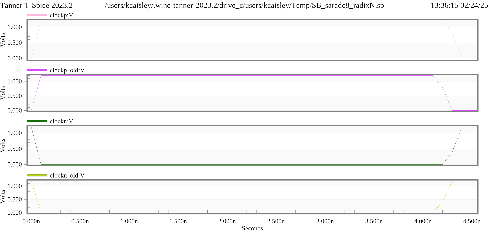
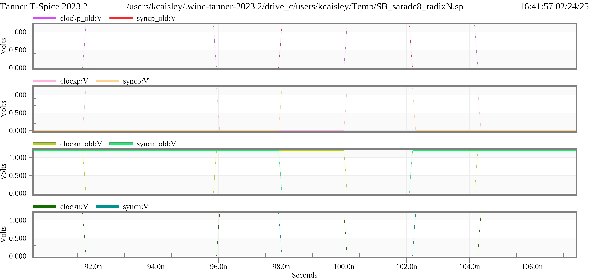

The original clock waveforms produced by the Caeleste are generated like
so:

        .subckt Source_v_pulse_differential n p ref del=0 high=1.8 low=0 period=200n risefall=10n width=100n
            vSource_v_pulse_1 p ref pulse(low high del risefall risefall width-risefall period)
            vSource_v_pulse_2 n ref pulse(high low del risefall risefall width-risefall period)
        .ends

        XSource_v_pulse_differential_1 clockn_old clockp_old gnd Source_v_pulse_differential del=0 high=log_VCC low=0 period='convtime/12' risefall=100p width='convtime/24'
        XSource_v_pulse_differential_2 syncn_old syncp_old gnd Source_v_pulse_differential del='-convtime/48' high=log_VCC low=0 period=convtime risefall=100p width='convtime/24'

The revised approach uses just the basic AnalogLib blocks:

        VV5 syncn gnd! PULSE( log_VCC 0 -convtime/48  100p 100p convtime/24  convtime  )
        VV6 syncp gnd! PULSE( 0 log_VCC -convtime/48  100p 100p convtime/24  convtime  )
        VV7 clockn gnd! PULSE( log_VCC 0 0 100p 100p convtime/24  convtime/12 ) 
        VV8 clockp gnd! PULSE( 0 log_VCC 0 100p 100p convtime/24  convtime/12 ) 

We can see there are two issues in the image below. Besides for the
initial transition, the new waveforms lag by 100ps. Next the waveforms
are seemly transitioning late.

{width="70%"}

Rerunning the simulation with the maximum time step updated from `0.1n`
to `0.01n` we see smoothed transitions which now only last 100ps each.
Examing the waveforms, we over that the delays exist only on the half
the transitions, when `syncp` and `clockp` are falling. On the next
rising edge, they re-synchronize, indicating that the period is correct,
but that the pulse widths are different.

{width="70%"}

Cursor measurements give 4.266n width for the clockp/n waveforms but
4.166ns for the old waveforms.

Since `contime = 0.1u` we know that the period should be: 4.166 ns. This
indicates that the `pw` parameter in the `pulse(...)` function doesn't
include the rise or fall time in the width duration. Thus if we want a
waveform which has a pulse width measured from the half-maximum, we need
to shorten the pulse width by half the rise and half the fall time. Or
in the case that they are equal simply `pw = width - risefall`.

This solution exactly what we find upon inspecting the original old
waveform generator.

Not, you can't by default have independent params determined by others.
Also, you can't have spaces, and need quotes around expression. So
`pw=’(convtime/24)-100p’`
