# Analysis development contracts

The analysis pipeline has one explicit direction:

```mermaid
flowchart TB
    subgraph shared_adc[ADC from any source]
        direction LR
        adc["MeasAdc"]
        adc --> dynamic["analyze_adc_dynamic"] --> dynamic_out["AnalysisAdcDynamic"]
        adc --> transfer["analyze_adc_transfer"] --> transfer_out["AnalysisAdcTransfer"]
        adc --> endpoint["analyze_adc_endpoint_nonlinearity"] --> endpoint_out["AnalysisAdcEndpointNonlinearity"]
        adc --> ramp["analyze_adc_ramp"] --> ramp_out["AnalysisAdcRamp"]
        adc --> density["analyze_adc_code_density_nonlinearity (+ ramp)"] --> density_out["AnalysisAdcCodeDensityNonlinearity"]
        ramp_out --> density
        adc --> distribution["analyze_adc_code_distribution"] --> distribution_out["AnalysisAdcCodeDistribution"]
        adc --> noise["analyze_adc_noise"] --> noise_out["AnalysisAdcNoise"]
        adc --> conditions["analyze_adc_operating_conditions (+ noise)"] --> conditions_out["AnalysisAdcOperatingConditions"]
        noise_out --> conditions
        adc --> paths["analyze_adc_decision_paths"] --> paths_out["AnalysisAdcDecisionPaths"]
        adc --> power["analyze_adc_power"] --> power_out["AnalysisAdcPower"]
        dynamic_out --> dynamic_plot["plot_adc_dynamic / plot_adc_dynamic_sweep (list)"]
        transfer_out --> transfer_plot["plot_adc_transfer"]
        endpoint_out --> static_nonlinearity_plot["plot_adc_static_nonlinearity"]
        density_out --> static_nonlinearity_plot
        ramp_out --> ramp_plots["plot_adc_ramp_transfer / _histogram / _weights / _nonlinearity"]
        distribution_out --> distribution_plot["plot_adc_code_distribution"]
        noise_out --> noise_plots["plot_adc_noise_sweep / _distribution_sweep / _distribution_grid (lists)"]
        conditions_out --> sequence_plots["plot_adc_sequence_enob / plot_adc_sequence_chip_overview (list)"]
        paths_out --> paths_plots["plot_adc_decision_paths / plot_adc_decision_path_density"]
        power_out --> power_plot["plot_adc_power_sweep (list)"]
    end

    subgraph adc_external[ADC with scope waveforms]
        direction LR
        adc_ext["MeasAdc with scope wave"] --> scope_bits["analyze_adc_scope_bits"] --> scope_bits_out["AnalysisAdcScopeBits"] --> scope_bits_plot["plot_adc_fastrx_scope_comparison"]
        adc_ext --> comp_out_eye["analyze_adc_comp_out_edge_eye"] --> comp_out_eye_out["AnalysisAdcCompOutEdgeEye"] --> comp_out_eye_plot["plot_adc_comp_out_edge_eye"]
    end

    subgraph adc_internal[ADC with simulated internal nets]
        direction LR
        adc_int["MeasAdc with internal nets"]
        adc_int --> sampling["analyze_adc_sampling_noise"] --> sampling_out["AnalysisAdcSamplingNoise"]
        adc_int --> settling["analyze_adc_cdac_settling"] --> settling_out["AnalysisAdcCdacSettling"]
        adc_int --> power_wave["analyze_adc_power_waveform"] --> power_wave_out["AnalysisAdcPowerWaveform"]
        adc_int --> response["analyze_adc_comparator_response"] --> response_out["AnalysisAdcComparatorResponse"]
        adc_int --> closure["analyze_adc_timing_closure"] --> closure_out["AnalysisAdcTimingClosure"]
        adc_int --> summary["analyze_adc_timing_summary (+ closure)"] --> summary_out["AnalysisAdcTimingSummary"]
        closure_out --> summary
        adc_int --> comparator_eye["analyze_adc_comparator_edge_eye"] --> comparator_eye_out["AnalysisAdcComparatorEdgeEye"] --> comparator_eye_plot["plot_adc_comparator_edge_eye"]
        sampling_out --> sampling_plot["plot_adc_sampling_noise"]
        settling_out --> settling_plot["plot_adc_cdac_settling"]
        power_wave_out --> power_wave_plot["plot_adc_power_waveform"]
        response_out --> response_plot["plot_adc_comparator_response"]
    end

    subgraph comparator[Comparator and CDAC decisions]
        direction LR
        decisions["MeasComp"] --> offset["analyze_comp_offset_noise"] --> offset_out["AnalysisCompOffsetNoise (one common mode)"]
        decisions --> common_mode["analyze_comp_common_mode (+ offsets)"] --> common_mode_out["AnalysisCompCommonMode"]
        offset_out --> common_mode
        comp_int["MeasComp with internal nets"]
        comp_int --> timing["analyze_comp_timing"] --> timing_out["AnalysisCompTiming"]
        comp_int --> comp_power["analyze_comp_power"] --> comp_power_out["AnalysisCompPower"]
        comp_int --> candidate["analyze_comp_candidate (+ offset, timing, power)"] --> candidate_out["AnalysisCompCandidate"]
        cdac_ext["MeasCdac (one curve)"] --> transition["analyze_cdac_transition"] --> transition_out["AnalysisCdacTransition"]
        cdac_adc["MeasCdac (one ADC)"] --> mismatch["analyze_cdac_cap_mismatch (+ transitions, comparator offset)"] --> mismatch_out["AnalysisCdacCapMismatch"]
        transition_out --> mismatch
        offset_out --> mismatch
        offset_out --> offset_plots["plot_comp_offset_noise / plot_comp_sampling_campaign"]
        common_mode_out --> common_mode_plot["plot_comp_common_mode_campaign"]
        timing_out --> timing_plot["plot_comp_timing"]
        comp_power_out --> comp_power_plot["plot_comp_power"]
        candidate_out --> candidates_plot["plot_comp_candidate_sweep / plot_comp_noise_power_tradeoff (lists)"]
        mismatch_out --> mismatch_plot["plot_cdac_cap_mismatch / plot_cdac_cap_mismatch_comparison (list)"]
    end

    subgraph calibration[ADC calibration]
        direction LR
        cal_cdac["MeasCdac"] --> cal1["analyze_adc_calibration1 (+ cap mismatch)"] --> cal_out["AnalysisAdcCalibration"]
        cal_adc["MeasAdc"]
        cal_adc --> cal2["analyze_adc_calibration2 (+ ramp)"] --> cal_out
        cal_adc --> cal3["analyze_adc_calibration3 (+ ramp)"] --> cal_out
        cal_out --> cal_weights_plot["plot_adc_calibration_weights (list)"]
        cal_out --> calibrated["transfer / ramp / code density / distribution (+ calibration)"]
    end

    subgraph waveform[Saved waveforms]
        direction LR
        wave_any["Any Meas* wave"] --> wave_plot["plot_waveforms"]
    end

    subgraph raw[Other plotting inputs without a Meas type]
        direction LR
        raw_noise["Differential amplifier voltage samples"] --> noise_analysis["analyze_diffamp_noise"] --> noise_analysis_out["AnalysisDiffampNoise"] --> diffamp_plot["plot_diffamp_noise"]
        raw_scope["Aligned Basil scope waveforms"] --> scope_wave["scans.scope.scope_wave"] --> scope_wave_out["Wave"] --> raw_wave_plot["plot_waveforms"]
        margins["SAR correction margins"] --> redundancy_plot["plot_adc_redundancy"]
        serdes_words["Raw serializer word captures"] --> serdes_word_plot["plot_serdes_output_word_grid"]
        serdes_eyes["Raw serializer symbol captures"] --> serdes_eye_plot["plot_serdes_symbol_eye_grid"]
    end

    shared_adc ~~~ adc_external ~~~ adc_internal ~~~ comparator ~~~ calibration ~~~ waveform ~~~ raw
```

Arrows show inputs, analyses, and plotters; plotters return artifact paths. One measurement type per circuit block serves both simulations and physical captures. "(+ x)" marks a keyword-only prior result. Sweeps are lists of per-capture results passed to one plotter; there are no sweep or comparison container types. Many plotters also take the originating `Meas*` measurements for their information boxes. Hardware or simulator producers write typed HDF5 before measurement analyses; the last section documents the separate raw-array and scope-capture plotting paths.

## Analysis contract

The rules:

- Every public function in `adc.py`, `comp.py`, `cdac.py`, and the calibration modules is named `analyze_<block>_<thing>`, takes exactly one positional `Meas*` or `Sequence[Meas*]`, takes earlier results only as keyword-only `Analysis*` arguments, and returns one `Analysis*` result. There are no threshold or setting arguments and no `ALL_CAPS` module constants.
- Architecture facts (resolution, capacitor and decision counts, symbols per decision) are derived from the measurement parameters. Numerical method settings and portable heuristics are written inline at their point of use with a comment.
- A pass/fail or validity judgment is a field of the result, next to the quantity it judges.
- An analysis never calls another public analysis, and a result never contains another result. Runners run each stage and pass flat lists of results into the next one.
- Every result derives from `Analysis` (`group`, `index`, `dut`). `group` is the board number or Monte Carlo seed, `index` the observed ADC channel or Monte Carlo iteration, and `dut` the design parameters analyzed. `measurement_identity` and `check_identity` in `types.py` build and match them; a prior result whose group, index, or DUT parameters differ raises.
- Analyses do no file I/O. Runners save results that another runner needs with `write_analysis` and read them back with `read_analysis`; measurement files are never modified.
- Only `types.py`, `io.py`, and `calc.py` define helper functions or classes. Analysis, plotting, and runner code keeps its logic inside its public functions, with no private functions, classes, or nested functions. Values derived from a measurement are properties of its `Meas*` type; reusable numerical steps are `calc` primitives.
- `plots.py` defines only `plot_*` plotters, `style_*` formatting, and `save_figure`; `runner.py` defines only `*_study` functions and the command-line `main()`.
- `flow/analysis/test_conformance.py` checks these rules from signatures and source, and runs as a pre-commit hook.

## Calculator functions explain

Throughout the circuit block specific analysis function, we should strive as much as possible to express our logic in our own `calc` prefixed primitives.

## Measurement types

Every measurement derives from `Meas`, which fixes the fields all of them carry: `group`, `index`, and `dut` (the same identity as `Analysis`), `info` (`MeasInfo`: backend, timestamp, instruments, readbacks), `param` (the complete scan or testbench parameters), and an optional `wave`. A subclass (`MeasAdc`, `MeasComp`, `MeasCdac`, `MeasSamp`) adds only its per-record readback arrays, such as `conversion_index`, `bout`, and `dout`. Producers set the identity explicitly: a physical capture uses its board and observed ADC, a simulation its Monte Carlo seed and iteration. `Meas` checks that the readback arrays share one row per conversion or trial; `test_conformance.py` checks that every subclass is a frozen, slotted, keyword-only dataclass adding only array fields.

`Wave` holds node voltages `v` and supply currents `i`, read like Cadence's `v()` and `i()`. Keys are canonical net names from the circuit's net bundle (`comp_out`, `dac_state_p[0]`, `comp.latch_p`) whether the source was a simulator or an oscilloscope; `vin_diff` is the one derived name, for a differential probe. Each trace has one row per record (the measurement row in `record_index`) and one column per sample of `time_s`. Supply currents use the supply name and are positive for current drawn from the source.

`write_measurement` stores a measurement like an analysis result: one native dataclass tree under `/measurement`, whose stored type names its `Meas` subclass. The reader rebuilds any importable subclass from that name, so a new measurement class needs no registration. Producers construct a concrete typed measurement and call `write_measurement()`; `flow/circuit/results.py` owns conversion from simulator raw data. The analysis layer does not control hardware, start simulators, or depend on sidecar manifests.

## Other explanation

Reusable analysis functions accept concrete `Meas*` values and keyword-only prior results, perform numerical work, and return a concrete `Analysis*` dataclass. Generic waveform and numerical operations live in `calc.py` and callers use the `calc.` prefix. Functions accept NumPy arrays and scalars; waveform functions take an explicit independent axis. Do not add a request/dispatcher framework. Constructors check structure only (`Meas` row alignment and `Wave` trace shapes); analysis results are plain dataclasses without validators. Decode simulated ADC observations once during conversion. ADC edge pairing and observation selection belong to analysis. Derived analysis caches are not additional measurement types.

For example, `calc.cross(signal, time_s, threshold, edge="rising")` returns interpolated crossing coordinates, `calc.clip(signal, time_s, start, stop)` returns clipped signal and axis arrays, and `calc.average(signal, time_s)` uses time weighting. Without an axis, `calc.average(signal)` and `calc.stddev(signal)` treat values as discrete samples; passing an axis computes continuous-waveform statistics. `calc.value(signal, time_s, at)` interpolates at one or several coordinates. Spectral functions accept uniformly sampled arrays and an explicit sample rate, and `calc.dft` returns one-sided complex amplitudes in the signal's units. The calculator knows nothing about circuit nets, HDF5 records, or plotting artifacts.

The calculator groups are waveform selection and timing (`value`, `clip`, `sample`, `cross`, `delay`, `settlingTime`, `riseTime`, `fallTime`, `slewrate`, `frequency`, `eyeDiagram`, `eyeHeightAtXY`, `abs_jitter`, `period_jitter`), statistics and integration (`average`, `integ`, `deriv`, `rms`, `stddev`, `ymin`, `ymax`, `xmin`, `xmax`, `peakToPeak`), spectra and noise (`dft`, `psd`, `rmsNoise`, `thd`, `spectrumMeas`), and converter or density calculations (`dnl`, `inl`, `histogram2D`). Boolean validity traces use `calc.settlingTime` to find the first sample of the final uninterrupted valid interval. CDAC traces use a late-window median target, an explicit tolerance, and a clipped update interval for analog settling time. ADC-specific sine fitting and code-density calculations live in `adc.py`; scope validation filters spurious crossings before estimating a median cycle period; simple medians, percentiles, and histograms use NumPy directly. Circuit analyses choose the signals and windows, then assemble their typed results.

`calc.eyeDiagram` interpolates requested window boundaries and returns phase/value columns separated by NaN rows. The serializer symbol plot folds a two-UI window at each nominal UI and uses `calc.eyeHeightAtXY` for the geometric center opening; the midpoint is estimated from waveform levels. The comparator eye analyses resample every decision window around its COMP rise onto a common phase axis, so their plotters only draw. Jitter functions return numeric arrays by default; optional axes, phase units, moving period references, and scalar period-jitter standard deviation are requested by keyword.

ADC nonlinearity and ramp analyses compose `calc.dnl`, `calc.inl`, and `calc.cross` directly in their analysis functions. Half-code and comparator probability crossings use first contact on a plateau; a threshold reached only at a record endpoint remains unbracketed. SPICE ADC power windows start at interpolated INIT crossings, comparator settling starts at the clipped clock trigger, and comparator power without stored readbacks uses time-weighted record averages. Sequence decision intervals use `1 / calc.frequency(...)`; LOGIC updates are paired within the individual COMP intervals.

Plot functions write no CSV summaries. They consume typed measurements and/or completed analysis results, then return the paths of the figures they wrote. Plotters never drop data: every point a scan captured and the analysis kept is drawn; only an analysis may exclude data, and it records what it excluded. The CDAC plotters read the board inventory only for the displayed ideal/PEX reference. Analysis runners explicitly select reviewed input files or run directories and orchestrate load, analyze, plot, and save. They never build reports: no CSV, JSON, text, or LaTeX output; slides are written by hand and reference the figures. New measurements or simulations never silently replace an accepted analysis input; updating that selection is a deliberate review step. Runner functions may be long when their orchestration remains linear and self-contained.

Plot functions are one layer deep: a plot function does not call another plot function. A runner can call the same plot function for multiple datasets. Keep bin counts and display limits fixed inside each plotter unless actual runners need different settings for the same plot.

All active plots use the shared presentation and saver in `plots.py`: a fixed 9.6 × 5.4 inch canvas, black 12 pt titles, black 10 pt labels/ticks/legends, 7 pt information boxes, white axes by default, off-white legend and information boxes, and the shared major/minor grid colors. Density-focused plots use the Nord light-blue axes background. Data lines are 1 pt wide and markers are 4 pt. PNG output is 500 DPI (4800×2700); major and minor ticks are 2.5 pt and 1.5 pt long; PDF and SVG remain vector. `PLOT_PNGS`, `PLOT_PDFS`, and `PLOT_SVGS` are the only format switches. Plot callers pass one suffixless `output_path`, and the saver must not crop or resize the canvas.

Ordinary series follow `CURVE_COLORS`; ordered density and spectrum data use `SPECTRUM_COLOR_MAP`. Supply rails are always added as Analog, Digital, and DAC so they receive blue, orange, and green consistently. Data artists are opaque. Information boxes contain only concise measurement setup that is not already in the title, axes, or legend; numerical results belong in the plotted data or short legend labels. Renderers trust their typed inputs and limit their work to unit conversion, text formatting, and drawing.

Tests should exercise each analyzer using the same concrete measurement types used in production, validate dataclass invariants, and test plotting separately from numerical results. For fitted calibration, final acceptance metrics should eventually come from a separately acquired validation run: freeze all weights and model choices learned from the training run, then apply them to the validation run without refitting.

## Runtime follow-up

Keep analysis serial until profiling justifies added concurrency. A future bounded worker pool may decode independent HDF5 files or analyze independent ADCs, and independent per-ADC plots may be rendered before a comparison plot. Any such change must preserve deterministic ordering and numerical equivalence. Use the existing 6,024-file comparator campaign and 10,040-point CDAC campaign as benchmarks; their many small HDF5/dataclass decodes dominate more than BLAS work, so increasing NumPy threads alone is unlikely to help.

## Study entrypoints

All analysis runners end in `_study` and have exactly `(output_dir: Path) -> tuple[Path, ...]`. Their input directories and selection limits are explicit in their bodies/docstrings. The argument is output-only; no newest-run discovery, input overrides, or analysis immediately after collection. `main()` selects one study and creates its timestamped output directory. Keep orchestration in each study. Private helpers in `runner.py` hold stages that several studies share: comparator characterization, CDAC curve selection (later reacquired runs replace whole curves), and the CDAC transition and mismatch stages. Existing numerical analyzers and plotters remain reusable.

| Study | Selected coverage |
| --- | --- |
| `adc_transfer_curve_study` | Known-voltage ADC00 DC steps; archived directory currently missing locally. |
| `adc_ramp_nonlinearity_study` | ADC00--03 uniform sawtooth, code-density INL/DNL without absolute voltage reconstruction. |
| `adc_calibration_study` | ADC00 ramp and CDAC A-state threshold acquisitions; all three calibration methods. |
| `adc_sequence_study` | Corrected 160-symbol sweep: 29 continuous recipes × 16 ADCs × 2/6/10 MSPS, with per-ADC and chip PDFs. Includes seven PEX flavors × seven matching recipes at 1600 MBd. Per-ADC and per-flavor operating-condition results and per-case timing summaries are saved as analysis HDF5 files. |
| `adc_sample_rate_study` | ADC00/01 DC and sine sweeps plus ADC00's 800-mV control; only the historical INIT8/SAMP16 control pattern is selected, at 0.3125--6.25 actual MSPS. |
| `adc_power_study` | Instrumented ADC00/01 fixed-input rate sweeps and ADC00 reference points, with three supply readbacks. |

Consolidated acquisition directories can contain both DC and sine measurements. The sample-rate study selects DC and sine by their typed stimulus for the respective panels; the power study selects instrumented DC. A reviewed mixed rate directory can therefore be pinned in both rate-study input selections. No saved campaign is renamed or automatically selected.

Internal comparator/SAR/CDAC plots and seven clock plots require a simulated `MeasAdc` and its saved internal nets. The physical sequence sweep uses the stored codes and readout checks of the physical `MeasAdc` captures. Outputs are flat. Physical captures and PEX cases go through the same per-capture noise analysis and the same operating-condition analysis. The operating-condition analysis matches each capture to its noise result by sequence and symbol rate; its reference code is the median mean code over every sequence at the lowest symbol rate, and a capture is shifted when its mean leaves that reference by more than five times the median code noise there (at least four codes). The PEX subset covers seven of the 29 physical recipes at 1600 MBd. Saved patterns and decoded samples remain unchanged. Fixed-input ENOB is explicitly noise-equivalent; spectral ENOB is shown separately. Low spread alone does not establish correct conversion or a working sequence.

Reusable plotting functions need not all appear in these selected studies. `plot_adc_dynamic` is retained for individual spectral checks in the rate study. `plot_adc_noise_distribution_grid` requires an all-ADC comparison dataset; `plot_adc_sampling_noise` is a separate internal held-voltage noise study; `plot_adc_power_waveform` requires simulated rail-current traces. `plot_adc_decision_paths` is the line alternative to the retained trajectory density, and selects one conversion, one final code, or all of them for display. `plot_adc_ramp_weights` is the older alternative to the common calibration-weight comparison. Measurement-versus-simulation and cross-channel comparisons pass several results to the same plotter. Their functions and tests remain; removing unused imports is not a reason to delete them.

Simulated waveforms use the same `Wave` as scope captures. ADC comparator internals use the `comp.` scope, for example `comp.latch_p`, and buses one key per bit, for example `dac_botplate_n_diff[15]`. Derived input differences are calculated from the saved P/N voltages.

Each target in `adc/sim.py` and `comp/sim.py` invokes conversion and HDF5 writing. Simulation workers return raw-file locations and bindings or run metadata. `circuit.results.read_raw_transient` loads a VLSIR `TranResult`; converters map its raw variable names to the canonical names selected by the save bindings. The converter rejects missing/unmapped traces and raw time gaps larger than the requested waveform spacing. It neither adds fictitious timing detail nor reads old waveform formats as a fallback. Rebuild old simulation HDF5 files from raw results with an explicitly appropriate sample interval, or rerun simulations when their saved samples are too coarse for the intended timing measurement.

Both simulator `maxstep` and `strobeperiod` default to 10 ps through `waveform_sample_interval_s` on the testbench parameters. The HDF5 record spacing uses the same setting. This is a configurable numerical resolution, not a validated claim of transistor-level timing accuracy. ADC records retain every complete decoded conversion, all mapped traces, and a next-cycle tail for B16. Comparator records retain every trial at the three transition-region points and a representative trial at other points, with the complete evaluation window. The record indices identify the retained population.

Ordinary analyses and plots consume the saved measurement without redecoding or replacing its DAQ codes. `analyze_adc_timing_closure(MeasAdc)` on a simulation returns `AnalysisAdcTimingClosure`: one row per saved conversion and decision, including internal resolution time, SR agreement at LOGIC, and LOGIC-to-CDAC settling time. The setup requirements are 200 ps before LOGIC and before the next observed COMP, written inline and recorded in the result. A repeated SR value is valid; a late polarity reversal, weak resolution, wrong SR/state value, or insufficient margin fails the corresponding check. Missing observations produce NaN times and cannot pass. The final decision retains its SR observation but has no SAR/CDAC update, so that check is inapplicable; the decision and capacitor counts come from the DUT's CDAC.

Internal resolution uses a 0.3 V differential threshold; SR and digital states use 30%/70% rail limits. CDAC settling uses a 1 mV tolerance: bottom plates must reach the programmed rail, while top plates must remain within tolerance of their last saved value before COMP. This measures settling in the observed interval, not accuracy against a separately solved DC target. Reported times are limited by the saved sample spacing. The typed timing-closure result can be regenerated from the source HDF5 measurement.

The comparator-response and timing-closure analyses pair each COMP rise with its LOGIC rise inline; the strict variant that rejects incomplete conversions belongs to simulator conversion in `flow/circuit/results.py`. `AdcSequence.logic_timing` backs the `MeasAdc` sequence properties. `calc.py` retains generic numerical primitives; `adc/sequences.py` retains the sequence definitions. `plot_waveforms` draws selected nets of one `Wave` record, relative to a chosen time origin.

Sampler transient conversion and caparray extraction conversion remain explicit `NotImplementedError` prototypes. The latter will describe nominal/extracted capacitances and Monte Carlo variation, rather than transient waveforms.

The noise and dynamic result field `logic_phase_delay_symbols` is a derived display metric relative to half a decision interval; it is calculated from row edges, not supplied to acquisition or simulation. The reader has no compatibility paths: files written before the `Meas` base class were converted in place once, and future measurement directories are recollected.
