# Analysis development contracts

The analysis pipeline has one explicit direction:

```mermaid
flowchart TB
    subgraph shared_adc[ADC external or internal]
        direction LR
        adc["MeasAdcExt / MeasAdcInt"]
        adc --> dynamic["analyze_adc_dynamic"] --> dynamic_out["AnalysisAdcDynamic"]
        adc --> transfer["analyze_adc_transfer"] --> transfer_out["AnalysisAdcTransfer"]
        adc --> nonlinearity["analyze_adc_nonlinearity"] --> nonlinearity_out["AnalysisAdcNonlinearity"]
        adc --> ramp["analyze_adc_ramp"] --> ramp_out["AnalysisAdcRamp"]
        adc --> distribution["analyze_adc_code_distribution"] --> distribution_out["AnalysisAdcCodeDistribution"]
        adc --> noise["analyze_adc_noise_sweep"] --> noise_out["AnalysisAdcNoiseSweep"]
        adc --> paths["analyze_adc_decision_paths"] --> paths_out["AnalysisAdcDecisionPaths"]
        adc --> dynamic_sweep["analyze_adc_dynamic_sweep"] --> dynamic_sweep_out["AnalysisAdcDynamicSweep"]
        adc --> power_sweep["analyze_adc_power_sweep"] --> power_sweep_out["AnalysisAdcPowerSweep"]
        dynamic_out --> dynamic_plot["plot_adc_dynamic"]
        transfer_out --> transfer_plot["plot_adc_transfer"]
        nonlinearity_out --> static_nonlinearity_plot["plot_adc_static_nonlinearity"]
        ramp_out --> ramp_transfer_plot["plot_adc_ramp_transfer"]
        ramp_out --> ramp_histogram_plot["plot_adc_ramp_histogram"]
        ramp_out --> ramp_weights_plot["plot_adc_ramp_weights"]
        ramp_out --> ramp_nonlinearity_plot["plot_adc_ramp_nonlinearity"]
        distribution_out --> distribution_plot["plot_adc_code_distribution"]
        noise_out --> noise_plot["plot_adc_noise_sweep"]
        noise_out --> noise_distribution_plot["plot_adc_noise_distribution_sweep"]
        noise_out --> noise_grid_plot["plot_adc_noise_distribution_grid (16 external ADCs)"]
        paths_out --> paths_plot["plot_adc_decision_paths"]
        paths_out --> paths_density_plot["plot_adc_decision_path_density"]
        dynamic_sweep_out --> dynamic_sweep_plot["plot_adc_dynamic_sweep"]
        power_sweep_out --> power_sweep_plot["plot_adc_power_sweep"]
    end

    subgraph adc_external[ADC external only]
        direction LR
        adc_ext["MeasAdcExt with scope wave"] --> scope_bits["analyze_scope_wave_to_bits"] --> scope_bits_out["AnalysisAdcScopeBits"] --> scope_bits_plot["plot_adc_fastrx_scope_comparison"]
    end

    subgraph adc_internal[ADC internal only]
        direction LR
        adc_int["MeasAdcInt"]
        adc_int --> sampling["analyze_adc_sampling_noise"] --> sampling_out["AnalysisAdcSamplingNoise"]
        adc_int --> settling["analyze_adc_cdac_settling"] --> settling_out["AnalysisAdcCdacSettling"]
        adc_int --> power_wave["analyze_adc_power_waveform"] --> power_wave_out["AnalysisAdcPowerWaveform"]
        adc_int --> response["analyze_adc_comparator_response"] --> response_out["AnalysisAdcComparatorResponse"]
        adc_int --> closure["analyze_adc_timing_closure"] --> closure_out["AnalysisAdcTimingClosure (no plotter)"]
        adc_int --> comparator_eye_plot["plot_adc_comparator_edge_eye"]
        sampling_out --> sampling_plot["plot_adc_sampling_noise"]
        settling_out --> settling_plot["plot_adc_cdac_settling"]
        power_wave_out --> power_wave_plot["plot_adc_power_waveform"]
        response_out --> response_plot["plot_adc_comparator_response"]
    end

    subgraph comparator[Comparator and CDAC decisions]
        direction LR
        decisions["MeasCompExt / MeasCompInt / MeasCdacExt"] --> offset["analyze_comp_offset_noise"] --> offset_out["AnalysisCompOffsetNoise"]
        comp_int["MeasCompInt"]
        comp_int --> timing["analyze_comp_timing"] --> timing_out["AnalysisCompTiming"]
        comp_int --> comp_power["analyze_comp_power"] --> comp_power_out["AnalysisCompPower"]
        comp_int --> candidates["analyze_comp_candidate_sweep"] --> candidates_out["AnalysisCompCandidateSweep"]
        cdac_ext["MeasCdacExt"] --> mismatch["analyze_cdac_cap_mismatch"] --> mismatch_out["AnalysisCdacCapMismatch"]
        cdac_runs["Runs of MeasCdacExt"] --> campaign["analyze_cdac_cap_mismatch_campaign"] --> campaign_out["MeasCdacExt groups + AnalysisCdacCapMismatch tuples"]
        offset_out --> offset_plot["plot_comp_offset_noise"]
        offset_out --> sampling_campaign_plot["plot_comp_sampling_campaign"]
        offset_out --> common_mode_plot["plot_comp_common_mode_campaign"]
        timing_out --> timing_plot["plot_comp_timing"]
        comp_power_out --> comp_power_plot["plot_comp_power"]
        candidates_out --> candidates_plot["plot_comp_candidate_sweep"]
        candidates_out --> tradeoff_plot["plot_comp_noise_power_tradeoff"]
        mismatch_out --> mismatch_plot["plot_cdac_cap_mismatch"]
        campaign_out --> mismatch_comparison_plot["plot_cdac_cap_mismatch_comparison"]
    end

    subgraph calibration[ADC calibration]
        direction LR
        cal_cdac["MeasCdacExt"] --> cal1["calibration1.analyze"] --> cal1_out["AnalysisAdcCalibration"]
        cal_adc["MeasAdcExt / MeasAdcInt + AnalysisAdcRamp"]
        cal_adc --> cal2["calibration2.analyze"] --> cal2_out["AnalysisAdcCalibration"]
        cal_adc --> cal3["calibration3.analyze"] --> cal3_out["AnalysisAdcCalibration"]
        cal1_out --> cal_weights_plot["plot_adc_calibration_weights (one or more calibrations)"]
        cal2_out --> cal_weights_plot
        cal3_out --> cal_weights_plot
    end

    subgraph waveform[Saved waveforms]
        direction LR
        wave_adc["MeasAdcExt / MeasAdcInt with wave"] --> wave_fn["analyze_measurement_waveforms"] --> wave_out["AnalysisWaveform"]
        wave_comp["MeasCompExt / MeasCompInt with wave"] --> wave_fn
        wave_other["MeasSampInt / MeasCdacExt / MeasCdacInt with wave"] --> wave_fn
        wave_out --> wave_plot["plot_waveforms"]
    end

    subgraph derived[Analysis-only combination]
        direction LR
        comparison_in["AnalysisAdcNoiseSweep + AnalysisAdcDynamicSweep"] --> comparison["combine_adc_noise_comparison"] --> comparison_out["AnalysisAdcNoiseComparison"] --> comparison_plot["plot_adc_noise_sweep (with MeasAdc)"]
    end

    subgraph raw[Other plotting inputs without a Meas type]
        direction LR
        raw_noise["Differential amplifier voltage samples"] --> noise_analysis["analyze_diffamp_noise"] --> noise_analysis_out["AnalysisDiffampNoise"] --> diffamp_plot["plot_diffamp_noise"]
        raw_scope["Aligned Basil scope waveforms"] --> scope_analysis["analyze_scope_waveforms"] --> scope_analysis_out["AnalysisWaveform"] --> raw_wave_plot["plot_waveforms"]
        margins["SAR correction margins"] --> redundancy_plot["plot_adc_redundancy"]
        scope_captures["Raw scope captures + ADC sequence"] --> comp_out_eye_analysis["analyze_adc_comp_out_edge_eye"] --> comp_out_eye_result["AnalysisAdcCompOutEdgeEye"] --> comp_out_eye_plot["plot_adc_comp_out_edge_eye"]
        serdes_words["Raw serializer word captures"] --> serdes_word_plot["plot_serdes_output_word_grid"]
        serdes_eyes["Raw serializer symbol captures"] --> serdes_eye_plot["plot_serdes_symbol_eye_grid"]
        sequence_metrics["Sequence metrics arrays"] --> sequence_overview_plot["plot_adc_sequence_static_overview"]
        sequence_metrics --> sequence_enob_plot["plot_adc_sequence_enob"]
        sequence_metrics --> sequence_chip_plot["plot_adc_sequence_chip_overview"]
    end

    shared_adc ~~~ adc_external ~~~ adc_internal ~~~ comparator ~~~ calibration ~~~ waveform ~~~ derived ~~~ raw
```

Arrows show inputs, analyses, and plotters; plotters return artifact paths. `MeasAdc` means either ADC measurement type, and sweeps and campaign plotters take sequences. Some plotters shown after an `Analysis*` also take the originating `Meas*` measurements: `plot_adc_transfer`, `plot_adc_static_nonlinearity`, `plot_adc_code_distribution`, `plot_adc_noise_sweep`, `plot_adc_noise_distribution_sweep`, `plot_adc_noise_distribution_grid` (external only), `plot_adc_dynamic`, `plot_adc_dynamic_sweep`, `plot_adc_power_sweep`, `plot_adc_cdac_settling`, `plot_adc_decision_paths`, `plot_adc_decision_path_density`, `plot_adc_fastrx_scope_comparison`, and the comparator/CDAC plotters other than `plot_comp_noise_power_tradeoff`. Hardware or simulator producers write typed HDF5 before measurement analyses; the last section documents the separate raw-array and scope-capture plotting paths.

Each HDF5 file represents one logical measurement and stores native `/info`, `/param`, `/daq`, and `/wave` groups. Producers construct a concrete typed measurement and call `write_measurement()`; `flow/circuit/results.py` owns conversion from simulator raw data. The analysis layer does not control hardware, start simulators, or depend on sidecar manifests.

Reusable analysis functions accept concrete `Meas*` values and explicit keyword parameters, perform numerical work, and return a concrete `Analysis*` dataclass. Generic waveform and numerical operations live in `calc.py` and callers use the `calc.` prefix. Functions accept NumPy arrays and scalars; waveform functions take an explicit independent axis. Do not add a generic measurement superclass or request/dispatcher framework. Arrays have shape, dtype, and finite-value invariants checked at the typed boundary. Decode simulated ADC observations once during conversion. Trust the measurement's validated sample arrays rather than repeating their shape and finite-value checks. ADC edge pairing and observation selection belong to analysis. Derived analysis caches are not additional measurement types.

For example, `calc.cross(signal, time_s, threshold, edge="rising")` returns interpolated crossing coordinates, `calc.clip(signal, time_s, start, stop)` returns clipped signal and axis arrays, and `calc.average(signal, time_s)` uses time weighting. Without an axis, `calc.average(signal)` and `calc.stddev(signal)` treat values as discrete samples; passing an axis computes continuous-waveform statistics. `calc.value(signal, time_s, at)` interpolates at one or several coordinates. Spectral functions accept uniformly sampled arrays and an explicit sample rate, and `calc.dft` returns one-sided complex amplitudes in the signal's units. The calculator knows nothing about circuit nets, HDF5 records, or plotting artifacts.

The calculator groups are waveform selection and timing (`value`, `clip`, `sample`, `cross`, `delay`, `settlingTime`, `frequency`, `eyeDiagram`, `abs_jitter`, `period_jitter`), statistics and integration (`average`, `integ`, `deriv`, `rms`, `stddev`, `ymin`, `ymax`, `xmin`, `xmax`, `peakToPeak`), spectra and noise (`dft`, `psd`, `rmsNoise`, `thd`, `spectrumMeas`), and converter or density calculations (`dnl`, `inl`, `histogram2D`). Boolean validity traces use `calc.settlingTime` to find the first sample of the final uninterrupted valid interval. Project-specific fitting, code-density calculations, and the filtered scope-frequency estimate live in `_metrics.py`; simple medians, percentiles, and histograms use NumPy directly. Circuit analyses choose the signals and windows, then assemble their typed results.

`calc.eyeDiagram` interpolates requested window boundaries and returns phase/value columns separated by NaN rows. Jitter functions return numeric arrays by default; optional axes, phase units, moving period references, and scalar period-jitter standard deviation are requested by keyword.

Plot functions load no files and write no CSV summaries. They consume typed measurements and/or completed analysis results, then return the paths of the figures they wrote. Analysis runners explicitly select reviewed input files or run directories and orchestrate load, analyze, plot, and export. New measurements or simulations never silently replace an accepted analysis input; updating that selection is a deliberate review step. Runner functions may be long when their orchestration remains linear and self-contained.

Plot functions are one layer deep: a plot function does not call another plot function. A runner can call the same plot function for multiple datasets. Keep bin counts and display limits fixed inside each plotter unless actual runners need different settings for the same plot.

All active plots use the shared presentation and saver in `plots.py`: a fixed 9.6 × 5.4 inch canvas, black 12 pt titles, black 10 pt labels/ticks/legends, 7 pt information boxes, white axes by default, off-white legend and information boxes, and the shared major/minor grid colors. Density-focused plots use the Nord light-blue axes background. Data lines are 1 pt wide and markers are 4 pt. PNG output is 500 DPI (4800×2700); major and minor ticks are 2.5 pt and 1.5 pt long; PDF and SVG remain vector. `PLOT_PNGS`, `PLOT_PDFS`, and `PLOT_SVGS` are the only format switches. Plot callers pass one suffixless `output_path`, and the saver must not crop or resize the canvas.

Ordinary series follow `CURVE_COLORS`; ordered density and spectrum data use `SPECTRUM_COLOR_MAP`. Supply rails are always added as Analog, Digital, and DAC so they receive blue, orange, and green consistently. Data artists are opaque. Information boxes contain only concise measurement setup that is not already in the title, axes, or legend; numerical results belong in the plotted data or short legend labels. Renderers trust their typed inputs and limit their work to unit conversion, text formatting, and drawing.

Tests should exercise each analyzer using the same concrete measurement types used in production, validate dataclass invariants, and test plotting separately from numerical results. For fitted calibration, final acceptance metrics should eventually come from a separately acquired validation run: freeze all weights and model choices learned from the training run, then apply them to the validation run without refitting.

## Runtime follow-up

Keep analysis serial until profiling justifies added concurrency. A future bounded worker pool may decode independent HDF5 files or analyze independent ADCs, and independent per-ADC plots may be rendered before a comparison plot. Any such change must preserve deterministic ordering and numerical equivalence. Use the existing 6,024-file comparator campaign and 10,040-point CDAC campaign as benchmarks; their many small HDF5/dataclass decodes dominate more than BLAS work, so increasing NumPy threads alone is unlikely to help.

## Study entrypoints

All analysis runners end in `_study` and have exactly `(output_dir: Path) -> tuple[Path, ...]`. Their input directories and selection limits are explicit in their bodies/docstrings. The argument is output-only; no newest-run discovery, input overrides, or analysis immediately after collection. `main()` selects one study and creates its timestamped output directory. Keep orchestration in each study; ask before extracting shared runner helpers. Existing numerical analyzers and plotters remain reusable.

| Study | Selected coverage |
| --- | --- |
| `adc_transfer_curve_study` | Known-voltage ADC00 DC steps; archived directory currently missing locally. |
| `adc_ramp_nonlinearity_study` | ADC00--03 uniform sawtooth, code-density INL/DNL without absolute voltage reconstruction. |
| `adc_calibration_study` | ADC00 ramp and CDAC A-state threshold acquisitions; all three calibration methods. |
| `adc_sequence_study` | Corrected 160-symbol sweep: 29 continuous recipes × 16 ADCs × 2/6/10 MSPS, with per-ADC and chip PDFs. Includes seven PEX flavors × seven matching recipes at 1600 MBd, with timing and reset evidence. |
| `adc_sample_rate_study` | ADC00/01 DC and sine sweeps plus ADC00's 800-mV control; only the historical INIT8/SAMP16 control pattern is selected, at 0.3125--6.25 actual MSPS. |
| `adc_power_study` | Instrumented ADC00/01 fixed-input rate sweeps and ADC00 reference points, with three supply readbacks. |

Consolidated acquisition directories can contain both DC and sine measurements. The sample-rate study selects DC and sine by their typed stimulus for the respective panels; the power study selects instrumented DC. A reviewed mixed rate directory can therefore be pinned in both rate-study input selections. No saved campaign is renamed or automatically selected.

Internal comparator/SAR/CDAC plots and seven clock plots require `MeasAdcInt` and its saved waveform records. The physical sequence sweep uses the stored `MeasAdcExt` codes and readout checks. Outputs are flat. The study preserves the SPICE deck and records PEX provenance separately from the physical capture index. It matches physical captures by all four INIT/SAMP/COMP/LOGIC rows, ADC and baud rate; the PEX subset covers seven of the 29 physical recipes at 1600 MBd. Saved patterns and decoded samples remain unchanged. Fixed-input ENOB is explicitly noise-equivalent; spectral ENOB is shown separately. Low spread alone does not establish correct conversion or a working sequence.

Reusable plotting functions need not all appear in these selected studies. `plot_adc_dynamic` is retained for individual spectral checks in the rate study. `plot_adc_noise_distribution_grid` requires an all-ADC comparison dataset; `plot_adc_sampling_noise` is a separate internal held-voltage noise study; `plot_adc_power_waveform` requires simulated rail-current traces. `plot_adc_decision_paths` is the line alternative to the retained trajectory density, and `plot_adc_ramp_weights` is the older alternative to the common calibration-weight comparison. `combine_adc_noise_comparison` remains available for its older stimulus/DC/sine/PEX overlay. Their functions and tests remain; removing unused imports is not a reason to delete them.

`MeasAdcInt` and `MeasCompInt` keep one waveform representation in `/wave`. `voltage` and `current` map authoritative bundle names to record-by-time arrays. Examples are `vin_p`, `dac_state_p[0]`, `dac_botplate_n_diff[15]`, and `comp.latch_p`; ADC comparator internals use the `comp.` scope. Current entries use the canonical supply name and are positive for current drawn from its source. Derived input differences are calculated from the saved P/N voltages.

Each target in `adc/sim.py` and `comp/sim.py` invokes conversion and HDF5 writing. Simulation workers return raw-file locations and bindings or run metadata. `circuit.results.read_raw_transient` loads a VLSIR `TranResult`; converters map its raw variable names to the canonical names selected by the save bindings. The converter rejects missing/unmapped traces and raw time gaps larger than the requested waveform spacing. It neither adds fictitious timing detail nor reads old waveform formats as a fallback. Rebuild old simulation HDF5 files from raw results with an explicitly appropriate sample interval, or rerun simulations when their saved samples are too coarse for the intended timing measurement.

Both simulator `maxstep` and `strobeperiod` default to 10 ps through `waveform_sample_interval_s` on the testbench parameters. The HDF5 record spacing uses the same setting. This is a configurable numerical resolution, not a validated claim of transistor-level timing accuracy. ADC records retain every complete decoded conversion, all mapped traces, and a next-cycle tail for B16. Comparator records retain every trial at the three transition-region points and a representative trial at other points, with the complete evaluation window. The record indices identify the retained population.

Ordinary analyses and plots consume the saved measurement without redecoding or replacing its DAQ codes. `analyze_adc_timing_closure(MeasAdcInt, ...)` returns `AnalysisAdcTimingClosure`: one row per saved conversion and decision, including internal resolution time, SR agreement at LOGIC, and LOGIC-to-CDAC settling time. The setup requirements default to 200 ps before LOGIC and before the next observed COMP. A repeated SR value is valid; a late polarity reversal, weak resolution, wrong SR/state value, or insufficient margin fails the corresponding check. Missing observations produce NaN times and cannot pass. B16 retains its final SR observation but has no SAR/CDAC update, so that check is inapplicable.

Internal resolution uses a 0.3 V differential threshold; SR and digital states use 30%/70% rail limits. CDAC settling uses a configurable 1 mV tolerance: bottom plates must reach the programmed rail, while top plates must remain within tolerance of their last saved value before COMP. This measures settling in the observed interval, not accuracy against a separately solved DC target. Reported times are limited by the saved sample spacing. The typed timing-closure result can be regenerated from the source HDF5 measurement.

ADC edge pairing and nominal sequence timing are private calculations in `analysis/adc.py`, shared where needed with conversion. `calc.py` retains generic numerical primitives; `adc/sequences.py` retains the sequence definitions. The former capture/apply pipeline and capture-cache format have been removed. `analyze_measurement_waveforms` can align a stored record to a selected reference edge, with an optional reference-relative window.

Sampler transient conversion and caparray extraction conversion remain explicit `NotImplementedError` prototypes. The latter will describe nominal/extracted capacitances and Monte Carlo variation, rather than transient waveforms.

Saved ADC parameter records containing the old whole-symbol `seq_*_phase_delay_symbols` fields are migrated at the HDF5 reader boundary by folding each delay into its binary row. New records store only final rows and the separate symbol rate. Fractional legacy delays cannot be represented by this interface and raise an explicit error. The existing sweep result field `logic_phase_delay_symbols` remains a derived display metric relative to half a decision interval; it is calculated from row edges, not supplied to acquisition or simulation.
