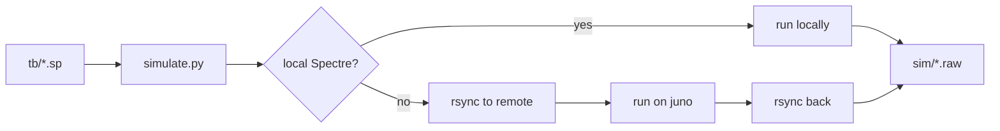
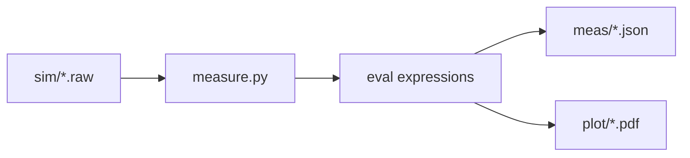

# Setup

The FRIDA analog design flow uses a Python-based netlist generation system that creates parameterized subcircuits and testbenches, runs SPICE simulations, and analyzes results.

Run `make setup` to check dependencies and install missing packages.

This project is a "workspace", and relies on a mixture of tools (mostly open, some commercial) which don't all have a decent Python interfance. Therefore 'make' fufills the needs better than a `requirements.txt` or `pyproject.toml` file.

## Flow commands

Generate parameterized subcircuit netlists from block definitions:

```bash
make subckt cell=<cellname> [debug=1]
```

Input: Block definition in `blocks/[cell].py` containing:
- `subckt` struct with topology parameters, device parameters, and sweep specifications
- Optional `generate_topology()` function for dynamic topologies

Output: `results/[cell]/subckt/`
- `[cell]_[tech]_[hash].sp` - SPICE subcircuit netlists
- `[cell]_[tech]_[hash].json` - Netlist metadata
- `files.json` - File tracking database

Process:
- Topology Expansion: `expand_topo_params()` creates cartesian product of `topo_params`, calls `generate_topology()` to compute ports/devices
- Device Parameter Expansion:** `expand_dev_params()` creates cartesian product of tech, inst_params, dev_params
- Maps generic device types to technology-specific models
- Writes SPICE and JSON files, updates db.json

Generate testbenches that reference the subcircuit variants:

```bash
make tb cell=<cellname> [debug=1]
```

Input: Block definition `blocks/[cell].py` containing:
- `tb` struct with testbench devices, analyses, corner/temp sweeps, and optional `topo_params`
- Optional `generate_tb_topology()` function for dynamic testbenches

Output: `results/[cell]/tb/`
- `[cell]_[tech]_[hash]_[corner]_[temp].sp` - SPICE testbench netlists
- `[cell]_[tech]_[hash]_[corner]_[temp].json` - Testbench metadata

Process:
- Reads `files.json` to find all generated subcircuits
- For each subcircuit, generates testbenches across corner × temp combinations
- Matches testbench topology to subcircuit using `topo_params`
- Auto-adds includes (from files.json paths), libs, options, save statements
- Updates files.json with testbench paths

## Netlist Structs

The netlist schema provides a way to describe many different combinations of subcircuits and testbenches withou having to write procedural code.

Here is an example subcircuit netlist struct:

```python
subckt = {
    "cellname": "comp",                    # Cell name
    "ports": {},                           # Port definitions (or empty for dynamic)
    "devices": {},                         # Device instances (or empty for dynamic)
    "tech": ["tsmc65", "tsmc28"],          # Technologies to generate
    "topo_params": {                       # Topology parameters (optional)
        "param_A": [val1, val2],           # Cartesian product in Stage 1
    },
    "dev_params": {                        # Device defaults (applied last)
        "nmos": {"type": "lvt", "w": 1, "l": 1, "nf": 1},
        "pmos": {"type": "lvt", "w": 1, "l": 1, "nf": 1},
    },
    "inst_params": [                       # Instance overrides (applied before dev_params)
        {"devices": ["MN1", "MN2"], "w": [20, 40], "l": [1, 2]},
    ]
}
```

To generate the ports and devices list based on topology paramters, we can write a function called `generate_topology()`:

```python
def generate_topology(**topo_params) -> tuple[dict, dict]:
    """Generate (ports, devices) for given topo_param combination."""
    # Compute ports and devices based on topo_params
    return ports, devices
```

Device parameters are applied in **priority order** (later values override earlier):

1. Topology-set values, from `generate_topology()` using `topo_params`, are never overwritten
2. `inst_params`, are applied to specific device instances
3. `dev_params` - are applied last as defaults to all devices of matching type

All list-valued parameters create cartesian products. For example `tech: ["tsmc65", "tsmc28"]` × `dev_params.nmos.w: [1, 2]` yeilds 4 variants.

To simulate a circuit, you also can (and should!) create a corresponding tesbench netlist struct, with it's generation function:

```python
tb = {
    "devices": {                           # Testbench devices (or empty for dynamic)
        'Vvdd': {'dev': 'vsource', ...},
        'Xdut': {'dev': 'cellname', ...}   # References subcircuit
    },
    "corner": ["tt", "ss", "ff"],          # Process corners
    "temp": [27, -40, 125],                # Temperatures
    "topo_params": {                       # For matching with subcircuits (optional)
        "switch_type": ["nmos", "pmos"]
    },
}

def generate_tb_topology(**topo_params) -> tuple[dict, dict]:
    """Generate testbench devices for given topo_param combination."""
    return {}, devices  # Ports always empty for top-level TB
```

## Output files and their management

The output of each flow step writes to a subdirectory inside `/results`:

```
results/
└── [cell]/
    ├── files.json             # File tracking database
    ├── subckt/
    │   ├── *.sp               # SPICE subcircuits
    │   └── *.json             # Subcircuit metadata
    └── tb/
        ├── *.sp               # SPICE testbenches
        └── *.json             # Testbench metadata
```

Furthermore, each cell has a `results/[cell]/files.json` automatically written and update to track all generated files. Here's a single entry:

```json
[
  {
    "cellname": "samp",
    "cfgname": "samp_nmos_tsmc65_dfe2429be6c3",
    "subckt_json": "subckt/samp_nmos_tsmc65_dfe2429be6c3.json",
    "subckt_spice": "subckt/samp_nmos_tsmc65_dfe2429be6c3.sp",
    "subckt_children": [],
    "tb_json": ["tb/samp_nmos_tsmc65_dfe2429be6c3_tt_27.json"],
    "tb_spice": ["tb/samp_nmos_tsmc65_dfe2429be6c3_tt_27.sp"],
    "sim_raw": [],
    "meas_db": null,
    "plot_img": []
  }
  // plus many more
]
```

Subsequent flow steps read files.json to find exact file paths without inferring from filenames. For example, testbench generation reads `subckt_spice` to add `.include` statements.

## Simulation Flow

Run Spectre simulations (automatically uses remote server if local host lacks Spectre):

```bash
make sim cell=<cellname> mode=<dryrun|single|all> [tech=<tech>] [debug=1]
```

- `mode=dryrun` - Show simulation plan only
- `mode=single` - Run first testbench only (for debugging)
- `mode=all` - Run all testbenches



## Measurement Flow

Extract measurements and generate plots from simulation results:

```bash
make meas cell=<cellname> [tech=<tech>] [corner=<corner>] [temp=<temp>] [no_plot=1] [debug=1]
```



## Full Flow

Run the complete flow (subckt → tb → sim → meas) in one command:

```bash
make all cell=<cellname> [mode=single|all] [debug=1]
```

Defaults to `mode=single` for quick iteration.

## Clean Targets

```bash
make clean_subckt cell=<cellname>   # Remove subcircuit outputs
make clean_tb cell=<cellname>       # Remove testbench outputs
make clean_sim cell=<cellname>      # Remove simulation outputs
make clean_meas cell=<cellname>     # Remove measurement outputs
make clean_plot cell=<cellname>     # Remove plot outputs
make clean_all cell=<cellname>      # Remove all outputs for cell
```

Omit `cell=` to clean all cells.

## Analyses and Measures

Each cell defines its analyses and measures in `blocks/[cell].py`. These are evaluated by PyOPUS PerformanceEvaluator.

### Analyses Configuration

Analyses specify what simulations to run:

```python
analyses = {
    # Standard transient analysis
    "tran": {
        "head": "spectre",
        "modules": ["tb"],
        "command": "tran(stop=5.5e-6)",
        "saves": [
            "v(['in+', 'in-', 'out+', 'out-', 'clk'])",
            "i(['Vvdd'])"
        ]
    },
    # Monte Carlo wrapped transient (uses foundry mismatch models)
    "mc_tran": {
        "head": "spectre",
        "modules": ["tb", "mc"],  # Include MC models from PDK
        "command": "'montecarlo numruns=10 seed=12345 variations=mismatch savefamilyplots=yes { inner_tran tran stop=5.5e-6 }'",
        "saves": [
            "v(['in+', 'in-', 'out+', 'out-', 'clk'])",
            "i(['Vvdd'])"
        ]
    }
}
```

### Measures Configuration

Measures define scalar values extracted from simulation waveforms:

```python
measures = {
    "offset_mV": {
        "analysis": "tran",
        "expression": "m.comp_offset_mV(v, scale, 'in+', 'in-', 'out+', 'out-')",
    },
    "delay_ns": {
        "analysis": "tran",
        "expression": "m.comp_delay_ns(v, scale, 'clk', 'out+', 'out-')",
    },
    "power_uW": {
        "analysis": "tran",
        "expression": "m.avg_power_uW(v, i, scale, 'Vvdd')",
    },
}
```

The expression has access to:
- `v(node)` - Returns voltage waveform array for a node
- `i(source)` - Returns current waveform array for a source
- `scale()` - Returns the time axis array
- `m` - The `flow/expression.py` module with measurement functions
- `np` - NumPy for array operations

Custom measurement functions are defined in `flow/expression.py` and should return a single scalar value.

## Monte Carlo Measurement Extraction

For Monte Carlo simulations, the measurement system automatically handles multiple runs and computes statistics:


The same measure expressions work unchanged for both deterministic and MC simulations. For MC, the output includes statistics:

```json
{
  "offset_mV": {
    "mean": 0.45,
    "std": 1.2,
    "min": -1.5,
    "max": 2.3,
    "values": [2.3, -1.1, 0.8, ...],
    "numruns": 10
  }
}
```

The MC models (mismatch, process variation) come from the foundry PDK and are automatically included when an analysis specifies `"modules": ["tb", "mc"]`.
