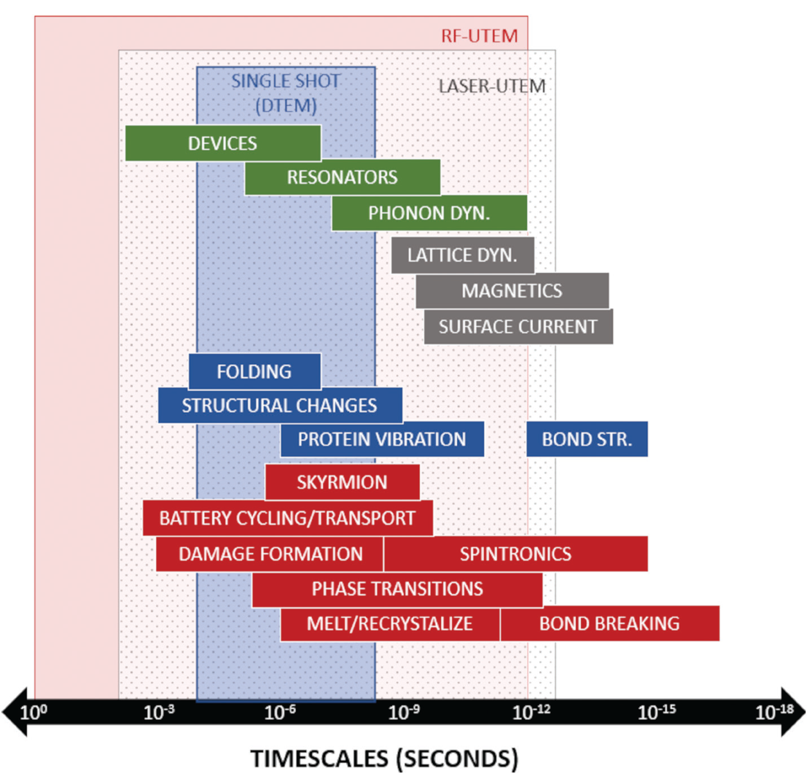
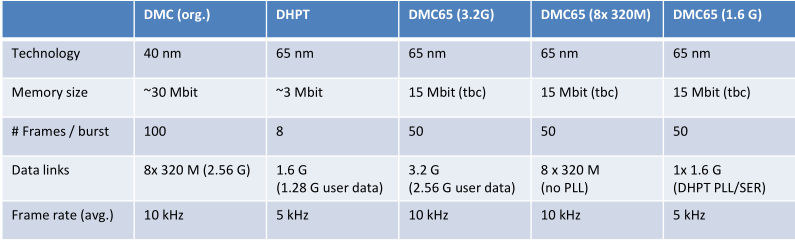

## Particles worth measuring

Notes: 

- Leptons/antileptons have no strong interaction
- 
Order of detection:
1. Charged Hadrons (Proton, Pion, etc) and charged Leptons (Electron, Muon, and Tau) are detected in silicon tracker. BUT: Neutral Hadrons (Neutrons, etc) and Neutral Leptons (All three Neutrino) and photons are not detected in silicon tracker as they uncharged
2. Photons and electrons are stopped in electromagnetic calorimeter, protons aren't stopped but are 'visible'.
3. Charged and neutral hadrons are stopped in hadron calorimeter
4. Muons are stopped in the muon outer layers. Neutrinos of all three types pass through with no interaction

**Composite Particles**
Hadrons (Made of Quarks, almost always unstable when 'free')
- Baryons (Odd quarks, usually 3)
	- Protons
	- Neutrons
	- +Exotic Baryons
- Mesons- Even quarks, usually 2, stable only ns before decay
	- Pions
	- Kaons

# how to detect:

Material systems

In metals, the outermost electrons are delocalized and form a sea of electrons that are free to move throughout the material. This delocalization means that the outer electrons are less tightly bound to individual atoms compared to the electrons in semiconductor materials. As a result, high-energy particles have less interaction cross section with the electrons in metals because they are less likely to scatter off the loosely bound electrons.
Also, in metals, I think that the conduction band overlapping with the valence (no distinct bandgap) means that incident high energy particle tend to excite electrons in the conduction band, rather than create electron hole pairs in the valence.

photoelectric effect vs compton scattering vs pair-production

How does the [photovoltaic effect](https://en.wikipedia.org/wiki/Photovoltaic_effect) work by comparison?

Infrared, visible light, and X-ray imaging are quite common. But UV isn't. This is has a couple reasons. One is that UV light is attenuated by the atmosphere, which means there is less of it for applications like ground based imaging of space. Another reason is that a significant challenge for UV imaging is the fact that glass absorbs UV light. Therefore, only specially designed optics made with very pure  glass (silica) with few impurities can fully take advantage of the full  UV exposure being imaged. Impurities such as iron and sodium are common  within glass and are the cause of most UV absorption. [Source](https://www.lumenera.com/blog/how-imaging-with-ultra-violet-light-reveals-hidden-details)

>  Shorter wavelength photons (400 nanometers and below) are either reflected or absorbed into the gate region of the CCD. Longer wavelength photons (between 400 and 700 nanometers) have a high probability of generating an electron within the charge well. As photon wavelength exceeds 700 nanometers, the probability becomes greater that the photon will pass directly through the CCD without being absorbed. The spectral sensitivity of the CCD differs from that of a simple silicon photodiode detector because the CCD surface has channels used for charge transfer that are shielded by polysilicon gate electrodes, thin films of silicon dioxide, and a silicon nitride passivation layer. 

https://micro.magnet.fsu.edu/primer/java/digitalimaging/ccd/quantum/

## Energy resolution

Kalpha and Kbeta emit the characteristic energy, and we see them in full absorption at those two lines

The flat background baseline is 'particle absorbption from scatting'

The energy noise is measured by 'fitting a gaussian' to the low energy peak

## Applications What needs to be measured, and with what precisions

Discuss applications, and their desired precisions, what is limiting bottleneck right now

Explain sometimes the particle itself is work measuring, other times it gives implicit information about another

# From source to deposition charge to propogation charge to pixel charge:

- Show how various state of the art sensors classes transform particle hits to pixel charge.
- Don't discuss optimization, just take sensors "for what they are", as optimized by others.
- Display simulation results in a consistent manner for different sensors types, against various incident particle types and conditions.
- Then discuss how the sensor has already modified the properties of the 

*Topics:*

Interaction with matter. Particles, charged or neutral, can only be detected via interaction with matter.

The Bethe-Bloch formula determines the *average* energy loss per path length, by the mechanism of ionization.

Of course, this radiation also deteriorate the sensors, as will be discussed in later sections.

Geant4 provides modeling from the initial source, be it and electron or hadron beamline, or radioactive source. It simulates the move of incident particles, as then pass through the sensor and calculates their energy deposition.

Based on this, the creation of electron hole pairs can be computed. [Lachnit, 2021, p37](https://www.physi.uni-heidelberg.de/Publications/BachelorLachnit.pdf)

[Allpix²](https://allpix-squared.docs.cern.ch/) then provides several models for propogation of this charge in the sensor.

At it's core it relies on an accurate model of pixels is done via TCAD simulation, including electric field and doping profiles. This is essentially the a set of  a FE or FD discretation approach for creating a mesh, then together evalutated with a quasi stationary solver.

Allpix² then builds on top of this core.

We don't need more complicated EM solver types like, Finite-differences-time domain (FDTD), Method of Moments (MoM), or equivalently, Boundary Element Method (BEM). [More info on these.](https://www.matecdev.com/posts/differences-fdtd-fem-mom.html)

electric field can't be generated in metals, as the conduction and valence band are overlapped
there are no 'carriers'weighting field and shockely ramo theorem

Short article on epitaxial layers on top of substrate, for pixel dectors: https://meroli.web.cern.ch/lecture_CMOS_APS_epilayer.html

# Masks

Wafer are like 200-300mm nowadays, but only processing 
Older wafer are 16in (40mm), which is only used by small foundaries with outdated tech
A mask is used for a single die area, and the light is scaled down by a factor of about 10.
Then the mask/reticle are stepped across the wafer, which is typically the bottle neck in manufacturing, as other processing steps are often wafer-wide.

# Sensors mechanical

At the edge of sensors you have the implanted guard ring structures, which gently diffusion the lateral pixel bias field.
Sensors can be made very large, but chips are often limited in size. Therefore we have concepts like quad modules.
At the edge regions between chips, the pixels are either:

- just larger
- or you have the intermediate orphan pixels attached to an interior pixel, a couple positions away, which isn't likely to be activated at the same time.

So different techniques to tile them are:

- Tipping and overlapping
- Back and front side of a support, two allow overlaps
- No overlapping on one layer, but various layers in detector are offset

# Charge signal formation

The primary particle will not always make a simple cloud shape
For example, if it passed between two pixels (at edge) or even four (at corners), it can make 1/4 of the charge.
A low energy photon will just product a small 1-2eV signal via the photo effect
A high energy photon, from X-ray or Gamma, will produce a ~60keV charge, but this then will collide with other atoms and produce a bunch of knock on carriers in a weird shape.
Another issue is that the vertical fields bend toward the collection nodes as they reach the 'top' of the substrate, which leave a 'dead zone' between pixels. Any carriers generated here will take a much longer time to be collected as drift will be minimal.

# Readout

Pixel sensor typically have a capacitance of $Cd = ~50$ fF
The sensor can be modeled as a current source in parallel
To fully read out this charge, we need either a resistive or large capacitive load.

- Large resistor could work, but it hasn't been used
- Large capacitor is possible, but is better achieve using a miller capacitance in feedback, where $Ctot = C_{f}*(A_{0}+1)$. 
  Signal charge is normally around 1fC
  What is the bias voltage across the detector?
  What is the leakage current typically/approx?

Hans wrote that $V = Q/C$, which is true, but this seems to imply that having a large cap actually reduces the voltage signal?

Some variations of the arch. are putting a current source in feedback with $C_{f}$, or placing an AC-coupling capacitor on the input of the amplifier. Also, placing something in feedback is a great way to also build a hi-pass filter, which eliminates the leakage baseline, and any left over signal.

# Images sensors:

Cyclic ADC is like SAR, but amplifier error signal instead of reference voltage

On sensor ADC, comes in 3 main layout configurations:

The full-well capacity (FWC) is the largest charge a pixel can hold before saturation which results in degradation of the signal. When the charge in a pixel exceeds the saturation level, the charge starts to fill adjacent pixels, a process known as Blooming.

# Scientific imaging needs:

*Timescales for phenomena studied in materials science (red), life sciences (blue), semiconductor (gray), and nanotechnology (green). Accessible timescales of complementary UTEM techniques are also superimposed.*

Are time scales the same thing as temporal resolution?

Yellow area: high time resolution, continously high repeated measurements (real and k-space)
Pinkg region: very high single-shot time resolution, but stroboscopic slower repetition  (k-space only)

# EDET & Belle: DCD + DMC + DEPFET
DCD 1 + Switcher3: [P. Fischer TWEPP 2007](https://indico.cern.ch/event/11994/contributions/84416/)
DCD Belle: [I. Peric TNS 2010](https://doi.org/10.1109/TNS.2010.2040487)
DCD2 + ASM Belle: [M. Koch Thesis 2011](https://cds.cern.ch/record/1380639?ln=en)
DCD2: [P. Fischer JINST 2011](https://doi.org/10.1088/1748-0221/6/01/C01085)
EDET prototype: [S. Epp VERTEX 2016](https://indico.cern.ch/event/452781/contributions/2297602/)
EDET prototype: [S. Epp IWDDA 2016](https://indico.mpp.mpg.de/event/4247/contributions/9603/)
Belle Modules: [F. Mueller Thesis 2017](https://www.mpp.mpg.de/~cmk/Belle/Thesis_Mueller_Felix.pdf)
EDET80k summary [MPG HPP HLL](https://www.hll.mpg.de/3051199/EDET80k)
EDET80k sensor [M. Predikaka JNIMA 2020](https://doi.org/10.1016/j.nima.2019.162544)

- EDET does time-resolved spectroscopy, does it measure after illumination?
- Good for study dynamics of chemical processes, protein folding.
- The spacial resolution of electron beam illuminated systems has already seen good improvements, I think down to the atomic scale?
- But 'real time' vs 'stroboscopic' imaging of system dynamics is still unsolved.
- Backthinning + minimal support reduces multiple and back scattering -> good spatial resolution
- In pixel signal compression -> DR is single primary $e^-$, or from $100$ -> $8\times10^5$ $e^-$ (poisson limited)

EDET is normally used for 'shadow' based imaging, with either electrons or photons (soft Xrays). Electrons have a very high depositied energy, and so if you're using them in a TEM configuration you need to make sure the dynamic range of the DEPFET pixel won't saturate. When doing Xray imaging, with a source coming from a syncrotron (for example) you instead have a different deposited energy pattern, which is the 'Fourier transform' of the incoming particle energy. It's used in drug discovery and material science.

DEPFETS could also be used for space based imaging, where the object of interest is the source itself.

DEPFETs in EDET and Belle2 uses a quad-grouped rolling shutter. In Belle2, this works for tracking because it's already a 'quasi' continuous beam with a 2ns bunch crossing, but the hit rate is so low, that the inner layers don't need to 'disentangle' nearly as many events. Finally, the outer layers actually take multiple samples along the deposited charge waveform, and so they are doing the job of getting precise timing information.

Sampling time of ADC but be slow enough to achive resolution needed for each pixel, but the aggregate rate must be fast enough to achive readout time of the entire pixel array.

- DCD1: TNS 2010. 72 ADC channels each with 140um x 110um. Contains two cyclic ADCs in parrallel, 8-bit, 660 SNR (56 dB), 320ns (3.125 MHz) conversion time, 40um x 55 um, 1mW power, 180nm. At this time, DEPFET array produced 400 pA /e in sensor. Input signal range Dynamic range is from +- 8uA, with a 64nA LSB. The measurement takes 8 cycles, each 40ns (25 MHz) long, for a total of 320ns for 8bit precision. (They also built a fast variant, with 20ns per bit, for 160ns sampling time for 8-bit resolution)

- DCD2: An in-between chip revision, not documented specifically in a paper.

- DCDB: Revision for Belle, 180UMC, increased to 256 channels (JINST 2011). Total chip area was 3200 x 5000 um. 16 by 16 ADC array, with each measuring 200 um x 180 um. 256 ADC channels, at same data rate as DCD1, requires eight 8-bit links. Each ADC presents a byte of data every 320ns. This is means each ADC is clocking out a parrallel byte at 3.125 MHz. 32 of these channels are serialized together. The ADC conversion time is increased now to 100ns (10MHz), which is like 3 times faster than DCD1. Total power per channel is 4mW.

- DCDB + DHPT65: T. Kishishita 2012 for Belle. 256 ADC in, 4:1 mux for 64 links -> DHPT, then with 1.6GHz single serial output (1.28Gbps after 20% overhead), 12-15m twisted pair. They used four DCDB + DHPT pairs. Shooting for 20 us per frame (50 kHz frame rate). The row time is the same as EDET, it's just 

Pixel array for Belle module is 768 px rows, x 256px columns. Four rows are read out at a time, though. Therefore, 4 DCD + DHPT channels are used. No correlated double sampling is used.

> Readout timing: The most challenging aspect is the frame readout time of 20 µs, which would translate on a full module with 1536 (768x2) pixels to a row time of only 13 ns (76.8 MHz). This timing is impossible to achieve (cf. measurements in Section 7.1) due to intrinsic settling times of the DEPFET sensor and the readout chips. The time constraint is however relaxed by splitting the module in half using readout chips at both sides, and implementing a high degree of parallelization by using a four-fold pixel arrangement(Figure 12). This results in a factor of eight gained in speed, translating to a row time of 104.2 ns (9.6 MHz). To gain additional time, the DEPFET typical sample-clear-sample (double sampling, see Section 2.2.3) readout operation has been abandoned in favor of the faster sample-clear (single sampling) sequence.

- EDET project starts: ~ 80 kHz frame rate (actually 78.125 kHz/12.8 us frame time). 512x512 pixel in a quadrant. Twice many columns as Belle, and I think still readout four rows at a time, so this is why 2*4 = 8 DCD + DMC chips are needed. To sanity check: 512 row read in groups of four (512/4=128), with each ADC at 100ns sampling time sampling time, gives us 12.8 us frametime (78.125 kHz frame rate).

- DCDE is an increased dynamic range version DCD. It's being used in EDET (Koffmane, 2019)

# For FASTRoic

We have 512 x 512, but each of the 8 chips is responsible for a 64 x 512 region of pixels. Each pixel is 60 x 60 µm, so that means that the width for the 64 pixel section is 3.84 mm. This is much less than the maximum ~20mm full reticle size. But that's okay, as we can reduce our design complexity and improve yield.

We have fourfold column readout though, so it more like we're reading a 256 wide x 128 tall pixel array.

Each of these 256 effective columns gets an ADC, which are fit in 16x16 configuration. Thus each ADC is limited to 64/16=4 pixel rows. That means each ADC must fit a 4*60 = 240µm width, and we assume they are square, a 57600 µm² or 0.0576 mm² area.

which takes 100ns to sample at 8-bit resolution, and that the full 64 x 512 region needs to be readout in 12.8 us frametime (78.125 kHz frame rate). 

ENOB * 6.02 + 1.76 -> SNR

8 * 6.02 + 1.76 -> 50 dB
10 * 6.02 + 1.76 -> 62 dB

Previously, in TSMC 65: 12.5 Ms/s, 8-bit, 40x70um size, 40 uW at 1.2V. 

100ns is 100 Ms/S.

Energy per conversion is 40e-6/12.5e6 = 3.2e-12 J.

at a ~80kHz full frame rate (12.8 us). The end application is for a high-performance transmission electron microscopy camera.

The ROICs will be bonded around the periphery of the sensor arrays substrate. Each is only responsible for reading a subsection of the array measuring 256 column x 128 rows, with one ADC per column. Based on the frame time ADC must capture the drain current in less than 100ns, at 10 bit resolution. The area per ADC should be around 0.0576 mm² area (240µm * 240µm, assuming it's square).

Are cyclic ADCs used in all of these? When I hear 'residual' and 'algorithmic ADC', what should this mean to me?

So what have we learned:

- The settling time of the switcher and DEPFET pixels determines how quickly a row can be readout.
  - approx 50ns settling appeared to be the speed limit in 2010. Can we improve on this?
  - So making the ADCs faster than 10 Mhz doesn't look like it would help.
  - But maybe switcher could be faster, or maybe the settling time of the DEPFET array has improved in the past 15 years?
  - Just reading multiple rows in at once, with extra ADCs, is a work around for the 'speed limit', but 4-fold may be the pratical limit.
  - What physical processes would be then measurable, if the frame rate were to improve?
- The on chip memory density/capacity determines how many frames can be buffered before the system has to pause.
  - Would this be beneficial to increase?
  - Do we really need a 3.2 Ghz PLL, if we can readout the frames as slowly as necessary?
  - What is the downstream PHY capable of, and how long/what type are the cables
- Would timing information be helpful? (I think not, as it's in imaging mode.)
- What determines/limits the spatial resolution? Does framerate affect that? Would it help if it were improved?
  - If ADCs were faster, but the frame time was the same, perhaps we could oversample or correlated double sample the pixel current
  - This would not improve temporary resolution, but would get us better SNR. 

EDET specs:
- 1Mpixel @ 80 kHz, but is broken into four regions of 512 x 512 pix
- Therefore one frame is 262 kbit/frame, with a 78 kHz frame rate, or fully readout every 12.821 microseconds

- 100 ns /gate
- 128 gates
- ADCs are column parallel, 8-bit
- Are ADCs one channel per column? How wide are they? Compare this with Murman ADC Survey

Existing 65nm PLLs:

|Design|Fin(Hz)|Fout(Hz)|Jitter(s)|Power(W)|TID(Rad)|
|---|---|---|---|---|---|
|DHPT|80M|1.6G|20p|1.25m VCO|20M|
|RD53|80M|1.28G|5p|6.5m|500M|

SAR ADC specs from Berkeley:

process_info:
  unit_res_ohms: 6600
  cap_mismatch_percentage: 10
top_specs:
  resolution_bits: 7 #8
  samp_freq: 1e6
  input_range: 1.8
  throughput: 8 #11 # latency
app_specs:
  clk_in_jitter: 1e-11

# Notes from meeting, Oct 10
-The dynamics of the collection electrode are very slow, relative to the injection charge. Ie the dominant pole is the electronics. Therefore the shaped of the transient of the current injection isn’t important, and can be modeled as anything. The area is all that matters. This is why injection circuits can be built the way they are. Perhaps this would not be true for timing sensitive systems?
- First order description of a detector front end is just noise and threshold. Second order is amplitude dependent time walk.
- TOT information is mainly just used for calibration. However, it can be used to provide a slight improvement for particle identification in assistance to the calorimeters, and in the case of a particle that just arcs through the inner tracker, only, without passing into the calorimeters, it can identify that too. These would be heavy particles?
- EDET and current PXD system are very similar
Cordia has ADC which could be built into new EDET
You could have the DCD and DHPT all on one chip in EDET
- The Cordia project has a very, very large dynamic range from 10photons to 10000, and so it needs an adaptive real time gain scaling, incase a hit gets close to saturating.
- VTX Obelix is a monolithic chip for Belle upgrade, which has a column based VCO for timing at 320MHz.
- Timepix has a local VCO for timing.
- The Belle DCD had a data rate of 2.5 MS/s, with 10 bit of resolution, while the EDET DCD needs 10MS/s
- Tracking systems are of low commercial appeal, so maybe I should focus more on imagers. EDET and Timepix are two examples.
- The two main ongoing monolithic detector projects are the RD 50 projects and the Obelix projects. I’m not sure how Liverpool fits in here, perhaps it’s part of the RD 50? 
- Is allpix useful for imaging systems?
- Snoeyes is well known for leading the Alpide design project.
- The ASM is specially made in a proprietary process by a research lab. Is it by MPG HLL? It has DEPFETs and had flip chips for Switcher, DCD and DMC/DHPT chips.
- The inventor of DEPFETs is a TCAD guy, now working on EDET.

# AGIPD:
Find more stuff like this:
- Stuff at linear accelerators
- Stuff at syncrotron light sources

Hybrid system w/ bump bonds, 200um pitch, 

4.5 MHz (pulse separation of by 220 ns) for up to 2,700 pulses (total train 600 µs)
10Hz repetition (10ms), so there is 99.4 ms of spacing after start of new train

EDET

# Cordia
at Desy

Cordia 10 MS/s 8-bit charge-redist ADC [Tetsuichi, Hemprek, Krueger, JNIMA 2013](https://doi.org/10.1016/j.nima.2013.05.192)

# Medipix/Timepix

| Chip | Year | Node |
| ---- | ---- | ---- |
|  Medipix4 | 2021 | 130 |
| Timepix4 | 2019 | 65 |
| Timepix2 | 2018 | 130 |
| Medipix3 | 2011 | 130 |
| Timepix3 | 2013 | 130 |
| Timepix1 | 2006 | 250 |
| Medipix2 | 2004 | 250 |
| Medipix1 | 1998 | 1000 |

Timepix4 specs: `3.58*10^6 hits/mm^2/s	195ps LSB	ToA 23bit DR (1.6ms)	80e- LSB	15-bit DR	5 x 10^9 hits/mm2 /s`

# Monolithic
OBELIX monolithic (BELLE II)
ALPIDE (ALICE)
TJMonopix
LFMonopix

from [I. Caicedo 2018](https://arxiv.org/pdf/1902.03679.pdf)
Tangerine

0.1-0.7w /cm2 typical? Is this for monolithic or hybrid?
Obelix has no pll

# Hybrid Tracker LHC

Particle detector for tracking are weird, as they don't form images, are single particle sensitive, and they are event-based triggering-based, rather than frame based

FE-I4 (ATLAS LHC)
RD53 (CMS + ATLAS HL-LHC)

0.1-0.7w /cm2 typical? Is this for monolithic or hybrid?

Pixel sensor FOM:

focus on charge based sensor readout. Must ignore different input sensors, as ADCs foms typically do?
REduce down to individual pixek, but specify area + power per
Factor out monolitichi/hybrid specific parameters
Single-shot pulse signal: SNR isn't useful, as signal+noise is measured in energy, not power?
ADC FOMs factor out dynamic range by making to a part of the the distoritaion (via SNDR), do I have this luxury? ADCs and assume a sinusoidal input, but I don't have that?

In a single pulse system, can the accuracy of the energy measurement be made arbitrarily accurate by stretching the pulse out over a longer period of time, or larger period of amplitude?

No, I don’t believe so, because even if the input was ideally noise free, there is no such thing as noise free amplification. In any case, post amplification the signal to noise ratio of the signal fed to the quantizer, now full-scale.

---

### From other notes:

RDL/Passivation to connect resistors on the top, costs $4600

AIDA 28nm

SPAD sensors
Normal CMOS image sensors?

			Tracking Mode (Data Driven Readout)					Imaging/Counting Mode (Frame-Based Readout)					
Pixel Pitch	Pixels	Sensi. Area.	Max Hit Rate	Time Res.	Time DR	Energy Res.	Energy DR	Max Hit Rate	Particle Counts			Readout Type	Tiling Sides

RD53: 500mW per square centimeter, as -20C must be maintained to prevent thermal runaway damage
In hybrid sensors current is ~nA, but voltage is higher, which means it still consumes 50% of total power

multiple scattering is worse in e+ e- colliders like Belle

In systems that are DC coupled, which is the majority of the sensors, any additional current will manifest as error signal in the integration period, and so you need a compensation circuit. It sounds like charge-sensitive amplifiers somehow manage to work around this partially, by somehow ignoring the dc component using their 'bandpass' characteristic. But I suppose this isn't perfect?

The other approach, which has been tried, is AC coupling the sensor which prevents the DC leakage from affecting the readout electronics. However, this will form a capacitive divider with the pixel sensor capacitance. The ratio of sensor_cap:coupling_cap roughly forms the ratio of signal loss so a much larger coupling cap is needed. For example a 1:10 ratio means that 10% of the signal charge is lost (I think???).  Seeing as typical pixels have a capacitance on the order of 50fF, we would need a coupling capacitance of around 5 pF (100x) in order to get around only a 1% loss in the sensor's signal charge.

high hitrate, limited IO, not all hits read, but don't know which until tracker informs. 

majority of hits never read out, but we can't know which hits to discard until we recieve the tracking data. Can't read out all though as digital IO limit. Therefor a huge amount of chip are and space is spent holding the potential hit data in memories, which then are mostly discarded when tracking data is recieved after a fixed delay. Some people have investigated different ways of acquiring simple tracking information on-chip, so that a larger portion of the hits can be discarded immediately.

The reason the first bit of measurement in the discriminator is so high precision is that we are just using the device for tracking. Energy resolution is just a secondary feature, mainly used for calibration and characterization, with the built in injection circuit

---

# Long 'detector signal chain essay'
The purpose of this essay will be to study and quantify the design space of pixel detector systems, including the creation of a FOM. It will draw upon comparisons with other data conversion circuits like Image Sensors, ADCs, and TDCs.

To do this, we must build a model or incident radiation's interaction with matter. This model is in contrast to the discipling of 'gaussian/geometric optics' where beams of light are geometric light rays. This has the concept of [focal and image planes](https://en.wikipedia.org/wiki/Cardinal_point_(optics)#Focal_planes), etc. (Focal plane is the same as image plane but just in case on image coming from infinity.) By contrast are interested in single quanta detection. The other domain of this is the detection medium, which we'll model with a staring/plane array.

What we need to do is fix a temperature, a sensor material, and incoming particle type/energy range direction and radiation environment.

Then we create parametric limits on the thickness (to ensure energy loss doesn't dominate resolution of measuring particle direction, momentum, and energy.)

What resolution on energy does the calorimeter provide? Can a tracking sensor ever provide that?

A detector, vs imager, is something which has the concept of 'detection efficiency' take all the way to the quanta. We want every incident particle interacting with the sensor, and generating signal charge.

We want to measure particle kinematics, so particle direction, momentum, and energy. But we need to strip down and simplify this model to the context of what is definable in a single chip. We're going to abstract away the dimensions of:
- multiple layers increase in precision
- mass's decrease on precision
- recovery time/bunch crossing effect on pile-up/and  -> probability of loss of detection

So we'll essentially compress it down into: power budget, mass budget, detection efficiency by setting a limit below which these parameters will not be the bottleneck on performance.

The first constraint is precision for a single particle, passing through a plane array sensor. 

Basically, you want a high detection probability (low noise, )

There is a correspondence/connection between:

**Detector**: granularity, ENC, detection efficiency, timing resolution, timewalk, power per cm^2

**Imagers**: Noise Equivalent Quanta, Detective Quantum Efficiency, and Quantum Effienciy.

**ADCs**: Technology (getting better or worse?) vs architecture front, ENOB, Nyquist limit, fundamental limit on kT noise, 

* https://www.analog.com/en/technical-articles/a-12-b-10-gss-interleaved-pipeline-adc-in-28-nm-cmos-tech.html
* https://ewh.ieee.org/r5/dallas/sscs/slides/20120829dallas.pdf
* http://www.hit.bme.hu/~papay/edu/DSP/adc2000.htm
* https://www.youtube.com/watch?v=doTHd0W9QhA

In general, arbitrarily high resolution is achievable up to the noise floor, at the maximum single stage speed can be achieved, if you if you are willing to spend more power via pipelines. Put differently, pipe-lining is a way to improve resolution, at a fixed speed, by spending more power. It is limited by device noise, most probably dominated by the those in the first stage. 

Double sampling, flat-field correction, dark frame subtration, noise shaping, and oversampling are a way to reduce noise, by taking subsequent measurements. Correlated double sample is primarily to fixed each pixel's offset (although it does a bit of noise shaping), just as flat-field correction and dark frame subtraction.

* Dark frame correction corrects variations in thermal noise, which originates from lattice vibrations, and occurs every when there is no signal exposure. In devices where charge is passed from pixels, pixels at the end of the chain will have worse additive thermal noise as they are bucket brigaded the longest along the array. In images this is possible, because images are integrated, and so we will be able to measure a higher than average noise power over the integration period in those pixels. ADCs, the equivalent to this thermal noise problem is solved by noise shaping, where again multiple measurements are averaged to improve confidence in the measurement. This comes at the expense of added power (I think, obviously?) as you must oversample.
  * I'm not sure how the 'order' of the noise shaping affects this.
* Flat field correction, in turn, fixes sensitivity variation which originates from random offsets in the devices, but not dynamic noise sources, typically. (Of course this will change with environmental conditions and radiation damage, etc.) 
* In imaging, the additive error (dark current noise power) and multiplicative effect are removed via the expression $(input-dark)/(flatfield)$. Notes that the input frame and dark frame should have had the same exposure time.
* Note that these are post processing techniques, not in hardware, and that they are both removing 'fixed pattern noise' in the sensor. The hardware equivalent to this is pixel calibration techniques, although this mainly applies to sensitivity i.e. threshold tuning. I don't know if there's a good way to correct 'hot pixels' as detectors are inherently single shot. I think that this latter parameter is expressed as ENC?

 For example, if a single stage has an uncertainty, 

The can be done either by improving a single stage, or by chaining 

I'm adding TDC's in here, because their single shot precision requirement helps me connect to 

Also, I think I can take an ADC and reduce it down to a 1-bit design, in order to better compare it to a detector.... Meaning I can look at the charts of ADCs, but at the 1-bit level to understand the theoretical limits?

>  What is the poisson limit? The Poisson limit is a statistical concept that describes the behavior of a counting process when the number of events being counted is large and the probability of any one event occurring is small. In this limit, the counting process can be well-approximated by a Poisson distribution, which describes the probability of a certain number of events occurring in a given time period or space. 
>
> In the Poisson limit, the variance of the counting process is approximately equal to the mean of the process, which means that the standard deviation of the counting process is proportional to the square root of the mean. This has important implications for the measurement of low light levels, as it means that the signal-to-noise ratio (SNR) of the measurement is proportional to the square root of the number of photons detected.
>
> For example, in a typical photon-counting experiment, the number of photons detected in a given time period will be proportional to the intensity of the light source multiplied by the detection efficiency of the detector. In the Poisson limit, the distribution of the number of photons detected will be well-approximated by a Poisson distribution, and the standard deviation of the number of photons detected will be proportional to the square root of the mean. This means that as the intensity of the light source decreases, the SNR of the measurement will also decrease, and the measurement will become increasingly noisy.
>
> The Poisson limit is an important concept in many areas of physics and engineering, particularly in the measurement of low light levels and the detection of weak signals. Understanding the Poisson limit can help researchers to design experiments and instruments that are optimized for low light-level measurements and other applications where signal-to-noise ratio is critical.

In pixel detectors, ENC or Equivalent Noise Charge (ENC), which is defined as the
input charge for which the front-end Signal-to-Noise ratio is equal to 1. It's not 'dependent' on input charge level, because it, itself, is specified at a certain input charge level. But perhaps it's dependent on the threshold level? Yes I think it is. So we can compare the 

| Parameters | ADCs | TDCs | Imagers | Detectors |
| -------- | --- | --- | ----- | ------- |
|            |       |       |         |           |
|            |       |       |         |           |
|            |       |       |         |           |
|            |       |       |         |           |
|            |       |       |         |           |
|            |       |       |         |           |

This might be worth a read: https://ieeexplore.ieee.org/document/5204577/

More importantly though, I want to examine this paper from Andrea Galliani: https://www.mdpi.com/2079-9292/12/9/2054

I met him at CERN! This would be super helpful, as it would allow me to compare the performance of such a design against that I can do with a VCO. I need to look at the linearity, speed, size, signal to noise ratio, etc. It's only 6.5 um by 22.5 um! It consumes 2.2uA, which works out to 2uW off a 0.9V supply.

A... also rivetti's groups is at it as well: https://iopscience.iop.org/article/10.1088/1748-0221/17/03/C03022 It uses 1.2-> 2.5 W/cm^2:

> The Timespot1 ASIC has been tested in standalone configuration. The TDC resolution is below
> 50 ps, with an average of 23 ps. From the point of view of the AFE the resolution has been
> quantified to be under 100 ps with an average of 43 ps. All measures have been performed within
> the specified power consumption constraint of 40 μW per pixel. The tests illustrated in the present
> paper show the possibility of improving the performance of the proposed architecture with minor
> corrections. Measurements with the actual sensor matrix and particle generated signals will be
> performed in the near future.

# Discoveries

VCOs **have** been used for CSAs in detectors: https://oparu.uni-ulm.de/xmlui/handle/123456789/3224;jsessionid=123DA682C20AD08FC79D12EFCDEFCD98

And here is an interesting paper, talking about similar problems but for mass spectrometers: https://nano.lab.indiana.edu/wp-content/uploads/2020/07/Todd_2020_JASMS.pdf

# Alice power consumption

In Alice, 

One statistic: In ALICE, water cooling is not needed if power consumption is < 20 mW/cm^2

# Monopix2 Notes

* The resistivity and the voltage determines how much you can deplete. Depletion is necessary because it allows all of your signal to be swept by drift, rather than some of it being collected by diffusion.
* The limit on voltage is the punch through effect, where the diode break down. Is this the dielectric breaking down? 

* Ivan Peric first published work on HV-CMOS, where people said 'well it doesn't matter if you have high-resistivity, because we can just apply a large external voltage to modern processes

* Other people, around the same time (2005-ish) said, whoah, wait, what if you just tuned the resistivity, but doesn't use a high voltage. They created what's called "HR-CMOS" detectors.
* These two detectors camps acted similarly after being irradiated, but did differ some during the beginning of their operation.

* Over time, these two MAPS camps have come together, and the byproduct is detectors with both HR and HV. Primarily these ones of interest are TJMonopix and LFMonopix/MALTA. (MALTA is essentially the same, but has had peripheral circuits designed.) Dr. Norbert Wermes likes to call this 'DMAPS', or Depletable Monolithic Active Pixel Sensors, as the combination of HV and HR allows for full or near full depletion.
* The Czochralski (CZ) method is a way to make substrates. It can be used to make high or low resistivity substrates. The alternative is using an epitaxial layer, which allows for a high-quality but thin layer of high resistivity material to construct a portion of the diode.
* LF monopix
  * Large fill factor, RO electronics are actually inside the collection node, which is sort of 'underneath'
  * Rev2 versions tested are backthinned to 100um thick, to reduce material
  * uses a standard CSA, as the large collection format creates a large pixel capacitance (~250 fF).
  * Power consumption of 370 mW/cm^2 or 28 uW /pixel. 
* TJ monopix
  * is a Small Fill Factor design, which has only a portion of it's pixel area action as the collection node.
  * Electronics are fully seperated from collection node
  * Process modification used to enhance charge collection ability... I this the epitaxy?
  * Additionally, it is a bit strange because it has two opposing voltage applied, rather than one large bias voltage. (How big is this voltage?).
  * One issue with this is the fact that small collection node causes some areas to be far from the node, and the horizontal field isn't strong enough to sweep up the charge properly. 
    * Some process modification, with either an opposite doped region, or just no epitaxial deposition (allowing regular p type to remain) counteracts this by removing the areas that were previous acting as dead-zones trapping signal charge
  * Uses the concept of 

Talking more with Ivan, there were three original flavors. 180nm from AMS/TSI, which has been led by Ivan Peric, and which became ATLAS pix. (peric also made Deptfet and FEI3) It has been customized for many different applications now, all under the HVCMOS label. Then there was the TJMonopix/TJMalta which family which started at CERN, in ALICE, and as a non-rad hard design with epitaxial layer (not called TJ), but then which received process modifications (intermediate n layer and end stops) to become the rad-hard TJ family. It was worked on by Ivan,It competed with ATLAS pix for the outerlayer of the ATLAS HLC upgrade, but neither won, as the whole ATLAS detector is now just RD53. The only potential outlet for TJ technology now is the Belle upgrade. This is called the 'Obelix' project. Finally the LFMonopix family, which doesn't have any process modifications, and which is large fill-factor like ATLASpix. This design has been tested in a  progression has been the major responsibility of Toko, Ivan, and Lars.

I should check who worked on what, like Kunis, Kostas, Piotr, Tomek?

#### Questions:

* Is the TDAC in both LF/TJ reused across the entire array? How is that calibration done? Is this essentially just 'flat-field' correction from basic image processors?

* What exactly is the punch through effect?

* What is the power consumption per pixel and per cm^2 for RD53? How does the width of the sensor stack compare?

* Christian is testing...if the epi layer is fully depleting?

* What is 'collection efficiency?' How does it relate to charge trapping?

* What is threshold overdrive, how does it relate to speed, and why is it measured in electrons?

* How does the size of a capacitor affect noise? What is 'equivalent noise charge'?
* Threshold dispersions/tuning (~100e)
* How does a beam telescope work? How do you ensure even energy of particles hitting the sensor? Is it one particle at a time, or a calibrated and continous fixed flux? How does a beam telescope differ from 

* For time walk calculations, is the 'seed pixel' considered the pixel with the highest value hit, and assumed to have 'no time walk' as a reference?

I'm reading about Noise Equivalent Quanta, Detective Quantum Efficiency, and Quantum Effienciy. The difference is, these are imaging measurements. We are no-fundamentally 'imagining', because we aren't reflecting particle off something, to measure something else. We want to learn about the particles themselves. This means our system measurement is 'single shot'. We don't to take another frame, in order to improve SNR. (Or do we??..) Also, we have radiation to deal with, and the fact that our measurements are 

# Pixel Detector Figure of Merit

"Imagers with larger numbers of pixels are considered to offer superior  spatial resolution, for example. But in order to increase the pixel  number without increasing the chip size, the size of pixel is reduced.  Does this imply finer details in the resulting images? A small pixel  also means less area for the photogeneration process or a loss of signal strength. In addition, smaller pixels may have higher cross-coupling,  so what impact would it have on image quality? Also, how do common  parameters like signal-to-noise ratio (SNR), dark current, fill factor,  full-well capacity, and sensitivity interact with image quality? Is  there any imager performance tradeoff involved among different  categories? How can one tell which imager has a better design?"

Basically though we can boil it down to spacial resolution, temporal resolution,  and dynamic range. But there is a complicated interplay between these.

But also power needs to be part of this.

For example, if pixels are smaller, more charge will be shared between  adjacent pixels when a particle hits, which produces signals closer to  the noise floor and with slower rise times more susceptible to jitter.  But also, quantization noise is reduced, as the nominal pixel size is  decreased. Ultimately we will be limited by the larger of the two error  sources, and so one must not be singularly focused on improving one at  the expense of the other.

One beautiful  interrelation of detectors is that the power dissipation limit is  directly derived from spatial noise limitations, because cooling systems add mass that increase multiple scattering.

Probably Assuming analysis on a certain recovery time for the pixel and on a  certain technology is necessary, as otherwise two much differs. Perhaps  the design should also be fixed to a certain sensor tech, and only  consider 

## from RD53A Specs 2015:

"following discussions with ATLAS and CMS sensor developers, for RD53A we have assumed sensors have less than 100 fF per pixel and deliver a single pixel signal greater than 600 e− in at least one pixel for 99% of incident particles"

* 4uA per pixel in analog circuits
* <1 % hit loss from in pixel pile up
* noise occupancy per pixel < 10^-6, for 50fF load, in a 25ns interval
* <500mA/cm^2 limit, so 0.6 W/cm^2 if it were at 1.2V supply
* min threshold of 600e- and min in-time (<25ns timewalk) threshold of 1200e-.
* all these specs must be met at 500Mrad dose

signal to noise ratio: quantization noise and jitter/noise can be combined into one measurement

pixel pitch/area may also be able to be combined into this parameter too, as the spacial resolution of the pixels ultimately just allows for

It looks like, depending on the mode of operation, about 600e- of resolution and >= 4 bits of resolution are needed.

At a 600e- input threshold, 99% of hits are detected, within 25ns, and 

At 900e- threshold, 50% of hits are detected in any time, and at (+300e-) 1200e- 50% of hits are detected within 25ns. Only 1% of hits are allowed to be lost due to pileup. And with this threshold, only <10-6 of hits can be false positive.

10^-6 probability of false hit corresponds to a Gaussian tail beyond 4.75σ, with a 600e- threshold this gives us an input-referred ENC << 126e-. (<< as threshold dispersion across the chip add in quadrature). So think like 70e- ENC.

Total recovery time is <1 us.

Assuming 25ns bunch crossing, we have a 40 MHz operating frequency. The TOT speed is 40 or 80 MHz, and has a 4b readout.

Let's assume a high-resolution TDC (TOT or TOA) in-pixel; ideally on the order of 10-40ps RMS. It should be the input jitter of the signal will be around 50ps RMS. 

> Hit rate: up to 3 GHz/cm^2 (75 kHz average pixel hit rate). This is less useful for considering pileup, but is good for knowing digital link capacity needed.

The TOT was designed with a 4-bit counter (16 total counts). By setting the counter rate (40 MHZ) and return-to-baseline dissipator (respecting pile-up limits) we can tune how much input ke- corresponds to which bin. So for the first 8 counts, we want to reach 12ke-, for a gain of 1.5ke- per LSB in this region. For counts 8-15 though,  (above 12ke-) the gain increase by 4X, to 6ke- per LSB. 1.5×8+6×8 = 60ke total dynamic range, therefore.

With this system, the quantization noise LSB/2 = 750 e- (midrise quantizer) is going to dominate the input noise. The input noise is like ~100e?

But remember the system isn't just a charge and TOA digitized, it also needs to reject false noise hits below a certain threshold. This is unusual from a circuit perspective.

# Explainer for in-time threshold

In-time threshold, means a hit which can be correctly assigned to the correct 25ns bunch id. Hits close to the threshold may take a long time to be detected.

In this example, a signal will be detected with 50% probability if it is 3000e-, but assuming any time delay is permissable. If we instead want to have that within 20ns, we find the 50% detection probability at that point is 1.7ke- (overdrive) higher at 4700e- at the *in-time threshold.*

## questions:

* are the values for threshold (i.e. 600e-) input referred?
* why is power limited to 0.5-1.0W per cm^2?   A: Because of the 

### Some calculations from the above

In a 1cm^2 area we have 40,000 pixels w/ 50um pitch
Therefore, given total power of 0.6 W/cm^2, so we can spend around 0.6W/40000 = 15 uW per 'pixel'.
Of course, the pixel has some digital periphery, and power is lower when there is no hit. So assuming that only 5uW can be consumed by the analog, 

## Power, cont:

* Pixel energy consumption inactive baseline when no in-pixel hit arrives

* Pixel energy consumption rise per hit (for a certain size, above threshold) actually doesn't matter, what matters is how this then dissipates into heat, which limits the pitch of the pixels. We don't want to conserve power, we just can't exceed our thermal limits.

Actually no, the power consumption should not simply be blindly reduced. Power consumption is a budget for performance! So assume a constant maximum power budget?, and simply optimize the best ways to spend this budget? Or perhaps increasing the decreasing power budget does actually improve performance, because mass matters?

Deadtime? Is there any need to have pixel dead times less than 25ns in the application of the LHC? 

Assuming each pixel produces data with the same number of output bits, we can therefore assume a fixed amount of area is necessary per pixel for data read-out, and we can abstract this

Should radiation hardness be a factor? Or should be simply just perform our measurements after a certain amount of radiation damage? I think the latter case is better.

Assume a standardized jitter for clocks available across the pixel matrix

# More basic approach

To optimize the circuit, I need a good equivalent circuit model for the characteristics of the signal, including noise, distortion, and detector capacitance. I know that the most basic detector is a PN junction? Or is it?

In any case, once I have an equivalent model, I believe it will be in the form of a current source with finite output impedance.

My goal is to measure the integrated area of a pulse, relative to some baseline.
Once issues with that is processing time. I have to observe a signal to it's completion to make a statement about it's integrated area.
There are different camps here. On camp integrates (accumulates) in a continuous fashion, and then measures (digitizes) the integrated quantity
Another camp integrates in smaller intervals, relative to the system dynamics, digitizes each, and adds up the result.
Image/video sensors are a example of the latter, as the signal of interest is generally continually present and varying, and so the system just defines a rate for sampling, relative probably to the rate of dynamics in the light signal of interest. If you're interested in faster changing events, you have to sample faster.

What does sampling theory tell us about pulse signals through, localized in time. Are we still faithfully trying to 'recreate' that waveform? Perhaps not.

# Comparison of RD53 Front-ends:

https://agenda.infn.it/event/22737/contributions/113830/attachments/72078/90767/2020-04-20_RD53_frontEnds.pdf

https://www.mdpi.com/2079-9292/12/9/2054

https://indico.cern.ch/event/806731/contributions/3503810/attachments/1926267/3188644/vertex_gaioni.pdf

# Things I'm interested in exploring:

The pixel detector system is interesting.

- It's asynchronously triggered, but needs to be well calibrated across an entire array.
- It doesn't integrate hits over time, but instead need to have single hit sensitivity
- Again, it's asynchronously triggered, but has a 25ns window in which it is free to digitize the signal. This means a signal *can* be freely expanded into this window.
- The initial threshold of ~600e needs to have a high precision, in that input noise referred noise must be < ~75e (<10^-6 errors, accounting for noise and static/dynamic threshold dispersion). Does it make sense to talk about a SNR here? What about a resolution or a LSB? It's a 1-bit quantizer?
- But then the subsequent conversions of higher amplitudes are of a LSB of around 1.5 ke- with 5-6 bits. What's the noise spec here? I think the SNR is like 35dB?
- And furthermore, there is a potentially a TOA digitization which is being maybe desired. This would have maybe a 1-2ns dynamic range. The input jitter would be arond 50ps RMS, with the TDC capable of around 20ps RMS.

*Therefore:*

- Can a VCO be used as the initial integrator? Let's examine it's transfer function. It's a leaky integrator, and can have a very high gain.
- If we still need a miller capacitance, perhaps we can still use the digital VCO output to create one?
- Can we reuse the high precision discriminator (1-bit quantizer) for subsequent digitization. I'm thinking something like an asynchronous delta-signal modulator. Measure change in input signal in unit interval, digitize with 1-bit quantizer, then feed this back to input to
  - digitally subtract from VCO output, if using that
  - or use DAC to convert to voltage, and analogly subtract from CSE output (which is buffered)

# making sense of SNR and ENOB

For ADCs, it doesn't make much sense to specify the dynamic range often, as an input signal that is out of range can simply be amplified to fit within the full scale input range. (This amplification has some linearity(distortion) and noise penalty of course.)

Therefore we often compare converters at some nominal input signal range.

SNR of a signal make sense. But for a data converter, you need to essentially fix an input signal level for which you desire to measure. For example, if you have a TDC where you can add as many delay stages as you want, if you don't scale a signal, having more stages won't help, and if you do scale (amplify it), you will reduce the dynamic range while 

There is a reason dynamic range is not the most important spec to quote for a data converter, and that's because dynamic range is relatively easy to increase. For a TDC, for example, you can just add more stages. What doesn't come cheaply is LSB. 

> A converter’s differential linearity must be <1 LSB regardless of the specified resolution. Also, a converter’s integral linearity determines its distortion performance, so converters with higher resolution can achieve higher SFDR.

In SNR, you are computing a relative ratio; it's unitless. Therefore, 

# Bump bonding technologies

Indium
– small: 20μm pitch, 10μm diameter; electroplated
– soft, low soldering temperature (<180°C)
Goldstud
– 50μm diameter, 70μm pitch
– modified gold ball/wedge wirebonding process
– slow sequential bumping process; high force flip-chip; >300°C
Solder
– minimum: 20μm pitch, 15μm diameter; standard: 200μm pitch / 100μm dia
– Chip-on-Board: 300-500μm diameter
– evaporation, electroplating, screen printing, ball drop, jetting
– Eutectic, High-Lead, Lead-free solder alloys; >200°C soldering
more...
– Cu-Pillar
– Solid-Liquid Interdiffusion (SLID): High Temperatur (600°C) applications

# TSVs

Redistribution layers are a post metalization layer which can be used to remap the spacing of top metal traces, either in 3D or 2D integrations. They're being using for Obelix, but not for thin hybrid.

What is the difference between a DMAPS sensor, and a DEPFET? Is front gate, vs back gate amplification the only difference?

Via last technology is being used for the thin hybrid project.

Bonding and thinning of entire wafers is done before dicing.

Minimum TSV pitch in the IZM process is 20 um.

There is filling between wafer bonded layers, which is typically poly-silicon? (maybe?)

chip and sensor in bump-bonding are 300um and 150um respectively. With wafer bonding and TSV, the chip and sensor can be thinning to 20um and 100um, respectively.

# Guard rings and sensors:

On the sides and tops of the chips, surface damage occurs which reduces the impedance and causes super drastic transitions in the field strength, which can lead to breakdown. Oxide breakdown is at ~700V for a 300nm thick oxide, or 7V for a 3nm oxide.

Guard rings help smooth this transisition in the precense of defects, to avoid breakdown. 

# Questions:

Can TSV and wafer bonding (thin hybrid) be used with Silicon only, or also with Ge, GaAs, CdTe, Diamond? TSV and wafer bonding (limits on process?) Available in 28nm or 65nm?. It looks like maybe so: With 'Vist-last' TSVs provided by CEA-Leti and Fraunhofer IZM. Bonn-IZM project is already in this vein.

It's [often said](doi.org/10.1088/1748-0221/11/01/C01007) that TimePix chips are for spectroscopic X-ray imaging, but I don't understand how their counting discriminator can perform spectroscopy. Perhaps as it can look at TOT?

Where do the wafer for ATLAS come from? Are they LFoundary based?

When we say 'back-scattering' is bad, is this in the sensor volume? Can we improve this by thinning the sensor but having bump bonds? Despite this supposed issue, there appear to be several examples of hybrid-detectors which are 

How to integrate with Allpix? Can Allpix be used to Xray and Electron detectors? How does it compare with Pyxel or Fluka 2005?

Is CdTe used for Xray or electron? -> For X-ray. Silicon or High-Z are used for Electrons.

What is the architecture of TJMonopix and LF-Monopix. -> I know, at least, that LF has flip-flops in pixel.

Are digital CMOS image sensors now the state of the art? How are the three layer stack chips organized? Is what happens before the DRAM?

Why is silicon Depfet used for EDET? How does it compare to what Dectris is doing? -> Dectris uses Silicon and High-Z, in hybrid bump bonded mode.

Is silicon DEPFET essentially just equivalent to an APS array? How about a 

Is the counting vs integrating perspective accurate? When to use which?

Let’s look at Peter Fischers presentation again. Was he making direct detection, counting optical photon ROICs?

What other companies are in the same space as Dectris?

Can we really not vertically integrate the EDET ROIC? Timepix3 and Dectris chip have been successfully used for direct electron detection in a stacked mode.

Dectris Arina appears to be the high frequency (120kHz) X-ray detector, with the KITE ASIC. I can 'count every single electron, up to 10pA/pixel' and has 'noise free readout'. It has Silicon or high-Z sensors, with 100um pitch. 192x192 pixels with 20mm x 20mm sensor size. It uses hybrid-pixel technology. KITE is the ASIC behind ARINA. '10us dwell times' 10^8 el/s/pixel.

Epitaxial wafer, vs Czochralski, vs SOI
3 layer process

# Early notes from Asianometry video
CCD in invented in 1970s
companies get it: GE, IBM, hughes, TI, RCA, fairchild, philips, hitachi, thompson, intel, sony
CMOS first started in 1960 (IBM 1964 scanister)
19060s 1st gen was passive pixel technology (1T per pixel, a passive switch). But a small charge, into a big wire, means lots of noise.
Hitachi tried for the longest, but flicker noise was a problem
1990s presented 2nd gen APS, as fabs caught up to make multi Ts per pixel
JPL's Eric Fossum created the photogate APS and correlated double sampling
Fossum then commercialized as Photobit, aquired by micron 2001, aptina spin off, then re-aquired by ON semiconductor in 2014.
Early fill factors were as poor as 26%, compared to CCDs 100%

# 21 december 2023
I. MacLaren, 2020, https://doi.org/10.1063/5.0026992
DEDs allow the 'whole back focal plane' to be captured
abberation correction was known but not achieved until 2000, which revolutionized both imaging and spectroscopy with TEM, allowing direct imaging of atomic lattice in crystals, and very thin non-crystalline materials
abberation correction also allowed increased beam current
geometric vs chromatic abberation, johnson noise -> these limit spacial resolution
k-space information can be obtained from angular-resolved scattered electrons

What is the 'back-focal plane' of a probe?

Electronic readout (in 1 dimension) first came to scanning, but even in this domain, useful information in the surrounding area of the beam exists (annular dark field and back-scattered diffraction patterns) and so we'd benefit from having 2D sensors in this area.

# noise, etc on Jan 1 2024
Mode of operation of detector affects how other noise sources contribute

dark current andnoise: can be fixed by dark subtraction, I guess this is just the 'baseline' leakage?
landau noise: variability in deposited energy (happens in integrating sensors, can be normalized out by counting sensors)

readout noise: (can be removed by thresholding?)

shot noise: temperature/frequency independent, applies to DC currents and HF alike (white noise). Therefore, at low temperature, as high frequencies, the shot noise may dominate, as flicker and Johnson noise reduce.
flicker noise (pink, 1/f noise): spectrally dependent, decreases with frequency 
Johnson-Nyquist (thermal) noise: increases with temperature

Normal shot noise is the square root of the signal? Something like that.

fano factor is a correction term to shot noise processes, which fits (recudes) the shot noise (which normally has a variance = value) to physical processes where one particle is producing others. For examples, charged particles creating ions in a gas, charged particles hitting a solid state detector, or visible light hitting a CCD or CMOS sensor.

In the case of a metal wire, the mutual coulomb repulsion between electrons regulates their spacing, and so there is almost not shot noise. But in cases where the carriers individually overcome a potential energy barrier, say a PN juction, this repulsive-cancellation doesn't occur.

Shot noise is distinct from thermal (Johnson-Nyquist) noise, as the latter occurs even without DC voltage or current flowing.  For example, a disconnected resistor, at thermal equilibrium, still internally has Johnson-Nyquist noise. However both are white noises, as so are difficult to disentangle even through their physical origins are different.

# measurement types:

- test beam w/ beam telescope
  - measure spacial resolution, relative to telescope track (rasmus)
  - temporal resolution, of time stamp relative to trigger logic unit
  - efficiency (% of hit) (is there a hit, where there is supposed to be one?)
  - noise occupancy (false positive)
- in-pixel injection
- injection + xray beam
  - pile-up testing
- xray beam
- desktop souce
  - spectroscopy lines?
- neutron and proton and x-ray irradiation
  - irradiation with neutrons to 10 15 n eq cm −2 NIEL (portion of energy that doesn't go into ionization, but displacement damage)
- sweep the intjection charge, to tget a per pixel threshold, then calculated chip wide
- general func
- pileup
- timing
- dispersion and temporal dispersion