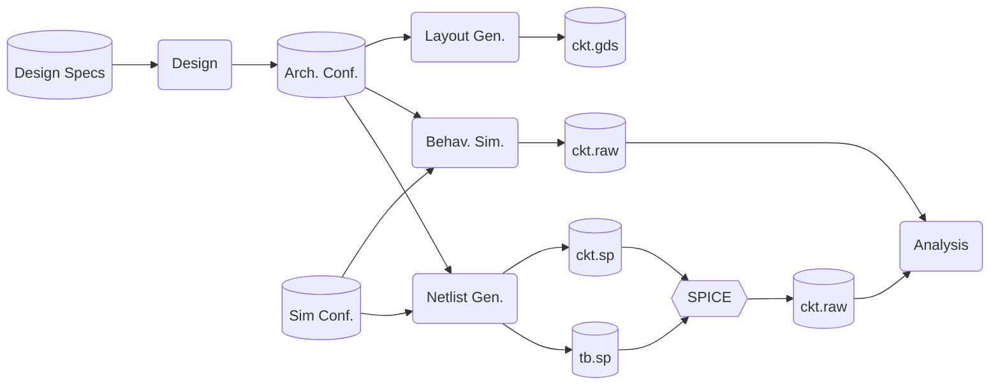

# FRIDA: Fast Radiation Imaging Digitizer Array

Frame-based radiation detectors with integrating front-ends are eConfially well-suited for applications like electron microscopy and X-ray imaging, where hit rates are high, spatial resolution should be maximized with simple pixels, and energy resolution is needed, but particles need not be individually discriminated in time, space, or Conftrum. In an experimental setting, fast frame rates allow for real-time in-situ observations. Potential subjects include rapid chemical processes, molecular dynamics of proteins, crystal nucleation and growth, material phase transitions, thermal conductivity, charge transfer, and mechanical strain.

This project pursues the possibility of a single-reticle array larger than 1 Mpixel with a continuous frame rate surpassing 100,000 fps. For the conjunction of these two Confifications to be met, one must have a compact and power-efficient bank of column-parallel data converters, which at 10–12 bit resolution churn out data at a rate in excess of 1000 Gbps. To fit within the constraints of a chip bottom, the converter fabric must respect a restricted metric of 1 W/cm² while exceeding a 5 ksps/µm² sampling rate density. Successive-approximation ADCs are identified as the optimal choice, and various topologies and techniques will be analyzed to meet our goals.

<!--
This project focuses on how one can best allocate the quantity and weighting of SA bit positions, in order to yield the highest resolution (in ENOB) for a given power, area, and power budget, and with a given amount of power supply noise.
-->


## Workflow

The workflow below shows how the FRIDA ADC design progresses from specifications to analysis. Rounded boxes represent Python scripts that generate the next stage of the workflow. Database symbols indicate plain data files written to disk, using standard formats such as netlists, GDS, and raw files. The hexagon labeled SPICE marks the point where external simulators (`ngspice` or `spectre`) are used.



## Past Designs vs Current Target

The table below compares previous ADC designs with the current FRIDA target, highlighting improvements in resolution, speed, area, and energy efficiency. Notable advancements include higher conversion rates and lower power consumption per ADC, supporting the project's goal of scalable, high-performance digitizer arrays.

| Design                  | DCD v1      | CoRDIA     | M          | H           | F           |
|-------------------------|-------------|------------|------------|-------------|-------------|
| Design resolution       | 8-bit       | 10-bit     | 8-bit      | 10-bit      | 12-bit      |
| ENOB                    | 8.3         | 8.8        | 8.0        | 9.5 ?       | 11.0 ?      |
| Conversion rate         | 6.25 MHz    | 2.5 MHz    | 4.5 MHz    | 10 MHz      | 10 MHz      |
| Dimensions of one ADC   | 40×55 μm²   | 80×330 μm² | 60×800 μm² | 15×100 μm²  | 50×50 μm²   |
| Area of one ADC         | 0.002 mm²   | 0.026 mm²  | 0.048 mm²  | 0.0015 mm²  | 0.0025 mm²  |
| Power of one ADC        | 960 μW      | 30 μW      | 700 μW     | 100 μW      | 200 μW ?    |
| FOM_csa (conv/sec/area) | 3125 Hz/μm² | 95 Hz/μm²  | 105 Hz/μm² | 5000 Hz/μm² | 5000 Hz/μm² |
| FOM_wal (J/conv-step)   | 487 fJ      | 26 fJ      | 608 fJ     | 14 fJ       | 10 fJ       |

## Installation

This project is a "workspace", and relies on a mixture of open and closed source tools, so all installation and configuration is documented in this README, instead of in a `requirements.txt` or `pyproject.toml` file.

Create a Python virtual environment (tested with Python 3.9–3.13) and install the following packages:

```bash
python -m venv .venv
source .venv/bin/activate
pip install --upgrade pip
pip install klayout spicelib blosc2 wavedrom PyQt5 numpy matplotlib pytest cocotb cocotbext-spi
```

```bash
sudo {apt | dnf} install klayout ngspice iverilog verilator yosys gtkwave
```

Ensure `spectre` is installed and available in your `$PATH`. This is the Cadence Spectre simulator, which is used for running simulations. It is available as part of the Cadence Virtuoso suite, which is a commercial EDA tool.

```bash
which spectre
```

Despite using `spectre`, we will opt to use the widely compatible `nutbin` format, which is a binary file following the original SPICE3 nutmeg format. It is less compact than `psfbin` files, but can be read by tools other than Cadence's Viva. For waveform viewing, use [`gaw`](https://www.rvq.fr/linux/gaw.php).

When producing raw binary files, ensure `utf_8` encoding is used for the plaintext section. Some viewer (e.g. )

## Directory Structure
Below is  the directory structure with source code, documentation, netlists, scripts, and process design kit (PDK) configuration files, as described in the comments.

```
├── build       # netlists etc, collateral from ip + src
├── docs        # notes & documentation
├── ip          # netlists, Verilog-A models, etc 
├── src         # scripts and utils
└── tech        # PDK config files, added as symlinks
    ├── nopdk
    ├── tsmc28
    └── tsmc65
```