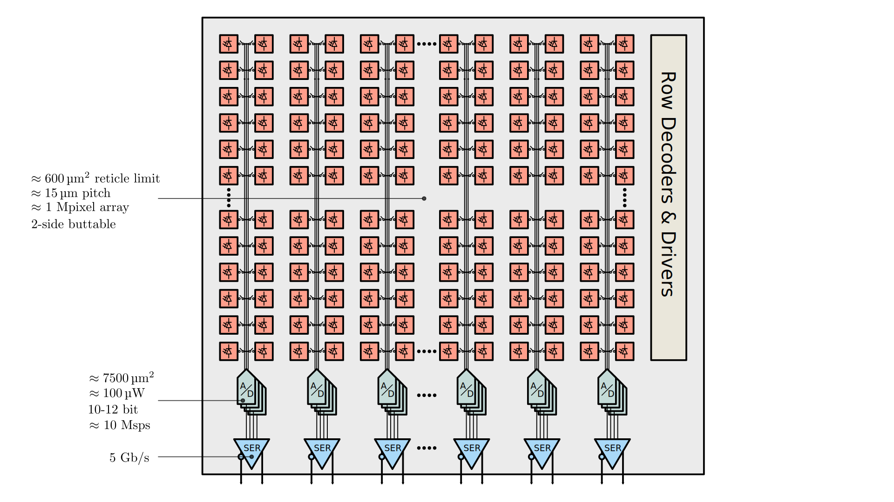
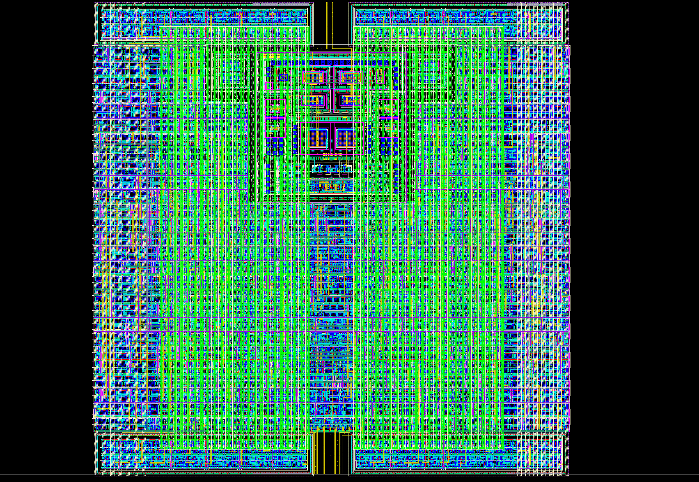
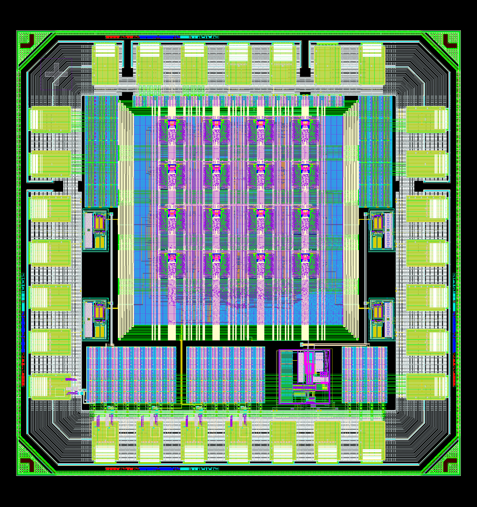
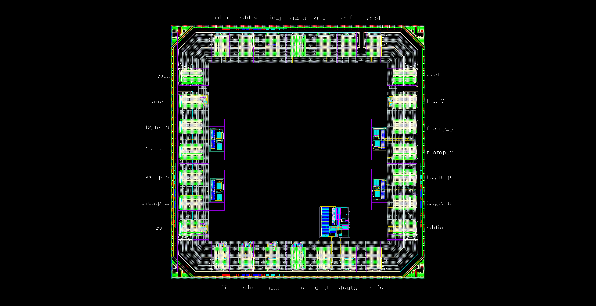
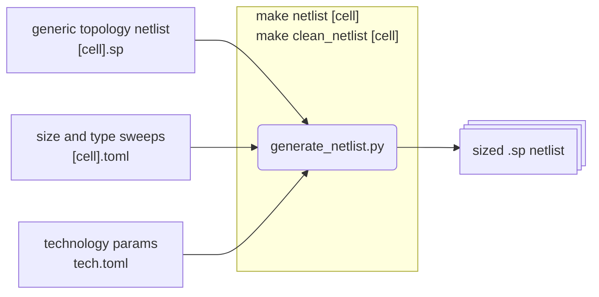
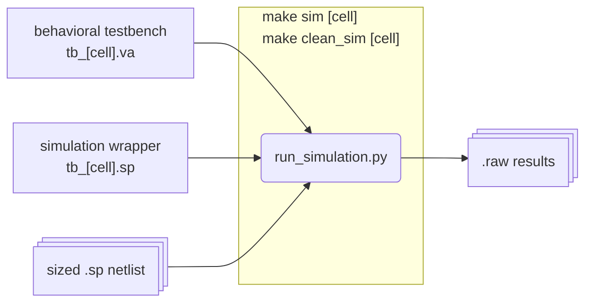
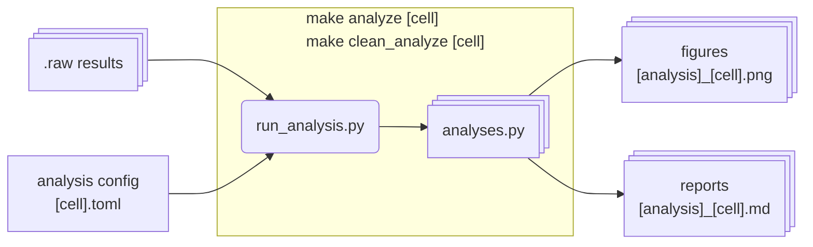

# FRIDA: Fast Radiation Imaging Digitizer Array

> [!WARNING]  
> This project is currently under very active development, and is subject to change.

Frame-based radiation detectors with integrating front-ends are especially well-suited for applications like electron microscopy and X-ray imaging, where hit rates are high, spatial resolution should be maximized with simple pixels, and energy resolution is needed, but particles need not be individually discriminated in time, space, or spectrum. In an experimental setting, fast frame rates allow for real-time in-situ observations. Potential subjects include rapid chemical processes, molecular dynamics of proteins, crystal nucleation and growth, material phase transitions, thermal conductivity, charge transfer, and mechanical strain.

This project pursues the possibility of a single-reticle array larger than 1 Mpixel with a continuous frame rate surpassing 100,000 fps. For the conjunction of these two specifications to be met, one must have a compact and power-efficient bank of column-parallel data converters, which at 10–12 bit resolution churn out data at a rate in excess of 1000 Gbps. To fit within the constraints of a chip bottom, the converter fabric must respect a restricted metric of 1 W/cm² while exceeding a 5 ksps/µm² sampling rate density. Successive-approximation ADCs are identified as the optimal choice, and various topologies and techniques will be analyzed to meet our goals.



## Prototypes

Below are images from prototype designs showing the ADC architecture, top-level integration, and padring implementation:







## Workflow

The workflow below shows how the FRIDA ADC design progresses from specifications, to simulations, to implementation, and analysis:


### 0. Configuration and setup

Run `make setup` to check dependencys, and install (some) if they are missing.

### 1. Netlist generation

Given a generic netlist topology, a technology mapping, and list of parameters to sweep, sized netlists for each technology can be generated.



### 2. Run simulation




### 3. Analyze results

The analysis depends on a `.raw` file containing simulation traces as individual numpy arrays, which can be fetch by name.

When you create: `raw = RawRead('file.raw', traces_to_read='*', dialect='ngspice')`

You get an object with:

```
PROPERTIES (read-only attributes):
  raw.nPoints        : int - Number of data points
  raw.nVariables     : int - Number of traces/signals
  raw.dialect        : str - 'ngspice', 'ltspice', 'qspice', or 'xyce'
  raw.encoding       : str - 'utf_8' or 'utf_16_le'
  raw.raw_type       : str - 'binary:' or 'values:'
  raw.has_axis       : bool - True if time/freq axis exists
  raw.steps          : list or None - Step numbers if stepped simulation
  raw.flags          : list - Flags used in the plot
  raw.plots          : list - List of plot objects (for multi-plot files)
  raw.backannotations: list - Backannotations from header
  raw.aliases        : dict - QSpice trace aliases

METHODS (functions you can call):
  raw.get_trace_names()           -> list[str]
  raw.get_axis(step=0)            -> np.ndarray (time or frequency)
  raw.get_wave(name, step=0)      -> np.ndarray (signal data)
  raw.get_trace(name)             -> TraceRead object
  raw.get_plot_name()             -> str ('Transient Analysis', etc.)
  raw.get_plot_names()            -> list[str]
  raw.get_len(step=0)             -> int
  raw.get_steps(**kwargs)         -> list[int]
  raw.get_raw_property(name)      -> str
  raw.get_raw_properties()        -> dict[str, str]
  raw.to_dataframe(columns, step) -> pandas.DataFrame
  raw.to_csv(filename, ...)       -> None
  raw.to_excel(filename, ...)     -> None
```

And, when you call: `trace = raw.get_trace('v(out)')`

You get a TraceRead object with:
```
  trace.name          : str - Trace name
  trace.data          : np.ndarray - The waveform data
  trace.whattype      : str - 'voltage', 'current', 'time', etc.
```



## Past Designs vs Current Target

The table below compares previous ADC designs with the current FRIDA target, highlighting improvements in resolution, speed, area, and energy efficiency. Notable advancements include higher conversion rates and lower power consumption per ADC, supporting the project's goal of scalable, high-performance digitizer arrays.

| Design                  | DCD v1      | CoRDIA     | M          | H           | F           |
|-------------------------|-------------|------------|------------|-------------|-------------|
| Design resolution       | 8-bit       | 10-bit     | 8-bit      | 10-bit      | 12-bit      |
| ENOB                    | 8.3         | 8.8        | 8.0        | 9.5 ?       | 11.0 ?      |
| Conversion rate         | 6.25 MHz    | 2.5 MHz    | 4.5 MHz    | 10 MHz      | 10 MHz      |
| Dimensions of one ADC   | 40×55 μm²   | 80×330 μm² | 60×800 μm² | 15×100 μm²  | 50×50 μm²   |
| Area of one ADC         | 0.002 mm²   | 0.026 mm²  | 0.048 mm²  | 0.0015 mm²  | 0.0025 mm²  |
| Power of one ADC        | 960 μW      | 30 μW      | 700 μW     | 100 μW      | 200 μW ?    |
| FOM_csa (conv/sec/area) | 3125 Hz/μm² | 95 Hz/μm²  | 105 Hz/μm² | 5000 Hz/μm² | 5000 Hz/μm² |
| FOM_wal (J/conv-step)   | 487 fJ      | 26 fJ      | 608 fJ     | 14 fJ       | 10 fJ       |

## Installation

This project is a "workspace", and relies on a mixture of open and closed source tools, so instead of in a `requirements.txt` or `pyproject.toml` file, a `make setup` target which creates a Python virtual environment (tested with Python 3.9–3.13) and installs the following packages:

```
klayout spicelib blosc2 wavedrom PyQt5 numpy matplotlib pytest cocotb cocotbext-spi
```

The following are also necessary in `$PATH`, using a mixture of `oss-cad-suite` or `apt` or `dnf` installs from distribution repos:

```bash
which klayout ngspice iverilog vvp verilator yosys gtkwave
```

Ensure `spectre` is installed and available in your `$PATH`. This is the Cadence Spectre simulator, which is used for running simulations. It is available as part of the Cadence Virtuoso suite, which is a commercial EDA tool.

```bash
which spectre
```

ngspice 45 should be installed, which when compiled depends on the following packages on Ubuntu 22 LTS:

```bash
sudo apt install bison flex libx11-6 libx11-dev libxaw7 libxaw7-dev libxmu-dev libxext6 libxext-dev libxft2 libxft-dev libfontconfig1 libfontconfig1-dev libxrender1 libxrender-dev libfreetype6 libfreetype-dev libreadline8 libreadline-dev

sudo ./compile_linux.sh
```

For waveform viewing, use [`gaw`](https://www.rvq.fr/linux/gaw.php).

When producing raw binary files, ensure `utf_8` encoding is used for the plaintext section.

## Directory Structure
Summarized below is the directory structure with source code, documentation, RTL, netlists, scripts, and pointer to the process design kit (PDK) configuration files.

```
├── build       # collateral from hdl + src
├── docs        # notes & documentation
├── hdl         # rtl and spice netlists 
├── src         # scripts and utils
└── tech        # PDK-specific config files, added as symlinks
    ├── nopdk
    ├── tsmc28
    └── tsmc65
```