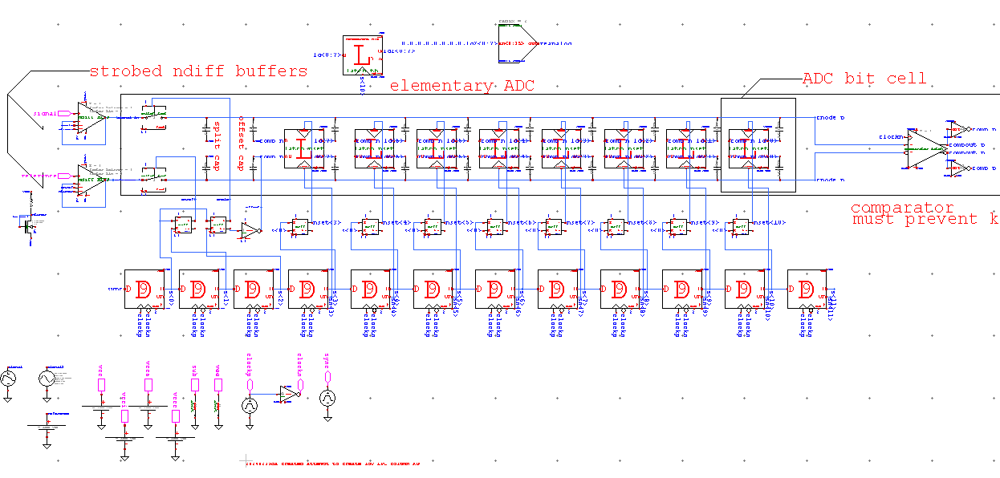
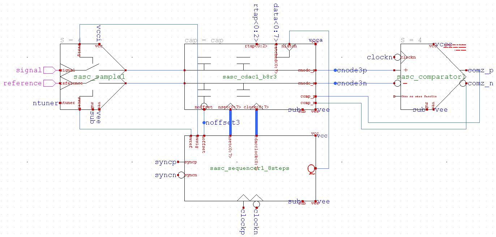
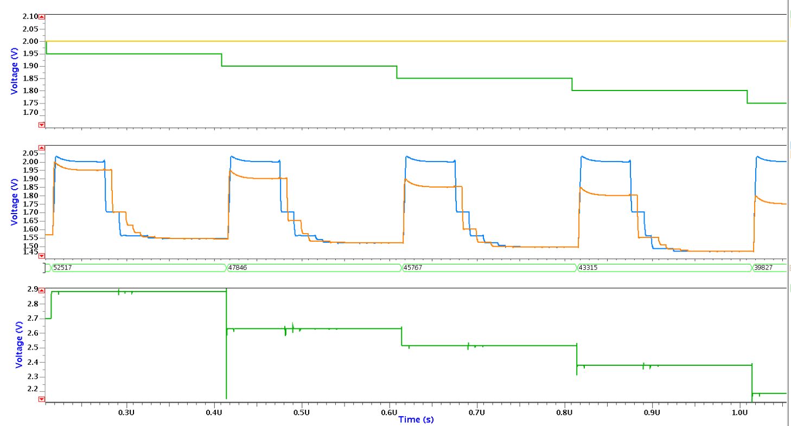

# Current design progress

### Legacy 'flat' design


### SAR ADC sub-circuits (SASC)


# Basic Simulation



# Design targets

| Design                  | EDET DCD    | CoRDIA     | pre-Helena | Helena      |
|-------------------------|-------------|------------|------------|-------------|
| ADC resolution          | 8-bit       | 10-bit     | 8-bit      | 10-bit      |
| Conversion rate         | 10 MHz      | 2.5MHz     | 5 MHz      | 10 MHz      |
| Area of one ADC         | 100x200 μm² | 80x330 μm² | 60x800 μm² | 20x100 μm²  |
| Power of one ADC        | 3500 μW     | 30 μW      | 700 μW     | 100 μW      |
| FOM_csa (conv/sec/area) | 500 Hz/μm²  | 95 Hz/μm²  | 105 Hz/μm² | 5000 Hz/μm² |
| FOM_epc (energy/conv)   | 350 pJ      | 12 pJ      | 155 pJ     | 10 pJ       |
| FOM_ppa (power/area)    | 17.5 W/cm²  | 0.11 W/cm² | 1.45 W/cm² | 5.0 W/cm²   |
| ADC qty Mpix @ 100 KHz  | 10000       | 40000      | 20000      | 10000       |
| ADCs total area         | 2.0 cm²     | 10.5 cm²   | 9.6 cm²    | 0.2 cm²     |
| ADCs total power        | 35.0 W      | 1.2 W      | 14 W       | 1.0 W       |


# Design techniques

- ✅ Unary, double conversion, and non-binary steps (typically x1.8 smaller)
- ✅ RDAC for powering lower voltage LSBs vs attenuating cap
- ❕ MoM != MIM, and POD is best  @ 4fF in μm², with ~5% variation
- ❌ MoM caps are only 0.6-0.8 fF in the same μm², with worse variation
- ❕ Most non-linearity comes from capacitor mismatch, but isn't a huge deal
- ❕ Gain loss comes from parasitic capacitance
- ✅ Double sample, and use differential cap array
- ✅ Auto-zero comparator, and use a basic dynamic/clocked latch design
- ❌ Async jeapordizes stability of neighbors
- ✅ Share sequencer across all ADCs
- ❌ Interleaving typically not worth it
- ✅ 7-8 Gbps JESD204B w/ 8b/10b encoding

# Column-parrallel ADC FOM


$$
FoM = \frac{P\times T_{conv} \times A}{10^{\frac{DR_{dB}-1.76}{10} }} \left[ \mathrm{\frac{fJ \cdot \mu m^2}{conv.-step}} \right]
$$

```python
def FoM(P, ConvTime, A_um2, DRdB):
    J_per_um2 = (P*ConvTime*A_um2)/(10**((DRdB-1.76)/10))
    fJ_per_um2 = J_per_um2*1e15
    return fJ_per_um2

DCD = FoM(3600e-6, 1e-7, 40000, 50)
print(DCD*10e15) #2e21

helena = FoM(100e-6, 100e-9, 2000, 60) 
print(helena*10e15) # 3e17
```


# Compiling/simulating against PDKs

- TSMC 65nm (✅ Working)
- Tower 180nm (✅ working on tsl018)
- TSMC 180nm (tsmc018)
- Tower 65nm (tpsc65)

### Still need:
- [ ] tpsco65
- [ ] Siemens AFS license (just 50EUR!)