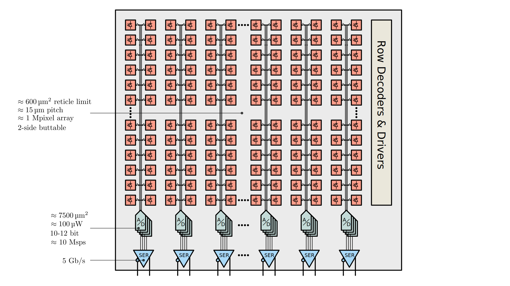

# FRIDA: Fast radiation imaging digitizer array

Frame-based radiation detectors with integrating front-ends are especially well-suited for applications like electron microscopy and X-ray imaging where hit-rates are high, spatial resolution should be maximized with simple pixels, and energy resolution is needed, but particles need not be individually discriminated in time, space, or spectrum. In an experimental setting, fast frame rates allow for real time in-situ observations. Potential subjects include rapid chemical processes, molecular dynamics of proteins, crystal nucleation and growth, material phase transitions, thermal conductivity, charge transfer, and mechanical strain.

This project pursues the possibility of a single-reticle array larger than 1 Mpixel with a continuous frame-rate surpassing 100,000 fps. For the conjunction of these two specifications to be met, one must have a compact and power efficient bank of column-parallel data converters, which at 10-12 bit resolution churn out data at a rate in excess of 1000 Gbps. To fit within the constraints of a chip bottom, the converter fabric must respect a restricted metric of 1 W/cm^2 while exceeding a 5 ksps/µm^2 sampling rate density. Successive-approximation ADCs are identified as the optimal choice, and various topologies and techniques will be analyzed to meet our goals.

This project focuses on how one can best allocate the quantity and weighting of SA bit positions, in order to yeild the highest resolution (in ENOB) for a given power, area, and power budget, and with a given amount of power supply noise.




## Status:

| Block                | Schematic | Layout | Notes                              |
|----------------------|-----------|--------|------------------------------------|
| Unit Length cap      | ✅        | ✅     |                                    |
| Unit Area Cap        | ❌        | ❌     | Need to decide type                |
| Unit Length Array    | ❌        | 🔄     | Design weights already known       |
| Unit Area Array      | ❌        | ❌     |                                    |
| Comparators x2       | ✅        | ✅     | Performance resimulated            |
| Drivers              | ✅        | ✅     | Mixture of devices from Caeleste / Cordia |
| SA Logic             | ✅        | ❌     | Mixture from Caeleste / Cordia     |
| SPI Interface        | ✅        | 🔄     | Need to resize                     |
| Pad Ring             | ✅        | ✅     |                                    |

```
LSB voltage: 585.94 µV
Quantization noise RMS: 169.15 µV
SNR_ideal: 74.01 dB
ENOB_ideal: 12.00 ENOB

Sampling noise RMS: 91.02 µV
Comparator noise RMS: 120.00 µV
SNR w/ noise: 71.47 dB
ENOB w/ noise: 11.58 ENOB

3σ worst-case DNL: 0.80 LSB
SNR w/ noise & dist: 64.22 dB
ENOB w/ noise & dist: 10.37 ENOB

Weights list: [896, 512, 288, 160, 80, 48, 24, 16, 8, 6, 3, 2, 2, 1, 1]
Sum of weights: 2047
```


## Modeling and analysis workflow


## Past designs vs current target

| Design                  | DCD v1      | CoRDIA     | M          | H           | F           |
|-------------------------|-------------|------------|------------|-------------|-------------|
| Design resolution       | 8-bit       | 10-bit     | 8-bit      | 10-bit      | 12-bit      |
| ENOB                    | 8.3         | 8.8        | 8.0        | 9.5 ?       | 11.0 ?      |
| Conversion rate         | 6.25 MHz    | 2.5MHz     | 4.5 MHz    | 10 MHz      | 10 MHz      |
| Dimensions of one ADC   | 40x55 μm²   | 80x330 μm² | 60x800 μm² | 15x100 μm²  | 50x50 μm²   |
| Dimensions of one ADC   | 0.002 mm²   | 0.026 mm²  | 0.048 mm²  | 0.0015 mm²  | 0.0025 mm²  |
| Power of one ADC        | 960 μW      | 30 μW      | 700 μW     | 100 μW      | 100 μW ?    |
| FOM_csa (conv/sec/area) | ??? Hz/μm²  | 95 Hz/μm²  | 105 Hz/μm² | 5000 Hz/μm² | 5000 Hz/μm² |
| FOM_wal (J/conv-step)   | 487 fJ      | 26 fJ      | 608 fJ     | 14 fJ       | 5 fJ        |

# Installation

This project should be thought of as a workspace, and relies of several different languages and a mixture of open and closed sources tools, and so all installation and configuration is documented in this README, instead of in a `requirements.txt` or `pyproject.toml` files.

Create a python .venv (tested with Python 3.9 - 3.13) and install the following packages:

```
python -m venv .venv
source .venv/bin/activate
pip install --upgrade pip
pip install numpy matplotlib pandas tqdm klayout klayout-pex
pip install git+https://github.com/augustunderground/pynut.git
pip install git+https://github.com/augustunderground/pyspectre.git
```

Ensure `spectre` is installed, and available in your `PATH`. This is the Cadence Spectre simulator, which is used for running simulations. It is available as part of the Cadence Virtuoso suite, which is a commercial EDA tool.

```
which spectre
```

Despite using `spectre` will will opt to use the widely compatible `nutbin` format, which is a binary file following original SPICE3 nutmet format. It is less compact than `psfbin` files, but can be read by other tools than Cadence's Viva. For waveform viewing, use [`gaw`](https://www.rvq.fr/linux/gaw.php).


Generating layouts requires `ciccreator` and viewing them optionally requires Cadence Virtuoso or `magic`, built with:

```
pip install cicpy
sudo dnf install -y m4
sudo dnf install -y tcl-devel tk-devel
sudo dnf install -y mesa-libGL-devel mesa-libGLU-devel zlib-devel
sudo dnf install -y libX11-common libX11-devel 
sudo dnf install -y ncurses-devel
```

For compiling/running cic-gui:

```
sudo dnf install qt6-qtbase qt6-qtbase-devel qt6-qtbase-x11
sudo dnf install xcb-util xcb-util-wm xcb-util-image xcb-util-keysyms xcb-util-renderutil libxcb
sudo dnf install qt5-qtbase qt5-qtbase-devel qt5-qtbase-x11 qt5-qtx11extras
sudo dnf install qt6-qtwayland qt6-qtwayland-devel qt5-qtwayland qt5-qtwayland-devel
```


```
├── build       netlists etc, collateral from ip + src
├── docs        notes & documentation
├── ip          netlists, verilog-A models, etc 
├── src         script and utils
└── tech        PDK specific files, only added as symlinks
    ├── nopdk
    ├── tsmc28
    └── tsmc65

```
