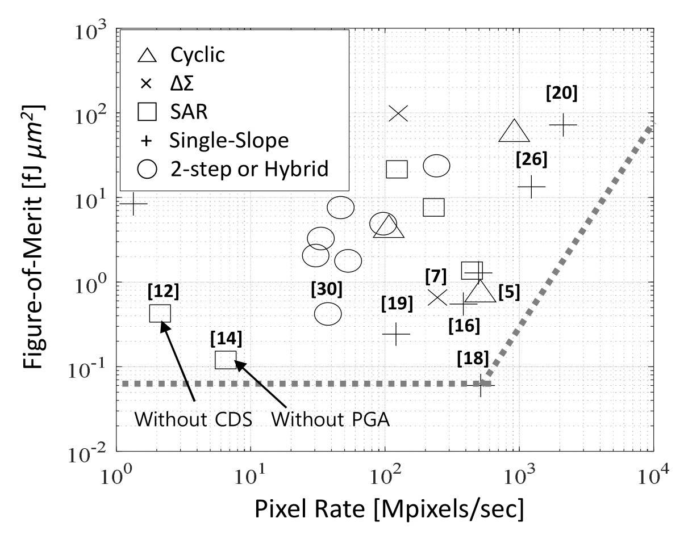
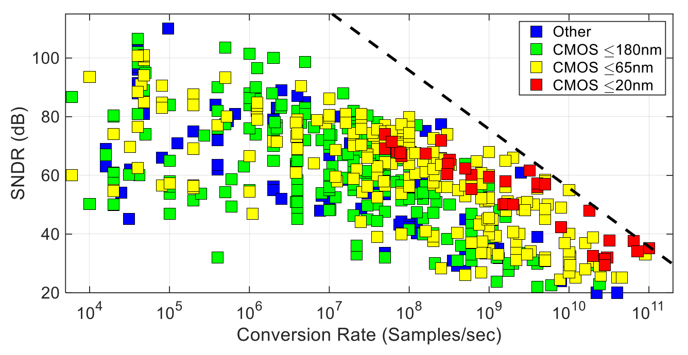

Improving the frame-rate of imaging system is indispensable for directly observing the dynamics of rapidly evolving systems, or rapidly capturing the complete structure of a solid, from many different angles for later reconstruction as is done in 'tomography' disciplines.

Systems like cells, protiens, chemical reactions, oxidation, battery chemistry, X-ray cyrstllography all have dynamic processes 

Historically, the highest frame rates haves been achieve by buffering and duty cycle readout, either in-pixel in the analog domain, or in-matrix or in the chip periphery in the digital domain.

There are multiple components which together to determine the read out rate, which in-term deterine the frame. These including clock distribution, column sequencer, global shutter in-pixel transistor, clolumn drain line, column buffer, and ADC, and serializer, and serial driver, and wireline inteface. Of these, in most applications areas typically the most critic limiting factor is the ADC, as it sufferes from a difficult tradeoff between resolution, sampling time, silicon area and power consumption. Furthermore, many critical imaging applications expose with high energy particles including electrons, X-ray, and neutrons. Depending on the type of particle and their energy, varying radiation damages occur, (both ionizing and non-ionizin) 

To this end, this work investigates techniques for maximizing the sampling rate of column and pixel parallel ADCs contrained by the power consumptions, silicon area, and resolution of imaging applications. The successive approximation or "SAR" ADCs it identified as the optimal choice, and various techniques are investigated, including 

# Design targets

| Design                  | EDET DCD    | CoRDIA     | pre-Helena | Helena      |
|-------------------------|-------------|------------|------------|-------------|
| ADC resolution          | 8-bit       | 10-bit     | 8-bit      | 10-bit      |
| Conversion rate         | 10 MHz      | 2.5MHz     | 5 MHz      | 10 MHz      |
| Area of one ADC         | 100x200 μm² | 80x330 μm² | 60x800 μm² | 20x100 μm²  |
| Power of one ADC        | 1800 μW     | 30 μW      | 700 μW     | 100 μW      |
| FOM_csa (conv/sec/area) | 500 Hz/μm²  | 95 Hz/μm²  | 105 Hz/μm² | 5000 Hz/μm² |
| FOM_epc (energy/conv)   | 180 pJ      | 12 pJ      | 155 pJ     | 10 pJ       |
| FOM_ppa (power/area)    | 9.0 W/cm²   | 0.11 W/cm² | 1.45 W/cm² | 5.0 W/cm²   |
| ADC qty Mpix @ 100 KHz  | 10000       | 40000      | 20000      | 10000       |
| ADCs total pixel rate   | 100 Gpx/s   | 100 Gpx/s  | 100 Gpx/s  | 100 Gpx/s   |
| ADCs total data rate    | 800 Gb/s    | 1 Tb/s     | 800 Gb/s   | 1 Tb/s      |
| ADCs total area         | 2.0 cm²     | 10.5 cm²   | 9.6 cm²    | 0.2 cm²     |
| ADCs total power        | 35.0 W      | 1.2 W      | 14 W       | 1.0 W       |

# Design techniques

- ✅ Unary, double conversion, and non-binary steps (typically x1.8 smaller)
- ✅ RDAC for powering lower voltage LSBs vs attenuating cap
- ❕ MoM != MIM, and POD is best  @ 4fF in μm²
- ❌ MoM caps are only 0.6-0.8 fF in the same μm², with worse variation
- ❕ Most non-linearity comes from capacitor mismatch, but isn't a huge deal
- ❕ Gain loss comes from parasitic capacitance
- ✅ Double sample, and use differential cap array
- ✅ Auto-zero comparator, and use a basic dynamic/clocked latch design
- ❌ Async jeapordizes stability of neighbors
- ✅ Share sequencer across all ADCs
- ❌ Interleaving typically not worth it
- ✅ 7-8 Gbps JESD204B w/ 8b/10b encoding

# Column-parrallel ADC FOM



$$
FoM = \frac{P\times T_{conv} \times A}{10^{\frac{DR_{dB}-1.76}{10} }} \left[ \mathrm{\frac{fJ \cdot \mu m^2}{conv.-step}} \right]
$$

```python
def FoM(P, ConvTime, A_um2, DRdB):
    J_per_um2 = (P*ConvTime*A_um2)/(10**((DRdB-1.76)/10))
    fJ_per_um2 = J_per_um2*1e15
    return fJ_per_um2

DCD = FoM(3600e-6, 1e-7, 40000, 50)
print(DCD*10e15) #2e21

helena = FoM(100e-6, 100e-9, 2000, 60) 
print(helena*10e15) # 3e17
```




# Capacitors types
You can create capacitor plates with poly, metal, and diffusion. 

Typically the common combinations are:

- Poly-diffusion, aka MOS varactor or 'MOSCAP' with poly over n-wells (actually implanted not diffused). Typically the term Varactor is used in RF applications, where the structure will be done differenclty. ITRS 2011 puts this at 7-11 fF/μm²
- Poly-diffusion cap, where you use a field oxide instead of the standard FET gate
- 'Accumulation cap' which is a poly-diffusion (POD) cap, but with the S and D connection. Only using G to Bulk capacitance
- MIM caps, are created with metal layers, but place an intermetidate metal layer closer, and use a special insulator (silicon nitride, tantalum pentoxide Insulators (e.g., Si3N4 or Ta2O5)). ITRS 2011 puts this at 5-7 fF/μm²
- Metal-metal, aka metal-fringe-capacitor (MFC), availabe in TJ180. These can be multiple layers, or just a single layer. There are several variations, with intedigitated fingers with via between, or with vias only on the edges, and fingers rotated each and other layers called an 'RTMOM'. In TSMC65, this is covered [here](file:///eda/kits/TSMC/65LP/2024/V1.7A_1/1p9m6x1z1u/PDK_doc/TSMC_DOC_WM/PDK/crtmom_rf_device_route_guidance_for_RF_application.pdf). ITRS 2011 puts this at 5-7 fF/μm²?
- Poly-poly caps can be as simple as two large rectangles, on two seperate poly layers. Called 'POP' caps. Need to have a poly2 layer.


Tower 65nm seems to have nmoscap, moscaps, pmos caps (all these are varactors), mimcap, mimpcap 3T, RTMOM, and MIM. List is [here](file:///eda/kits/TSMC/65LP/2024/V1.7A_1/1p9m6x1z1u/PDK_doc/TSMC_DOC_WM/PDK/CRN65LP_v1d7a_pdkFSAChecklist.pdf).

Tower 180nm Accumulation caps, MIM caps, and MFCs are covered [here](/eda/kits/TOWER/ts18is_6M1L_2014/HOTCODE/models/ts18sl/v4.9.3/docs/DRS2_0018_B_manual.pdf).

A common way to increase the density of decoupling capacitors. Stack MOM on top of device capacitors (make sure they are connected in parallel and not series).

# Array weighting
BWC - binary weighted capacitor DAC
BWSC - binary weighted split capacitor DAC
SC - split capacitor (Ginsburg 2005)

# Switching strategies

Once we know that matching isn't important, we can discard unit capacitor design and guard rings. This allows the array to be smaller is capacitance, giving lower power, lower area, and faster settling.

Brian Ginsburg and Anatha Chandrakasan, MIT 2005 showed that various switching stragegies for the capacitor arrays can offer speed or energy benefits:

'split capacitor method' -> 37% energy reduction

https://ieeexplore.ieee.org/document/4140585
https://ieeexplore.ieee.org/document/1464555

Theoretical SAR ADC performance is estimated here:

https://ieeexplore.ieee.org/document/4077162

Lui 2010 introduced the 'monotonic' strategy => 86% energy reduction. Only allows 'H->L' transistions on the plates. One disadvantage is continuous dropping of common mode.

https://ieeexplore.ieee.org/document/5437496

Murmann 2006 analyzer regenerative latch offset from load cap mismatch:

https://ieeexplore.ieee.org/document/4033159	

'...the size of the sampling capacitors can be scaled down to the kTIC limit without matching concerns. For SA-ADCs with resolutions of 10 bits and above, a large power saving is envisioned using the proposed low-cost, power-efficient digital calibration technique.'
Theory paper:
https://ieeexplore.ieee.org/document/4415624
Implementation (less detailed)
https://ieeexplore.ieee.org/document/4977318

How does the redundancy or double-conversion stuff work? Does it retry with the same hardware, or different? And does it reset the previous stage, or proceed on from it? 

Are the unary stage at the beginning redundancy? Or does redundancy have to do with overlapping ranges, which can come from non-binary step?

A key term here is 'digital background calibration'.

# Interleaving

Two ADCs at once. Not further considered by Caeleste.

# Binary vs non-binary (vs unary!)

Allows for self-correction of conversion errors and code gaps. Compact sequencer and logic, simpler and smaller cdac, faster operation, lower power. But have to calibrate.

Another type of array is a C-2C capacitor array, but according to Liu 2010, this is not nearly as linear.

Kuttner 2004 is firs to use redundancy via non-binary: https://ieeexplore.ieee.org/document/992993

Unary steps just means that you don't in the beginning jump in an MSB step, and then MSB/2 step.

Instead, you take three steps, each of MSB/2 size. This costs an extra clock cycle, but perhaps improves the metastability time of the MSB which might be quite large.
