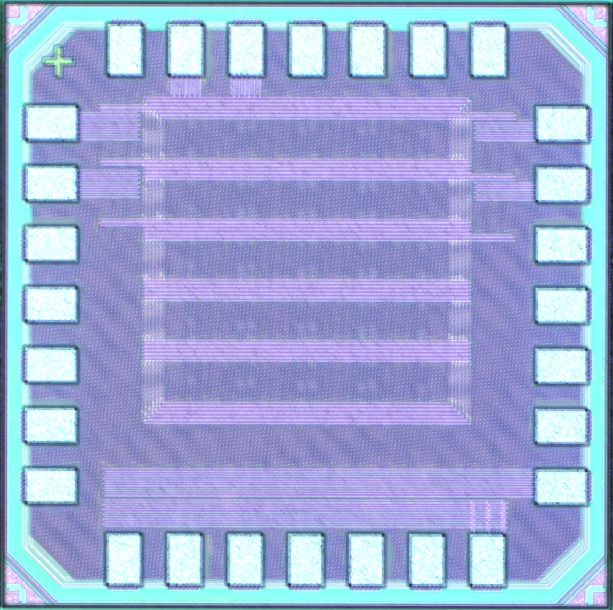
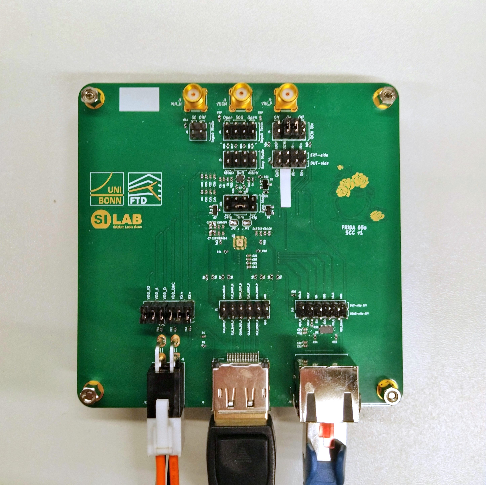

# FRIDA: Fast Radiation Imaging Digitizer Array

This project focuses on improving analog to digital converters (ADCs) in CMOS image sensors, the chip design discipline with arguably the most stringent constraints on silicon design density. A design flow built on open source EDA tools enables comparison across different circuit topologies and process nodes including 180, 130, 65, and 28 nm. So far, we've fabricated a prototype ASIC in 65 nm using this methodology, which targets a state-of-the-art 2500 µm² area and 100 µW power budget, with a performance of 12-bit resolution at 10 Msps performance.

Frame-based radiation detectors with integrating front-ends are especially well-suited for applications like electron microscopy and X-ray imaging, where hit rates are high and spatial resolution should be maximized with simple pixels. This project also pursues a single-reticle array larger than 1 Mpixel with a continuous frame rate above 100,000 fps. To meet those array-level goals, the converter fabric must deliver aggregate throughput above 1000 Gbps while staying within a 1 W/cm² chip-bottom power-density budget and exceeding 5 ksps/µm² sampling-rate density. Successive-approximation ADCs are the primary architecture under study.

> [!NOTE]
> FRIDA is still under active development. The repository is useful as a record of the design and flow, but it is not yet advertised as reproducible on other people's machines.

### Progress

The initial prototype is designed in 65 nm and measures 1×1 mm. It contains 16 ADCs, each measuring roughly 60×60 µm. The tapeout was submitted in October 2025, received March 2026, and is currently being characterized.  Here is a GDS render of the chip:

  

A micrograph of the fabricated prototype:

  

And the single-chip carrier test card, with wirebonded FRIDA ASIC:

  

Detailed command-line usage, build notes, and tool installation instructions are recorded in [`docs/usage.md`](docs/usage.md).

### Past Designs vs Current Target

The table below compares previous ADC designs with the current FRIDA target, highlighting improvements in resolution, speed, area, and energy efficiency. Notable advancements include higher conversion rates and lower power consumption per ADC, supporting the project's goal of scalable, high-performance digitizer arrays. tbhi

| Design  | [DCD-E](https://doi.org/10.1016/j.nima.2019.162544) | [CoRDIA](https://doi.org/10.1088/1742-6596/3010/1/012141) | M  | H  | FRIDA (this repo) |
|-------------------------|-------------|------------|------------|-------------|-------------|
| Design resolution       | 8-bit       | 10-bit     | 8-bit      | 10-bit      | 12-bit      |
| ENOB                    | 8.3         | 8.8        | 8.0        | 9.5       | 11.0 (?)  |
| Conversion rate         | 6.25 MHz    | 2.5 MHz    | 4.5 MHz    | 10 MHz      | 10 MHz      |
| Dimensions of one ADC   | 40×55 μm²   | 80×330 μm² | 60×800 μm² | 15×100 μm²  | 50×50 μm²   |
| Area of one ADC         | 0.002 mm²   | 0.026 mm²  | 0.048 mm²  | 0.0015 mm²  | 0.0025 mm²  |
| Power of one ADC        | 960 μW      | 30 μW      | 700 μW     | 100 μW ?    | 200 μW ?    |
| FOM_csa (conv/sec/area) | 3125 Hz/μm² | 95 Hz/μm²  | 105 Hz/μm² | 5000 Hz/μm² | 5000 Hz/μm² |
| FOM_wal (J/conv-step)   | 487 fJ      | 26 fJ      | 608 fJ     | 14 fJ       | 10 fJ       |
