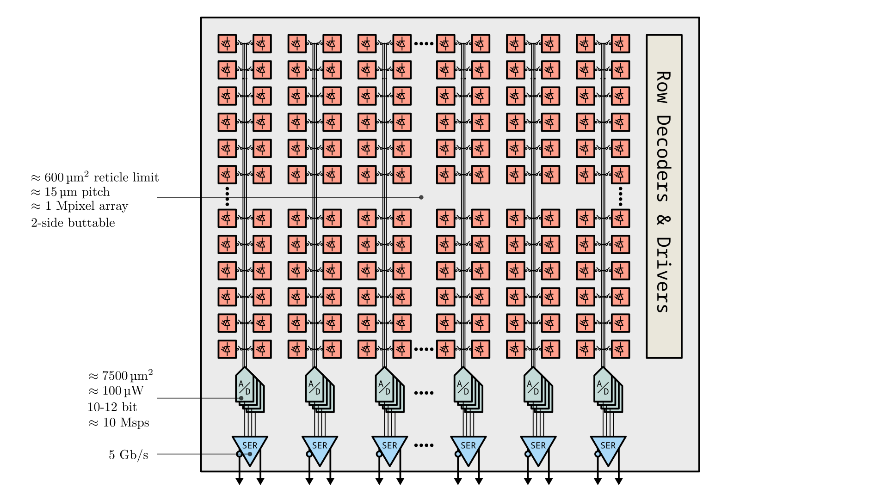
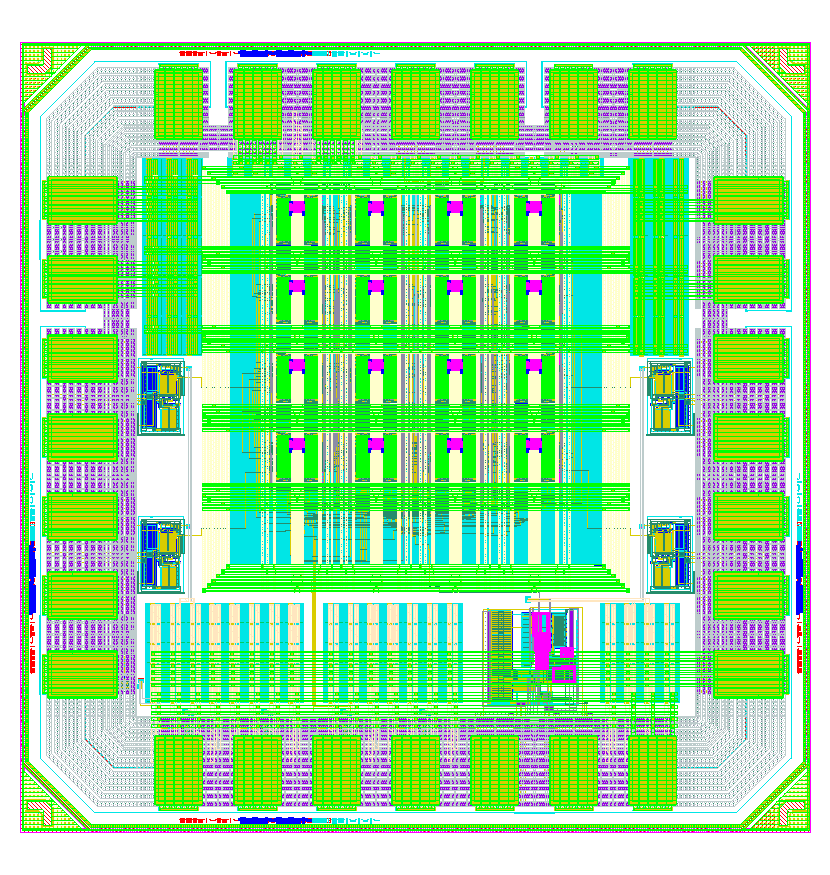

# FRIDA: Fast Radiation Imaging Digitizer Array

This project focuses on improving analog to digital converters (ADCs) in CMOS image sensors, the chip design discipline with arguably the most stringent constraints on silicon design density. A design flow built on open source EDA tools enables comparison across different circuit topologies and process nodes including 180, 130, 65, and 28 nm. So far, we've fabricated a prototype ASIC in 65 nm using this methodology, which targets a state-of-the-art 2500 µm² area and 100 µW power budget, with a performance of 12-bit resolution at 10 Msps performance.

Frame-based radiation detectors with integrating front-ends are especially well-suited for applications like electron microscopy and X-ray imaging, where hit rates are high and spatial resolution should be maximized with simple pixels. This project also pursues a single-reticle array larger than 1 Mpixel with a continuous frame rate above 100,000 fps. To meet those array-level goals, the converter fabric must deliver aggregate throughput above 1000 Gbps while staying within a 1 W/cm² chip-bottom power-density budget and exceeding 5 ksps/µm² sampling-rate density. Successive-approximation ADCs are the primary architecture under study.



Seen below is the initial prototype, designed in 65nm and measuring 1x1 mm. On the prototype are 16 ADCs, each measuring 60x60 µm. The tapeout was submitted in Oct 2025, and will be tested upon arrival this Spring 2026.

> [!NOTE]
> For some more detailed information about the submitted prototype, see [design.pdf](docs/design.pdf).



## Past Designs vs Current Target

The table below compares previous ADC designs with the current FRIDA target, highlighting improvements in resolution, speed, area, and energy efficiency. Notable advancements include higher conversion rates and lower power consumption per ADC, supporting the project's goal of scalable, high-performance digitizer arrays.

| Design  | [DCD-E](https://doi.org/10.1016/j.nima.2019.162544) | [CoRDIA](https://doi.org/10.1088/1742-6596/3010/1/012141) | M  | H  | FRIDA |
|-------------------------|-------------|------------|------------|-------------|-------------|
| Design resolution       | 8-bit       | 10-bit     | 8-bit      | 10-bit      | 12-bit      |
| ENOB                    | 8.3         | 8.8        | 8.0        | 9.5 ?       | 11.0 ?      |
| Conversion rate         | 6.25 MHz    | 2.5 MHz    | 4.5 MHz    | 10 MHz      | 10 MHz      |
| Dimensions of one ADC   | 40×55 μm²   | 80×330 μm² | 60×800 μm² | 15×100 μm²  | 50×50 μm²   |
| Area of one ADC         | 0.002 mm²   | 0.026 mm²  | 0.048 mm²  | 0.0015 mm²  | 0.0025 mm²  |
| Power of one ADC        | 960 μW      | 30 μW      | 700 μW     | 100 μW      | 200 μW ?    |
| FOM_csa (conv/sec/area) | 3125 Hz/μm² | 95 Hz/μm²  | 105 Hz/μm² | 5000 Hz/μm² | 5000 Hz/μm² |
| FOM_wal (J/conv-step)   | 487 fJ      | 26 fJ      | 608 fJ     | 14 fJ       | 10 fJ       |


# Usage

FRIDA uses a `flow` CLI with four subcommands:

```
flow primitive   Generate layout primitives
flow netlist     Generate netlists
flow layout      Run place-and-route via OpenROAD
flow simulate    Run simulations
```

Run from the repo root with `uv run`:

```bash
uv run flow netlist -c comp -t ihp130 -m min
```

## Subcommands

### `flow primitive`

Generate layout primitives (GDS).

```bash
flow primitive -c <cell> -t <tech> -m <mode> [-v] [-o <dir>]
```

| Flag | Values | Default |
|------|--------|---------|
| `-c, --cell` | `mosfet`, `momcap` | (required) |
| `-t, --tech` | `ihp130`, `tsmc65`, `tsmc28`, `tower180` | `ihp130` |
| `-m, --mode` | `min`, `max` | `min` |
| `-v, --visual` | (flag) | off |
| `-o, --out` | output directory | `scratch` |

Example:

```bash
uv run flow primitive -c mosfet -t ihp130 -m max -v
```

### `flow netlist`

Generate netlists at varying levels of scope.

```bash
flow netlist -c <cell> -t <tech> -m <mode> [-f <fmt>] [--scope <scope>] [--montecarlo] [-o <dir>]
```

| Flag | Values | Default |
|------|--------|---------|
| `-c, --cell` | `samp`, `comp`, `cdac`, `adc` | (required) |
| `-t, --tech` | `ihp130`, `tsmc65`, `tsmc28`, `tower180` | `ihp130` |
| `-m, --mode` | `min`, `max` | `min` |
| `-f, --fmt` | `spectre`, `ngspice`, `cdl`, `verilog` | `spectre` |
| `--scope` | `dut`, `stim`, `full` | `full` |
| `--montecarlo` | (flag) | off |
| `-o, --out` | output directory | `scratch` |

The `--scope` flag controls what is included in the generated netlist:

| Scope | Contents |
|-------|----------|
| `dut` | Subcircuit definitions only (DUT hierarchy) |
| `stim` | DUT subcircuits + testbench wrapper with stimulus sources and DUT instantiation |
| `full` | Complete simulator input: stim + analysis statements, options, and save commands |

The `cdl` and `verilog` formats only support `--scope=dut`. The `--montecarlo`
flag requires `--scope=full`.

Examples:

```bash
# Full sim-input netlist for comparator (default scope)
uv run flow netlist -c comp -t ihp130 -m min

# DUT-only subcircuit definitions in Verilog
uv run flow netlist -c comp -t ihp130 --scope dut -f verilog

# Testbench with stimulus but no analysis commands
uv run flow netlist -c adc -t tsmc65 --scope stim

# Full sim-input with Monte Carlo wrapper
uv run flow netlist -c comp -t ihp130 --montecarlo
```

### `flow layout`

Run place-and-route via OpenROAD. Requires `openroad` on `PATH`.

```bash
flow layout -c <cell> -t <tech> [-o <dir>]
```

| Flag | Values | Default |
|------|--------|---------|
| `-c, --cell` | `comp` | (required) |
| `-t, --tech` | `ihp130`, `tsmc65`, `tsmc28`, `tower180` | `ihp130` |
| `-o, --out` | output directory | `scratch` |

Example:

```bash
uv run flow layout -c comp -t ihp130
```

### `flow simulate`

Generate netlists and run simulation. Requires a supported simulator on `PATH`
(or use `--host` for remote execution).

```bash
flow simulate -c <cell> -t <tech> -m <mode> [-s <sim>] [--host <host>] [--montecarlo] [-o <dir>]
```

| Flag | Values | Default |
|------|--------|---------|
| `-c, --cell` | `samp`, `comp`, `cdac`, `adc` | (required) |
| `-t, --tech` | `ihp130`, `tsmc65`, `tsmc28`, `tower180` | `ihp130` |
| `-m, --mode` | `min`, `max` | `min` |
| `-s, --simulator` | `spectre`, `ngspice`, `xyce` | `spectre` |
| `--host` | remote hostname | local |
| `--montecarlo` | (flag) | off |
| `-o, --out` | output directory | `scratch` |

Examples:

```bash
# Local Spectre simulation
uv run flow simulate -c comp -t ihp130 -m min -s spectre

# Remote simulation on jupiter
uv run flow simulate -c comp -t tsmc65 -s spectre --host jupiter
```


# Installation

## Python Environment

FRIDA uses [`uv`](https://docs.astral.sh/uv/) to manage Python dependencies.
Clone the repo, install dependencies, and run the smoketest suite:

```bash
git clone --recursive git@github.com:kcaisley/frida.git
cd frida
uv sync
uv run pytest
```

`uv sync` creates a virtualenv and installs all pinned dependencies from the
lockfile. `uv run pytest` runs the test suite as a quick sanity check that the
environment is set up correctly.

## Spectre

FRIDA uses Cadence Spectre for signoff-oriented analog simulations. Ensure it
is installed and visible on `PATH` on whichever host runs the simulations.

```bash
which spectre
spectre -W
```

## Ngspice

FRIDA can also use `ngspice` for open-source simulation flows. The commands
below build from source; use either the Ubuntu path or the RHEL path depending
on your OS.

```bash
# Ubuntu 24.04 dependency install
sudo apt-get update
sudo apt-get install -y \
  build-essential autoconf automake libtool bison flex \
  libx11-6 libx11-dev libxaw7 libxaw7-dev libxmu6 libxmu-dev \
  libxext6 libxext-dev libxft2 libxft-dev \
  libfontconfig1 libfontconfig1-dev libxrender1 libxrender-dev \
  libfreetype6 libfreetype-dev libreadline8 libreadline-dev

# RHEL 9 dependency install
sudo dnf install -y epel-release
sudo dnf install -y \
  gcc gcc-c++ make autoconf automake libtool bison flex \
  libX11 libX11-devel libXaw libXaw-devel libXmu libXmu-devel \
  libXext libXext-devel libXft libXft-devel \
  fontconfig fontconfig-devel freetype freetype-devel \
  libXrender libXrender-devel readline-devel

# Clone and build
mkdir -p ~/libs
git clone https://git.code.sf.net/p/ngspice/ngspice ~/libs/ngspice
cd ~/libs/ngspice
./autogen.sh
mkdir -p release
cd release
../configure --with-x --enable-xspice --enable-cider --enable-openmp --with-readline=yes
make -j"$(nproc)"
sudo make install
sudo ldconfig

# Verify
which ngspice
ngspice --version
```

For waveform viewing, [`gaw`](https://www.rvq.fr/linux/gaw.php) is useful.
When producing raw binary files, ensure `utf_8` encoding is used for the
plaintext section.

## OpenROAD

FRIDA's digital implementation flow uses OpenROAD. The commands below clone,
build, and install system-wide to `/usr/local` following the upstream
[Build Guide](https://openroad.readthedocs.io/en/latest/user/Build.html).

```bash
git clone --recursive https://github.com/The-OpenROAD-Project/OpenROAD.git ~/libs/OpenROAD
cd ~/libs/OpenROAD

sudo ./etc/DependencyInstaller.sh -base
./etc/DependencyInstaller.sh -common -local
./etc/Build.sh
sudo make -C build install

# Verify
which openroad
openroad -version
```

## Remote SpiceServer Setup (for `--host`)

Use this when FRIDA runs on one machine and simulations run on a remote host
through `spice_server`.

Detailed build/ runtime instructions and known-issue notes are in:

- [`docs/spice_server.md`](docs/spice_server.md)
