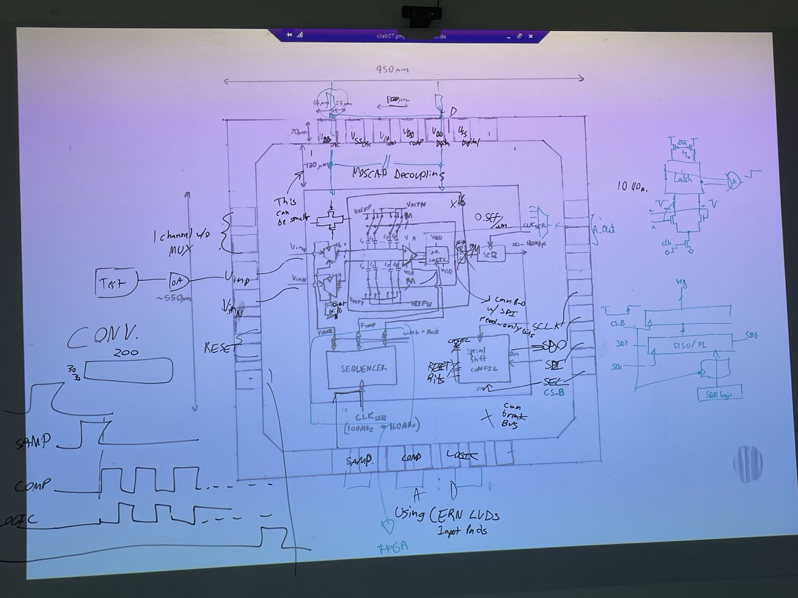

# Week 17 (22.04.2025)

- Input path: test generator -> high quality op amp -> Vin+ and Vin-
  - Perhaps have a second input pair, for a single test channel
- Four LVDS inputs, for sequencing the following:
  - DAC reset signal, Sampling, Comparator, and Logic (is maybe just combinational?)
  - Would be really nice to fit these all on one chip edge
  - Use the CERN LVDS pad ring cells. This should be considered trivial
  - These are generated via an 'oversampling' sequencer in the BDAQ FPGA.
- Out LVDS output, from comparator output of selected channel
- SPI 4-pin interface: SDI, SDO, SCLO, CS_B
  - CS_B lowers at beginning of transfer, and when it raises it parallel loads the first FIFO into a parallel register with live data
  - I can also read internal bits using a parallel load register
  - I shouldn't use a binary to one-hot encoder, simply have a enable bit for each channel, and enable as many as you want? Having multiple bits be high is an invalid state, but that's okay
- Three power domains, one pin for each
  * $V_{refp}$ and $V_{refn}$, $V_{dda}$ and $V_{vssa}$, $V_{vddd}$ and $V_{vssd}$
  * Decoupling MOSCAPs are available in periphery. Don't place them in-between as the real system won't have any room anyways
- Channel select bits do the following:
  - Allow SAMP to reach 1 (and only 1) input sample switch
  - Allow COMP to reach 1 comparator
  - Allow LOGIC clock to reach 1 logic
  - Allow DAC default reset bits to reach 1 DAC
  - Allow DAC reset signal to load from DAC bits
  - Connect the comparator output serial sequence from the 

- 

# Week 16 (15-04-2025)

Layout notes:

- SAR logic on chip

- SAR logic and comparator using different clock

- analog multiplexor for input of ADCs

- account for output measurement when

- Basil provides sequencer and clock generation

- SPI-fast?

- Device -> FPGA. Do I need the analog support board?

- Can I simply use the BDAQ board?

- Sequencer for Coarse clocks, or FPGA clock resources which are programmable

- Reminder:

  

100um pitch is doable, 80 is harder
don't forget fan out of bonds
100 chips from a mini asic = all from a single wafer, but there are 3-4 total wafer produced for backup
There are many pad rings in 65nm
Don't forget to update the pad ring to support higher voltages 
Calibre for DRC and LVS, but I won't get the full ruleset

Besides block level DRC, don't forget antenna, wirebond, density rules
Low level blocks have to pass local density check on the max end.

Check if the 65nm pad ring is a good idea

post Caeleste visit

- [ ] Look into TOYS and grid search methodology (per Jochen's advice)
- [ ] Understand digital calibratability condition a bit better (more than just stretching transfer function horizontally)
- [ ] Remove blue background from Inkscape slides
- [ ] To do with Bilgesu:
  - [ ] different capacitor types (MIM, MOSCAP, POD, MOM) and layouts (unit length!)
  - [ ] relation between input sampling noise and Ctotal
  - [ ] analyze radix vs mismatch (worse case of 100 runs)
- [ ] Accurate modeling of comparator threshold noise vs device sizing and process node
- [ ] Behavioral simulation outstanding issues:
  - [ ] Identify reason for shifted output values
  - [ ] Identify reason for non-monotonic sections
  - [ ] Check the unary and post conversion plots, as they look weird (even before noise is considered)
  - [ ] Fix issue of static linearity having noise enabled in plots
  - [ ] Fix issue with ENOB calculation. Noise ~= LSB should be -1.7 ENOB worse than ideal case

- [ ] Develop digital error correction logic (DEC)
  - [ ] Understand the requirement for FA addition-only DEC where #FA ~ Dout bits
  - [ ] What is the correct method for interpreting extended-search vs sub-radix2 Bout bits?
  - [ ] Verilog-A / Verilog-D model of logic (to try and speed up simulation)?
- [ ] Implement PyTables backend of simulation (for sane logging of data; see last message from Christian)
  - [ ] Append simulation meta data to results
- [ ] Think about measuring capacitor variation
  - [ ] 65nm and 180nm test structures?
  - [ ] Pixcap vs output DAC methodology of mismatch measurements?

- [ ] Measure power consumption profile of async vs syn designs
  - [ ] Can an async design potentially get away with less decaps?

# Week 15 (09-04-2025)

Visiting Caeleste on Thursday

- [x] fix decimal places to 3f in specs table
- [x] add array of weights
- [x] add weights total (and plus one)
- [x] page numbers
- [x] Add all device and reference noise checks
- [x] generate table latex from pandas dataframe
- [x] write .tex directly
- [x] fix base case dropped bins
- [x] Add plot on redundancy throughout chain
  - [x] Add to top level
  - [x] remove sine wave input chat
  - [x] scale to -35 to +55 percent
- [x] simply the run cases so that I can simply specify the cases,
- [x] add slides on theory / prior art from each paper I read
- [x] add methodology slide
  - [x] add note that our simulation is 4.5 orders of magnitude faster than spice (25 seconds vs 20-30 hours)
- [x] Check if Inkscape slides still have blue background?

# Week 12 (21-04-2025)

In direct pursuit of the above research question.

- [x] Verilog-A model of comparator
- [x] Replace active input with passive
- [x] Replace re-analog with external block
- [x] Verilog-A model of vstepping input voltage
- [x] Fix Spectre compatibility (necessary for multi machine runs)
    - [x] Replace waveform sources with either VA or SPECTRE supported AnalogLib parts
    - [x] Benchmark SPICE vs Spectre, profile CPU
- [x] Benchmark lt177 vs jupiter vs asiclab0## workstations (necessary to know where to run)
- [x] Understand if monotonic/BSS conversions are properly understood (can we use last conversion?)
- [x] Pass parameters to top level .params file, which can be written by python (necessary for multi param runs)
- [x] Figure out the expression for what input signal swing is, depending on total capacitance and parasitic capacitance!
